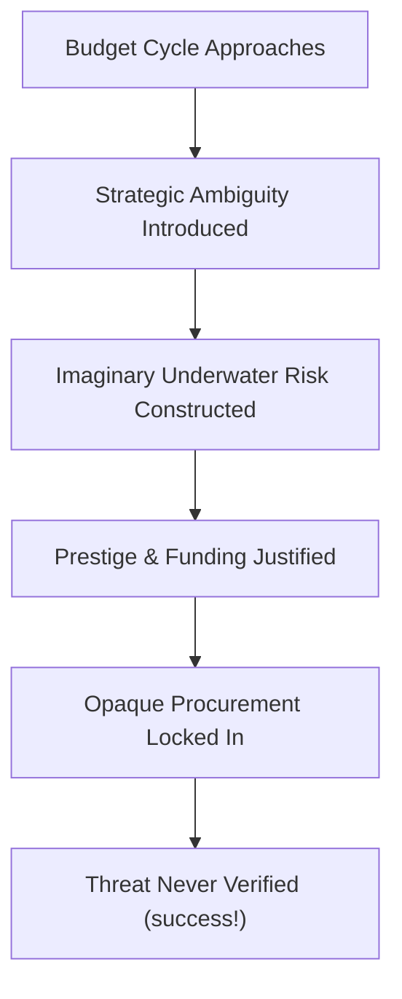

File: 🚢_royal_navy_and_the_definite_reality_of_underwater_threats.md

# 🚢 Royal Navy & The Definite Reality of Underwater Threats  
**First created:** 2025-11-17 | **Last updated:** 2025-11-17  
*Why navies throughout history — including the Royal Navy — have relied on exaggerated, unverifiable, and often completely imaginary underwater threats to justify budgets, prestige, and political leverage.*

---

## 🛰️ Orientation  
Across history, every powerful navy has maintained at least one of the following:

- **an imaginary sea monster**,  
- **a vague deep-ocean adversary**,  
- **a not-yet-seen but definitely-lurking horror**,  
- **a classified underwater “risk envelope”**, or  
- **a monster only officers claim to understand.**

This is not random.

Mythical underwater threats have always been a **strategic narrative device** used to:

- justify budgets,  
- maintain public awe,  
- secure political influence,  
- mask procurement spirals,  
- and prevent civilian oversight.

This node explains the sociological, political, and psychological function of invented maritime threats — including their modern descendants in nuclear-deterrent rhetoric.

Pairs with:  
- 🦑 *kraken-based_defence_budget_satire*  
- 🗡️ *why_trident_is_lowkey_kraken_insurance*

---

## ✨ Key Features  
- Shows the structural incentives behind naval monster-making.  
- Links maritime folklore to modern defence rhetoric.  
- Explains why oceans are ideal myth-making territories.  
- Uses satire to reveal real political mechanisms.  
- Places the Kraken in a long lineage of bureaucratic fictions.

---

## 🧿 Analysis / Content  

### 🌊 1. Why Navies Love Underwater Threats  
Underwater threats have unique advantages:

- **unobservable** → cannot be disproven  
- **emotionally evocative** → taps primal fear  
- **scientifically ambiguous** → plausible sci-fi  
- **geographically vast** → excuses “we haven’t seen it yet” logic  
- **prestige-compatible** → officers sound important  
- **audit-resistant** → everything is “classified”  

The perfect threat is one you can describe, but no one can verify.

---

### 🐉 2. Historical Pattern: Monsters = Funding  
Examples include:

- Norse sailors → Jörmungandr  
- Medieval navies → sea serpents  
- Early modern sailors → leviathans  
- Victorian naval officers → giant kraken  
- WWII submariners → “ghost U-boats”  
- Cold War → “unidentified underwater anomalies”  

Many of these were:

- whales  
- logs  
- storms  
- rum  
- Dave racing a seagull  

…but the **monster version** was always politically more useful.

---

### ⚓ 3. The Deep Sea = Bureaucratic Theatre  
The ocean is a perfect blank canvas for political storytelling:

- very deep  
- very dark  
- very unverifiable  
- very good at hiding truth  
- very good for hiding budgets  

The deeper the water, the **higher the line item**.

---

### 🫡 4. The Royal Navy’s Modern Mythmaking  
Even today, euphemistic phrases like:

- “undersea threat envelopes”  
- “irregular submarine vectors”  
- “emergent littoral adversaries”  
- “classified deep-sea profiles”  

…sound suspiciously like bureaucratic Kraken-speak.

These phrases appear in white papers precisely because:

- they’re too vague to contest  
- too technical to question  
- too scary to defund  

A perfect storm of **myth + bureaucracy + procurement**.

---

### 🧨 5. Why Myth-Making Increases During Political Instability  
When a government is:

- weak,  
- unpopular,  
- unsteady,  
- economically struggling,  
- culturally divided,  

…the Navy gently hints:

> “Only we can protect you from the Large Underwater Something.”

Kraken logic spikes when politics is fragile.

---

### 🧰 6. The Threat Narrative Pipeline  

A flawless system — unless you’re a taxpayer.

---

### 🔱 7. Trident Renewal as Naval Mythology  
Trident depends on:

- unseen adversaries  
- catastrophic hypotheticals  
- secret assessments  
- unverifiable threats  
- prestige narratives (“we are still world-class”)  
- deep-sea mystique  

Trident is Kraken mythology with nuclear warheads.

See: 🗡️ *why_trident_is_lowkey_kraken_insurance*.

---

### 😈 8. Why Naval Mythology Always Contains a Hint of Alcohol  
Sailors historically mixed:

- boredom  
- terror  
- rum  
- hazardous weather  
- bad sleep  
- loneliness  
- poor lighting  
- questionable decisions  

→ The folklore practically writes itself.

The Royal Navy lovingly maintains this narrative tradition because it:

- humanises sailors,  
- mystifies the ocean,  
- obscures the mundane causes of ship damage,  
- and makes funding easier.

---

### 🪞 9. The Polaris Reframe  
Naval monster-myths are not stupid.  
They are *functional*.

They are:

- political technology  
- budgetary insulation  
- strategic ambiguity  
- narrative armour  
- public mystique generators  
- tools for governing emotional responses to risk

The Kraken isn’t real.  
But its **political utility** very much is.

---

## 🏮 Footer  
**Royal Navy & The Myth of Underwater Threats** is part of Polaris’ Kraken Governance Satire cluster.  
It uses humour to dissect how imaginary monsters and vague aquatic adversaries continue to shape defence budgets and national myth-making.

Crosslinks:  
- 🦑 *kraken-based_defence_budget_satire*  
- 🗡️ *why_trident_is_lowkey_kraken_insurance*
