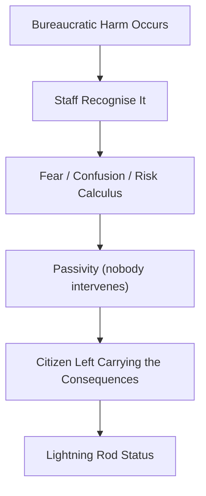

File: 🚫_when_no_one_steps_in_institutional_silence_as_warning_signal.md

# 🚫 When No One Steps In: Institutional Silence as a Warning Signal  
**First created:** 2025-11-17 | **Last updated:** 2025-11-17  
*Why the absence of intervention, correction, or safeguarding by institutions is one of the clearest early warnings of democratic drift and bureaucratic breakdown.*

---

## 🛰️ Orientation  
One of the most disorienting experiences during democratic drift is not the harm itself —  
but the **silence around it**.

No one corrects the error.  
No one intervenes when something is obviously wrong.  
No one escalates appropriately.  
Everyone appears afraid, frozen, confused, or “waiting for someone else”.

This is not an individual failure gesture.  
It is a **systemic warning signal**.

This node explains the emotional, structural, and political meaning of institutional silence.

Pairs with:  
- ⚡ *why_some_people_become_systemic_lightning_rods*  
- 🗂️ *when_institutions_start_treating_you_as_a_category_not_a_person*  
- 🧭 *how_authoritarian_drift_feels_from_the_inside*  
- 📛 *bureaucratic_memory_failure_and_identity_contamination*

---

## ✨ Key Features  
- Identifies institutional silence as a drift-sign, not bad luck.  
- Explains why systems stop stepping in even when they see harm.  
- Maps fear-based passivity in bureaucracies under political pressure.  
- Validates the loneliness and disbelief experienced by citizens.  
- Distinguishes silence caused by malice vs collapse vs fear.  

---

## 🧿 Analysis / Content  

### 🚫 1. What Institutional Silence Actually Means  
Silence is not neutral.  
Silence is:

- avoidance,  
- fear,  
- risk management,  
- overcaution,  
- political signalling,  
- insecurity,  
- collapse of courage,  
- crisis-driven passivity.

Institutions become quiet *when acting is more frightening than watching harm unfold.*

---

### 🧨 2. Why Institutions Stop Stepping In  
Systems under stress exhibit:

#### **a) Fear of liability**  
Correcting an error means admitting an error happened.

#### **b) Fear of political scrutiny**  
Staff avoid attention when culture-war pressure is high.

#### **c) Resource depletion**  
There aren’t enough staff, hours, or courage left.

#### **d) Procedural defensiveness**  
“Not my remit” becomes a shield.

#### **e) Hierarchical paralysis**  
Frontline workers freeze because leadership is silent.

#### **f) Confused chains of responsibility**  
Nobody knows who is “allowed” to act.

#### **g) Over-reliance on automated systems**  
“When in doubt, trust the flag.”

Silence is the product of fear + confusion + scarcity.

---

### ⚡ 3. The Silence Pipeline  

People interpret this as “I must be the problem.”  
In reality, it means **the system is overloaded and scared.**

---

### 🔥 4. The Emotional Experience of Institutional Silence  
People describe:

- bewilderment  
- disbelief  
- “Why is no one fixing this?”  
- “Why am I the only one noticing?”  
- “Why do I feel like I’ve been abandoned inside the machine?”  
- “Someone *must* see how wrong this is.”  
- “I feel invisible.”  
- “It feels surreal.”  
- “It feels unsafe.”  

This is the psychological cost of systems that stop stepping in.

---

### 🧬 5. Silence as a Drift Indicator  
In healthy systems:

- errors get corrected,  
- safeguarding intervenes proportionately,  
- decision-makers act early,  
- accountability is normal,  
- humans override bad data.

In drift-prone systems:

- no one takes responsibility,  
- silence replaces action,  
- errors accumulate,  
- fear spreads internally,  
- intervention becomes rare and late,  
- minorities carry the fallout.  

Silence is one of the **clearest** signs of systems edging authoritarian, because authoritarian drift punishes initiative.

---

### 🧩 6. Why Silence Happens First Around Minoritised People  
Because institutions:

- fear backlash from power-holders, not from minorities  
- hesitate to defend those already “othered”  
- avoid politically visible risk  
- judge some harms as “low priority”  
- internalise racialised and cultural biases  

If silence gathers around you, it’s not because you’re wrong.

It’s because the system sees you as a **safe place to absorb its fear**.

---

### 🕳️ 7. Silence Creates the Void Where Abuse Grows  
In drift contexts, silence is not passive — it is **fertile**.

Silence:

- inflames misinterpretation  
- allows harmful notes to persist  
- shields bad decisions from challenge  
- isolates people most at risk  
- creates the illusion “nobody else is affected”  
- encourages further escalation  
- erodes trust  
- trains staff not to intervene  

Silence teaches authoritarianism how to behave.

---

### 🧭 8. The Polaris Reframe  
When no one steps in:

> **It means the system is scared, not that you are wrong.  
> It means pressure is high, not that you deserve abandonment.  
> It means drift is happening, not that you caused it.**

Institutional silence is structural intelligence.

It is data.

---

## 🏮 Footer  
**When No One Steps In: Institutional Silence as a Warning Signal** is part of Polaris’ Democratic Drift Phenomenology cluster.  
It anchors the emotional reality of being left to absorb system error alone, and reframes silence as a sign of structural instability rather than personal failure.

Crosslinks:  
- ⚡ *why_some_people_become_systemic_lightning_rods*  
- 🗂️ *when_institutions_start_treating_you_as_a_category_not_a_person*  
- 🧭 *how_authoritarian_drift_feels_from_the_inside*
