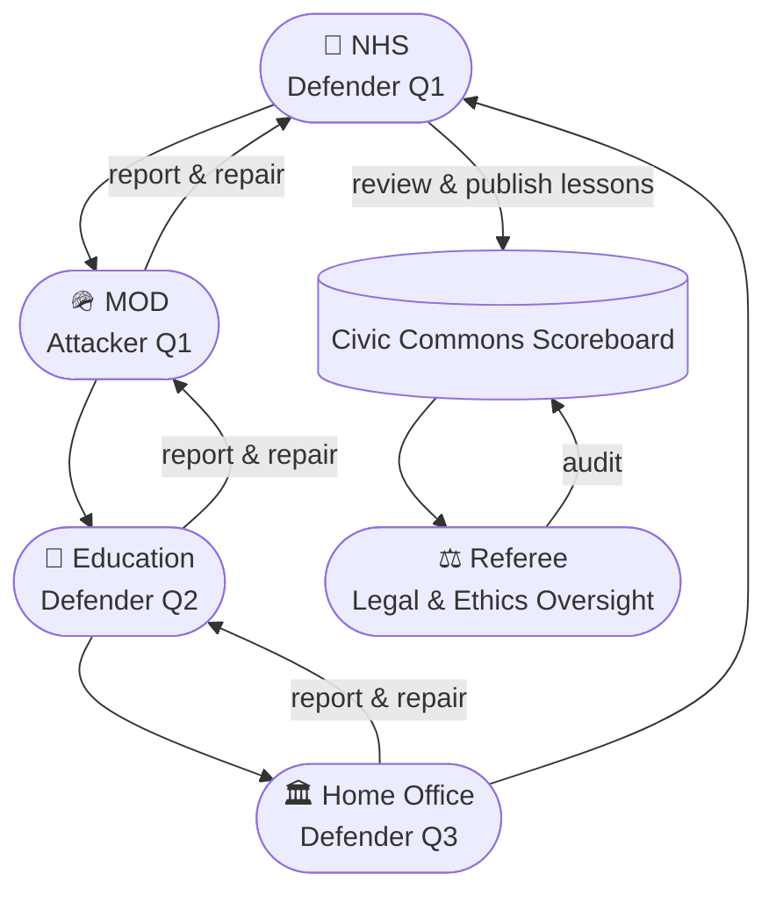

# 🛡️ PenTest Cup — Cooperative Security League  
**First created:** 2025-10-15 | **Last updated:** 2025-10-15  
*Turning network security into a friendly, low-stakes, high-learning civic sport.*

---

## 🧭 Orientation  
Most security work still happens behind sealed doors — reactive, anxious, and steeped in legal risk.  
This node proposes an **inter-service pentesting league**: a controlled, transparent rotation of security teams between departments, to find vulnerabilities *before* hostile actors do.  

Rather than shaming failure, the PenTest Cup reframes discovery as **teamwork, creativity, and civic care**.

---

## 🧩 Core Idea  

- **Rotating Defence:** Services exchange roles quarterly — NHS ↔ MOD ↔ Education ↔ Home Office — to test each other’s systems using synthetic or anonymised data.  
- **Known-Unknown Arena:** Every round uses a safe, pre-redacted dataset and controlled infrastructure mirror.  
- **Track the Fix, Not the Fault:** Points awarded for depth of discovery, clarity of reporting, and speed of remediation — not for concealment or blame.  
- **Public-Interest Shield:** Legal carve-out defining “friendly fire” in cross-service audits, removing tort exposure for verified league participants.  
- **Ethics Coach:** Survivor-rep or data-subject advocate ensures scope remains humane and no collateral harm occurs.  

---

## 🧩 Access & Recognition  

- **Open to All Levels:** Junior analysts, apprentices, and support staff participate alongside senior engineers. Each round doubles as informal training.  
- **Transferable Clearance:** Participants with live DBS, SC, or equivalent vetting can join across departments — the *same badge* counts everywhere.  
- **Civic Shareholder Principle:** All public-sector participants act on behalf of the same primary shareholder — *the public.* The Cup enshrines this legally and culturally.  
- **Community Gold Star System:** Lightweight recognition — digital stickers, internal app badges, small-grant prizes — issued for teamwork, integrity, and creativity.  
- **Lateral Entry Routes:** Contractors, students, and external allies can join under observer status once pre-vetted, expanding the knowledge pool.  

> 🏅 *People will defend what they helped build — especially if you tell them they did well.*

---

## 🧭 Sidebar: Legal Hackathon Prompt  

> **Challenge:** How can we embed “safe curiosity” into public-sector liability law?  
> Teams of lawyers, compliance officers, and coders draft model clauses for:  
> - benign intrusion exemptions  
> - time-boxed disclosure immunity  
> - mandatory post-breach learning logs  
>  
> Outcome: a ready-to-pilot **Public Curiosity Framework**.

---

## 🏆 Scoring Model  

| Metric | Description | Points |
|--------|--------------|--------|
| **Discovery Depth** | Quality and reproducibility of vulnerabilities found | 0–10 |
| **Repair Turnaround** | Time from report to verified patch | 0–10 |
| **Collaboration Spirit** | Clarity of communication with host team | 0–5 |
| **Ethical Adherence** | Zero collateral impact, full consent | 0–5 |
| **Innovation Bonus** | Novel tool or method demonstrated | +3 |

Top scores = annual *Civic Resilience Trophy* — awarded jointly to attacker + defender.

---

## 🕹️ Tournament Flow (mini-diagram)

> **Alt-text (diagram):** Departments rotate attacker/defender roles quarterly. Oversight referee ensures ethics and legality; the Commons scoreboard tracks learning, not casualties.

**Reading the play:**  
- Every quarter, roles rotate.  
- Each match produces a joint report: *findings → fix → shared lesson.*  
- The **Civic Commons Scoreboard** tracks progress and awards symbolic stars.  
- Referee layer guarantees fairness and anonymisation of sensitive results.

---

## 🌌 Constellations  
🛡️ 🏟️ 💡 ⚖️ 🌟 — Lives in the cooperation-through-transparency register; merges play, equity, and public recognition.

---

## ✨ Stardust  
pentesting, cybersecurity, cooperation, public sector, legal reform, safe curiosity, transferable clearance, recognition, resilience, civic gamification

---

## 🏮 Footer  

*PenTest Cup — Cooperative Security League* is a living node of the Polaris Protocol.  
It reframes inter-departmental security as a cooperative sport that rewards curiosity, empathy, and rapid repair instead of silence and liability fear.  

> 📡 Cross-references:  
> - [🏟️ Hackathon League](./🏟️_hackathon_league.md) — civic training framework  
> - [📓 Hackathon Playbook Companion](./📓_hackathon_playbook_companion.md) — replay and learning archive  
> - [🌍 Treaty for the English Internet](../../Big_Picture_Protocols/🧿_Watch_The_Watchers/🌍_treaty_for_the_english_internet.md) — governance context  

*Survivor authorship is sovereign. Containment is never neutral.*  

_Last updated: 2025-10-15_
