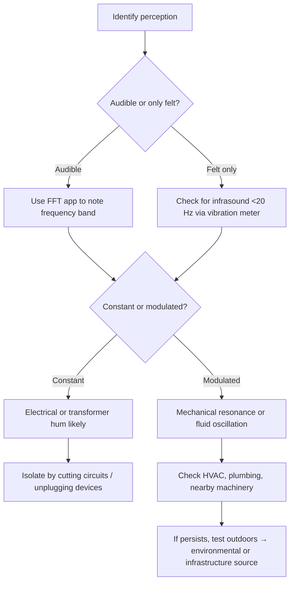

# 🛰️ Low-Frequency Hum — Structural & Environmental Diagnostic Log  
**First created:** 2025-10-21 | **Last updated:** 2025-10-21  
*Field observations of monotone vibration through solid structures causing physical symptoms.*

---

## 🧭 Orientation  
This log tracks low-frequency sound and vibration phenomena (20–120 Hz) perceptible through walls, floors, or objects.  
It helps distinguish **mechanical**, **electrical**, and **environmental** sources and document physiological effects such as headache, nausea, or ear pressure.

---

## 📋 Observation Checklist  

| Category | Indicators | Notes / Evidence |
|-----------|-------------|------------------|
| **Location** | Room / building section / materials in contact |  |
| **Perception type** | Heard / felt / pressure only |  |
| **Duration** | Continuous / intermittent / cyclic |  |
| **Time of day** | Start / stop times; pattern across days |  |
| **Vibration path** | Wall / floor / pipe / metal / furniture |  |
| **Pitch estimate** | Approx. Hz or note (A1 ≈ 55 Hz, etc.) |  |
| **Oscillation** | Steady / modulated / pulsing |  |
| **Equipment nearby** | HVAC, transformer, PC, fridge, water pump |  |
| **Power correlation** | Stops when mains off? |  |
| **Weather / external** | Wind / traffic / construction / trains |  |
| **Physiological** | Headache, pressure, dizziness, nausea |  |
| **Audio capture** | App used / FFT screenshot / decibel reading |  |

---

## ⚙️ Diagnostic Flow  

---

## 🔍 Preliminary Source Codes  

| Code | Category | Likely Source | Mitigation Test |
|------|-----------|----------------|-----------------|
| **LF-E01** | Electrical | Transformer / PSU / mains loop | Turn off circuits sequentially |
| **LF-M02** | Mechanical | Fan / pump / HVAC duct | Temporarily power down / decouple mounts |
| **LF-P03** | Plumbing | Flow resonance / water hammer | Run taps; listen for change |
| **LF-I04** | Infrastructure | Roadworks / substation / train | Note time & direction; contact local works |
| **LF-A05** | Acoustic environmental | Wind tunnel / building resonance | Change room or exit structure |
| **LF-U06** | Unidentified / mixed | Persistent cross-domain pattern | Continue log for 72 h |

---

## 🌌 Constellations  
🛰️ 🧭 👂 🪷 — field sensing, infrastructure resonance, embodied diagnostics, calm observation.

---

## ✨ Stardust  
infrasound, low-frequency hum, transformer vibration, infrastructure noise, field log, sensory mapping, environmental interference

---

## 🏮 Footer  
*🛰️ Low-Frequency Hum — Structural & Environmental Diagnostic Log* is a living node of the Polaris Protocol.  
It supports safe, methodical tracking of persistent resonance phenomena that may have health or environmental origins.

> 📡 Cross-references:  
> - [👾 Weirdness Screening → 🎛 Systematic_Patterns](../../👾_Weirdness_Screening/🎛_systematic_patterns.md)  
> - [🧭 System Governance → 🛰 Infrastructure Procurement](../../Big_Picture_Protocols/🌀_System_Governance/🛰️_Infrastructure_Procurement/README.md)  

*Survivor authorship is sovereign. Containment is never neutral.*  

_Last updated: 2025-10-21_
