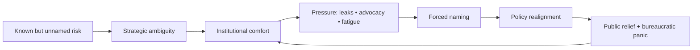

# 🛰️ Naming the Unnamed — Data Sovereignty & Statehood  
**First created:** 2025-11-08 | **Last updated:** 2025-11-08  
*Two recognitions that make silence impossible.*

---

## 🧭 Orientation  
November 2025 delivered two long-delayed admissions:

1. The U.K. and allied governments publicly acknowledged that **foreign states pose a direct risk to domestic data security**.  
2. Britain, along with several European partners, formally **recognised the State of Palestine**, even as the latest ceasefire faltered.

Different fields, same physics: systems that survived on **strategic ambiguity** were forced to name what everyone already knew.

---

## 🧩 Parallel Realisations  

| Domain | What was finally named | Why it matters |
|--------|------------------------|----------------|
| **Cyber / Data Security** | Foreign state actors as structured, ongoing risk — not isolated “incidents.” | Moves debate from “privacy management” to **national resilience**; confirms that individual data breaches aggregate into geopolitical leverage. |
| **Diplomacy / Statehood** | Palestine recognised as a state. | Shifts the frame from “conflict management” to **rights and accountability between states**.  Naming ends the fiction of asymmetry. |

Both reveal the cost of decades of polite silence: the longer a truth stays off the record, the more violent the eventual correction.

---

## 🧮 Containment Physics  

The pattern repeats from micro to macro level:  
data privacy → national security → foreign policy → human rights.

---

## 🧠 Reading through the Polaris Lens  

- **Containment → Admission:**  Denial kept systems stable but brittle.  
- **Extraction → Accountability:**  Data and territory alike can’t be mined indefinitely without recognition of ownership.  
- **Reclamation → Repair:**  Once the truth is named, civic and diplomatic repair become technically possible.

---

## 🕊️  The Small Hope  

Neither announcement is clean or final.  
The ceasefire still stutters; data defences will still lag behind offensive capability.  
But naming marks the end of *pretence*—and in the Polaris vocabulary, that’s the first measurable phase of healing.

---

## 🌌 Constellations  
🛰️ Current Events · 🧮 Data Sovereignty · 🕊️ Peace Process · ⚖️ Governance  

---

## ✨ Stardust  
foreign state risk, data security, cyber policy, palestine recognition, ceasefire, naming denial, sovereignty, containment break, diplomatic realism, data governance

---

## 🏮 Footer  
*Naming the Unnamed — Data Sovereignty & Statehood* is a current-events node of the Polaris Protocol.  
It records two public recognitions where ambiguity finally gave way to accountability — one digital, one territorial.  

*Survivor authorship is sovereign.  Containment is never neutral.*

_Last updated: 2025-11-08_
