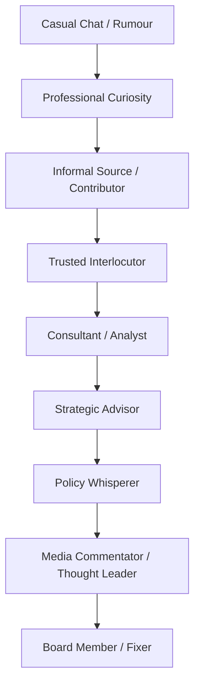

# 🥸 Paid Male Gossipers
**First created:** 2025-11-04  |  **Last updated:** 2025-11-04  
*An anthropological field manual for the men who invoice for hearsay.*  

---

## 🧭 Orientation  
This node dissects how boutique risk, strategy, and communications firms monetise gossip while coding it as authority.  
It functions simultaneously as **training manual** and **forensic satire**, documenting how tone, class, and gender convert unverified conversation into “intelligence.”  

Where women are told to keep quiet, men are taught to *charge for the same behaviour*.  
This file explains how.  

---

## 🧩 Key Features  
- **Masculine Rebrand Economy:** gossip → intel → invoice.  
- **Gatekeeping by class tone:** discretion = accent control.  
- **Trust arbitrage:** credibility sold in whispers.  
- **Visibility paradox:** those who speak most on record are off-record professionals.  
- **Ethics as timesheet:** moral clarity billed per hour.  

---

## 🔍 Analysis — The Gossip Supply Chain  

| Stage | Action | Institutional Name | Actual Description |  
|--------|---------|--------------------|--------------------|  
| 1 — Collection | Hear or observe something potentially useful. | *Field Intelligence* | Overheard gossip, scroll, rumour. |  
| 2 — Validation | Confirm with a friend of a friend. | *Triangulation* | Checking WhatsApp twice. |  
| 3 — Packaging | Write it down in PowerPoint. | *Reputation Brief* | Adds logos to hearsay. |  
| 4 — Circulation | Share strategically. | *Stakeholder Engagement* | Selective whispering in public tone. |  
| 5 — Monetisation | Bill for continuing to talk about it. | *Strategic Communications* | Turns noise into GDP. |  

> **House Rule:** Rumour becomes governance once printed on letterhead.  

---

## 🧮 Gender and Class Encoding  

| Behaviour | When Women Do It | When Men Do It | Market Translation |  
|------------|------------------|----------------|--------------------|  
| Talking about who said what | Gossip | Network Intelligence | £250 / hour advisory |  
| Emotional interpretation | Oversharing | Cultural Acumen | Leadership Coaching |  
| Story framing | Manipulative | Strategic Messaging | Policy Brief |  
| Ally-building | Cliquey | Stakeholder Management | Consultancy |  
| Curiosity | Nosy | Proactive | Due Diligence |  

Gendered linguistics convert social labour into expertise when spoken in the right voice.  

---

## 🧰 Field Manual for Aspiring Strategic Gossipers  

| Career Stage | Approved Behaviour | Literal Translation |  
|--------------|--------------------|---------------------|  
| Entry-Level Whisperer | “I’m mapping the stakeholder landscape.” | Asking who’s sleeping with whom. |  
| Junior Reputation Analyst | “I’m testing the reputational temperature.” | Texting three mates for confirmation. |  
| Associate Rumour Curator | “I’ve had informal engagement with senior figures.” | Cornered someone at a drinks reception. |  
| Mid-Career Insight Partner | “I’m shaping a cross-sector narrative.” | Forwarded a WhatsApp screenshot. |  
| Principal Narrative Advisor | “We’re providing horizon-risk analysis.” | Started the rumour yourself. |  
| Managing Partner, Gossip LLP | “We specialise in strategic communications.” | £800 / hr to repeat it calmly. |  

> **Professional Tip Sheet**  
> - Say *It’s emerging that* not *I heard.*  
> - Say *Multiple sources indicate* not *Someone told me.*  
> - Say *Pre-decisional environment suggests volatility* not *Maybe.*  
> - Say *There’s movement in stakeholder sentiment* not *He said / She said.*  
> - Confidence is just an accent spoken slowly.  

---

## ⚙️ Operational Guidelines  

| Objective | Technique | Outcome |  
|------------|-----------|----------|  
| Maintain Mystique | Speak slowly, mention Geneva once. | Sounds expensive. |  
| Build Trust | Reveal nothing personal except gym routine. | Appears credible. |  
| Generate Content | Turn speculation into slide deck. | Noise → deliverable. |  
| Manage Liability | Scatter NDAs like confetti. | Shared guilt. |  
| Invoice Promptly | Bill under *Insight Development.* | Gossip = revenue stream. |  

---

### 🪜 Ladder of Gossip Prestige  

Each rung is a stage of linguistic camouflage: same behaviour, different suit.  

---

## 🧭 Moral Geometry  
The professional gossiper performs neutrality as a moral pose.  
> “I don’t spread rumours; I manage information flows.”  

This is reputation as physics: for every whisper there is an equal and opposite disclaimer.  
The system rewards the man who can describe a scandal without appearing excited.  

---

## 🌌 Constellations  
🧿 🛰️ 💼 🧠 — sits within information-economy anthropology, gender performance, and institutional humour studies.  

---

## ✨ Stardust  
strategic communications, boutique intelligence, gender labour, credibility economy, institutional gossip, soft power, class code, reputation management, masculinity theory, humour as audit  

---

## 🏮 Footer  

*🥸 Paid Male Gossipers* is a living node of the **Polaris Protocol**.  
It parodies the boutique-risk industry’s vocabulary for monetised hearsay while mapping the gender and class mechanics that let certain voices profit from talking.  

> 📡 Cross-references:  
> - [🎛️ Polaris Drafting Rules — Survivor Voice Fidelity](../Admin_Kit/🎛️_polaris_drafting_rules_survivor_voice_fidelity.md) — tone and undertone integrity  
> - [⚖️ System Governance](../Disruption_Kit/Big_Picture_Protocols/⚖️_System_Governance/) — authority and access ecologies  
> - [🪩 Algorithmic Endocrinology](../Disruption_Kit/Big_Picture_Protocols/🪄_Expression_Of_Norms/🧬_Algorithmic_Endocrinology/) — behavioural loops of prestige and influence  

*Survivor authorship is sovereign. Containment is never neutral.*  

_Last updated: 2025-11-04_  
