# 🦁 Circle of Security Life  
**First created:** 2025-11-14 | **Last updated:** 2025-11-14  
*A systems-governance humour–serious node mapping the recursive career loops between policing, security, care, safeguarding, and back again.*

---

## 🛰️ Orientation  
This node captures a structural joke-with-teeth that emerges when looking at workforce patterns across the UK’s overlapping security–care–risk sectors.  
It is both satire and diagnosis: a way to describe the **recursive talent loop** where authoritarian-leaning, hyper-vigilant, or rule-fixated workers move between fields that share *watching, monitoring, and boundary-policing* as their core cultural behaviour.

This is not about individuals.  
This is about **structural recycling**.

---

## ✨ Key Features  
- Explains why certain personality types circulate through policing → security → care → safeguarding → policing.  
- Describes shared behavioural reflexes across these sectors.  
- Uses humour to articulate serious structural truths without naming persons or implying wrongdoing.  
- Includes a circular Mermaid diagram representing the loop.

---

## 🧿 Mermaid Diagram  

```mermaid
flowchart LR
    A["👮‍♂️ Policing (attempt)"] --> B["🛡️ Private Security"]
    B --> C["🏥 Care Sector"]
    C --> D["🧾 Safeguarding Roles"]
    D --> A
    style A fill:#f6f6f6,stroke:#555
    style B fill:#f6f6f6,stroke:#555
    style C fill:#f6f6f6,stroke:#555
    style D fill:#f6f6f6,stroke:#555
```

*A closed loop: different uniforms, same reflex spine.*

---

## 🧿 Analysis / Content  

### 1. The Loop (High-Level)  
The Circle of Security Life runs like this:

1. **Aspiring authoritarian personality tries policing**  
   Motivations vary: desire for order, hero-narratives, community standing, stability.  
   Police recruitment filters out the most extreme candidates (as it should).

2. **Rejected candidates drift into private security**  
   Lower barrier to entry.  
   Authority-adjacent identity.  
   Same uniforms, fewer constraints.  
   Culture often tolerates rigid or extreme temperament profiles.

3. **Burnout → Move into care sector**  
   Physical work.  
   Surveillance-based.  
   Highly routinised.  
   Clear hierarchies.  
   “I watch vulnerable people all day” is a transferable skill.

4. **Care → Safeguarding roles**  
   Vigilance instincts formalised.  
   Paperwork replaces patrol.  
   Institutional authority replaces visible authority.  
   Risk frameworks reward suspicion and boundary-enforcement.

5. **Safeguarding → Informal policing behaviours**  
   - defining “risk” 
   - escalating concerns  
   - interpreting distress as threat  
   - operating like quasi-police inside civilian structures

6. **Safeguarding → Policing (again)**  
   Some reapply.  
   Now with “experience.” 
   The loop closes.

---

### 2. Shared Reflexes Across All Sectors in the Loop  
Despite different job descriptions, these sectors share a behavioural spine:

- Watching bodies, moods, compliance  
- Evaluating risk with limited context  
- Hypervigilance rewarded  
- Discomfort with ambiguity  
- “Documentation as defence” 
- Loyalty inward, suspicion outward  
- Preference for hierarchy and rules  
- Interpreting transparency as threat

These reflexes migrate with the worker, forming a cultural loop.

---

### 3. Why the Loop Matters in a Post-Digital Landscape  
Digital information moves freely; reflexes do not.  
The loop shapes:

- safeguarding escalations  
- Prevent referrals  
- misread distress  
- inappropriate risk flags  
- oversurveillance of marginalised groups  
- punitive interpretations of vulnerability

It explains why some harmful behaviours persist unseen:  
the same instincts circulate through multiple systems.

---

## 🌌 Constellations  
🪆 Narrative Interference · 🧩 Systems Governance · 🪙 Power Typologies · 🛰️ Post-Digital Diagnostics  

---

## ✨ Stardust  
security loop, authoritarian drift, safeguarding reflexes, surveillance culture, risk behaviours, sector migration, workforce patterns, structural humour

---

## 🏮 Footer  
*Circle of Security Life* is a satirical–analytic Polaris node describing the recycling of surveillance-adjacent reflexes across the UK’s care, policing, security, and safeguarding sectors.  
It names no individuals. It identifies structural behaviours.  
_Last updated: 2025-11-14_
