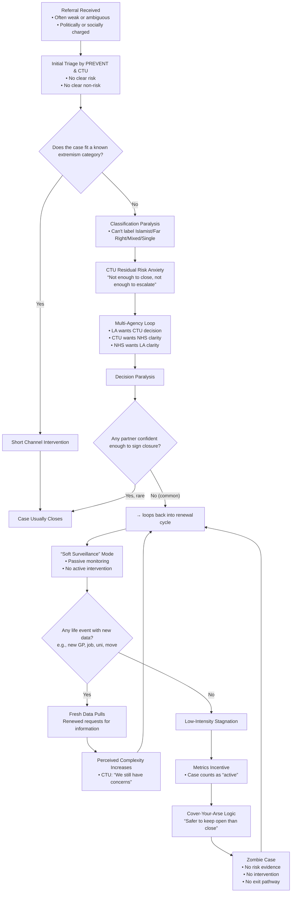

# 🧟‍♀️ Zombie Channel Case Neutralisation  
**First created:** 2025-11-20 | **Last updated:** 2025-11-20  
*How PREVENT cases become administratively undead — and how to neutralise them.*

## 🛰️ Orientation  
Some Channel cases are not “cases” anymore — they are **administrative phantoms**: kept alive by anxiety, metrics, and structural paralysis.  
This node documents **how zombie cases form**, **how to diagnose one**, and critically **how to neutralise one** using survivor-centred governance logic.

Zombie cases are not evidence of risk; they are evidence of **institutional fear**.

## ✨ Key Features  
- How Channel cases become “undead”  
- Flowchart of the zombie lifecycle  
- 10-point diagnostic checklist  
- Neutralisation strategies (forensic + procedural)  
- Survivor-fidelity interpretation of PREVENT incentives  

## 🧿 Analysis — How Zombie Cases Form  
Zombie cases arise when:

- PREVENT or CTU cannot justify closing a weak referral  
- Multi-agency partners refuse to take responsibility  
- Case ownership changes repeatedly  
- No new evidence appears, but renewal continues  
- Bureaucratic incentives reward *keeping* cases active  
- Life events (not behaviour) trigger new information pulls  
- Gendered or racialised biases undermine closure thresholds  
- Risk-aversion outweighs safeguarding logic

A zombie case is one where **nothing is happening**,  
**nothing needs to happen**,  
but **the file will not die**.

## 🧟‍♀️ Zombie Case Lifecycle (Mermaid)

## 🧟‍♀️ Diagnostic Checklist — Is This a Zombie Case?

Tick everything that applies.

1. **No agency can explain why it is still open.**  
2. **No new behaviour** triggers renewal.  
3. CTU uses **vague phrases** (“residual risk”, “ongoing concerns”).  
4. PREVENT officers have **changed multiple times**.  
5. Partners receive **repetitive, template information requests**.  
6. Agencies **disagree** on who wants it open.  
7. **No intervention** is ever offered.  
8. Renewal coincides with **life events**, not risk.  
9. Case exceeds **6–12 months** with no action.  
10. Nobody will commit to **closure criteria** in writing.

**4+ indicators:** zombie case likely.  
**7+ indicators:** zombie case certain.

## 🔥 Neutralisation Strategy — How to Kill a Zombie Case  

### 1. 🪓 Narrative Neutralisation  
- Request explicit risk rationale for each renewal.  
- Ask: “Which precise behaviour meets the Channel threshold at this time?”  
- Require them to state **criteria for closure**.  
- Force corrections to factual inaccuracies in writing.  
- Provide succinct, factual updates that contradict boilerplate claims.

### 2. 🧼 Procedural Neutralisation  
- Ask: “Who is the decision-maker responsible for closure?”  
- Log every renewal with: “What new evidence has triggered this?”  
- Ensure minutes state: “No new risk indicators identified.”  
- Ask for the legal gateway enabling continued monitoring.  
- Ask each partner privately & publicly: “Is your agency recommending closure?”

### 3. 🧊 Dataflow Neutralisation  
- Correct inaccurate records under GDPR Article 5(1)(d).  
- Request confirmation that **no new incidents** have been reported.  
- Ask partners to stop routine updates **not legally required**.  
- Submit SARs to identify stale or inaccurate circulating data.

### 4. ⚖️ Burden-Shifting Neutralisation  
- Written confirmation of “no risk behaviour” transfers liability.  
- Ask CTU/PREVENT to specify what intervention is proposed.  
- Ask for the risk owner to be named.  
- Request a closure timeline consistent with statutory guidance.

### 5. 🕯 Exit-Path Construction  
- Summarise protective factors (short, factual).  
- Request the panel to document: “Protective factors now outweigh any concern.”  
- Present a face-saving off-ramp for closure.

## 🌌 Constellations  
🧠 🛰️ 🧿 🪓 🧟‍♀️ — diagnostic mapping, multi-agency logic, containment breakpoints, counter-surveillance clarity, survivor-led neutralisation.

## ✨ Stardust  
channel, prevent, safeguarding, containment, multi-agency, ct policing, neutralisation, zombie case, diagnostics, governance anxiety

## 🏮 Footer  
*🧟‍♀️ Zombie Channel Case Neutralisation* is a living node of the **Polaris Protocol**.  
It documents how PREVENT cases can become administratively undead and provides survivor-led strategies for narrative, procedural, and dataflow neutralisation.

> 📡 Cross-references:
> - Metadata Sabotage Network — interference and containment logic  
> - Governance & Prevent — structural incentives analysis  
> - Survivor Tools — countermeasures and defence

*Survivor authorship is sovereign. Containment is never neutral.*

_Last updated: 2025-11-20_
