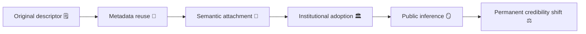

# 🧠 Attribution Inversion — When Someone Else’s Clinical Vocabulary Becomes Yours  
**First created:** 2025-11-11 | **Last updated:** 2025-11-11  
*Language drift as institutional misdiagnosis.*

---

## 🧭 Orientation  

Institutions recycle language.  
Clinical or behavioural descriptors first applied to one person — “manipulative,” “obsessive,” “attention-seeking” — can silently transfer to another through notes, training data, or shared metadata.  
This is **attribution inversion**: the moment when another person’s diagnostic frame becomes your reputation.  

The effect is profound.  
It converts historical record into personality, and personality into containment logic.

---

## ⚙️ Mechanism of Inversion  

| Phase | Trigger | Example | Outcome |
|:--|:--|:--|:--|
| **1️⃣ Proximity of records** | Victim and offender records stored in shared schema. | Prison health and community case notes cross-referenced. | Adjectives bleed between files. |
| **2️⃣ Semantic reuse** | Staff reuse templated phrasing. | “Displays controlling behaviour” pasted into wrong profile. | False continuity of character. |
| **3️⃣ Narrative migration** | Descriptive tone imported into institutional summaries. | Media or academic reporting uses same adjectives. | Label gains authority. |
| **4️⃣ Feedback consolidation** | New actors read the inherited file. | HR, ethics, or safeguarding panels rely on descriptors. | Original error gains procedural life. |

---

## 🧩 Flow of Containment  

The word outlives its speaker — and changes ownership.

---

## 🪞 Governance Interpretation  

- **Attribution inversion is narrative laundering.**  
  It moves stigma without altering the dataset.  
- **Institutional empathy decays linguistically:** care language becomes control language.  
- **Correction requires confession:** acknowledging that descriptors are not neutral metadata but living cultural artefacts.  

---

## 🧰 Corrective Strategies  

1. **Lexical lineage audit** — trace origin of recurring descriptors across record sets.  
2. **Descriptor quarantine** — flag inherited adjectives for contextual review.  
3. **Semantic timestamping** — append “first use” and “source” metadata to qualitative fields.  
4. **Counter-narrative footnotes** — attach survivor commentary to institutional language.  
5. **Linguistic parity review** — compare adjectives applied to different roles in same incident.  

---

## 🧮 Example: The “Manipulative” Tag  

| Context | Original Use | Inverted Use | Governance Effect |
|:--|:--|:--|:--|
| **Clinical** | “Displays manipulative behaviour” (patient, male offender). | “Manipulative” descriptor reused for complainant. | Victim credibility reduced. |
| **Academic** | “Difficult to supervise” (staff misconduct report). | “Overly assertive” (student complaint). | Role inversion reframed as personality flaw. |

---

## 🌌 Constellations  

🧠 💬 🪞 🎭  

Attribution Inversion pairs with *💬 Semantic Echo* and *🎭 Reputation as Governance*.  
Together they show how language becomes infrastructure.

---

## ✨ Stardust  

attribution inversion, clinical language, metadata bias, semantic drift, survivor credibility, institutional discourse, narrative containment, record inheritance  

---

## 🏮 Footer  

*🧠 Attribution Inversion — When Someone Else’s Clinical Vocabulary Becomes Yours* is a living node of the Polaris Protocol.  
It explores how words migrate faster than justice — and how the wrong adjectives can outlive the truth.  

> 📡 Cross-references:  
> - [💬 Semantic Echo — How Offender Language Re-Enters Institutional Notes](../📚_Narrative_Management/💬_semantic_echo_how_offender_language_re_enters_institutional_notes.md)  
> - [🪞 Narrative Drift — When Systems Inherit the Wrong Story](../📚_Narrative_Management/🪞_narrative_drift_when_systems_inherit_the_wrong_story.md)  
> - [🎭 Reputation as Governance — How Institutions Script Their Own Credibility](../📚_Narrative_Management/🎭_reputation_as_governance_how_institutions_script_their_own_credibility.md)  

*Survivor authorship is sovereign. Containment is never neutral.*  

_Last updated: 2025-11-11_
