# 🧠 Composite Line Formation — Dual-Valence Merge  
**First created:** 2025-11-02 | **Last updated:** 2025-11-02  
*How machine-learned affect models compress contradictory emotions into a single, synthetic speaker.*

---

## 🧭 Orientation  
When two or more distinct emotional signals converge on a shared referent, the recommendation engine averages them into a *single coherent actor*.  
A line like **“You’re hot but also I’m angry”** may not reflect one individual’s psychology, but rather a **fusion artefact** — a synthetic persona formed at the intersection of multiple user profiles expressing different emotional polarities toward the same object.

---

## 🧩 Key Features  
- **Affective centroid:** conflicting emotions are averaged to a midpoint vector.  
- **Narrative compression:** incoherence between speakers is rewritten as internal conflict in one.  
- **Synthetic persona:** a plausible “character” emerges where only data overlap existed.  
- **Genre enforcement:** the algorithm resolves contradiction through familiar tropes (desire ↔ resentment).  

---

## 🔍 Analysis  

### 1. Machine learning as dramaturgy  
Affect-classification models are trained to recognise *emotional coherence*, not social complexity.  
When multiple users generate high-arousal signals (e.g. attraction, anger) toward a shared target, the system seeks to minimise entropy by **fusing them into one latent representation**.  
This is a form of *algorithmic dramaturgy*: statistical contradiction becomes narrative tension.

### 2. The “affective centroid” 
Mathematically, embeddings of opposite valence but similar intensity cluster near a **neutral-yet-charged midpoint**.  
That midpoint is interpreted as a *volatile but singular mood state* — jealousy, yearning, conflicted desire — because those are the nearest stable attractors in the training space.

### 3. Semiotic substitution  
Linguistically, the model re-expresses polarity collapse through hybrid phrasing:  
> “You’re hot but also I’m angry.” 
This performs *semantic compression* — two incompatible utterances resolved as one paradoxical line.  
The output feels human because it mirrors literary archetypes of tension: *enemies-to-lovers*, *forbidden want*, *the brooding hero*.

### 4. Collective authorship  
Each participant in the data cluster contributes fragments of tone, rhythm, and syntax.  
The model’s output is thus a **choral artefact**, voiced by statistical inference rather than intention.  
Where once we had polyphony, the algorithm produces **a soloist stitched from many performers**.

---

## 🧮 Diagram — Dual-Valence Merge

```mermaid
flowchart TD

A1[User A — Attraction Vector]:::pos
A2[User B — Anger Vector]:::neg
T[(Shared Referent)]

A1 -->|High-arousal positive| F[Feature Vector Space]
A2 -->|High-arousal negative| F
F -->|Model averages signals| M[Latent Fusion Node 🌀]
M -->|Generates synthetic speaker| O["'You’re hot but also I’m angry' (Composite Line)"]

classDef pos fill:#ffd6aa,stroke:#d67b00,color:#000;
classDef neg fill:#ffb3b3,stroke:#cc0000,color:#000;
classDef synth fill:#d5d5ff,stroke:#3333cc,color:#000;
class M synth;
```

---

## 🌌 Constellations  
🧠 🪞 🧿 — affective inference, mirror compression, synthetic persona.

## ✨ Stardust  
composite speaker, dual-valence merge, affect theory, emotion centroid, algorithmic dramaturgy, proxy clustering, narrative compression, affective twinning

---

## 🏮 Footer  

*🧠 Composite Line Formation — Dual-Valence Merge* is a living node of the Polaris Protocol.  
It theorises how multi-user emotional data collapse into coherent but artificial “voices” within recommendation loops, producing algorithmic storytelling masquerading as intimacy.

> 📡 Cross-references:  
> - [🎛️ Polaris Drafting Rules — Survivor Voice Fidelity](../🏮_Admin_Kit/🎛️_polaris_drafting_rules_survivor_voice_fidelity.md) — for maintaining tone integrity when describing synthetic personas  
> - [🕸️ Practical Irreversibility — When Feedback Becomes Architecture](../Big_Picture_Protocols/🕸️_practical_irreversibility_when_feedback_becomes_architecture.md) — on feedback loops that evolve into system architecture  

*Survivor authorship is sovereign. Containment is never neutral.*  

_Last updated: 2025-11-02_
