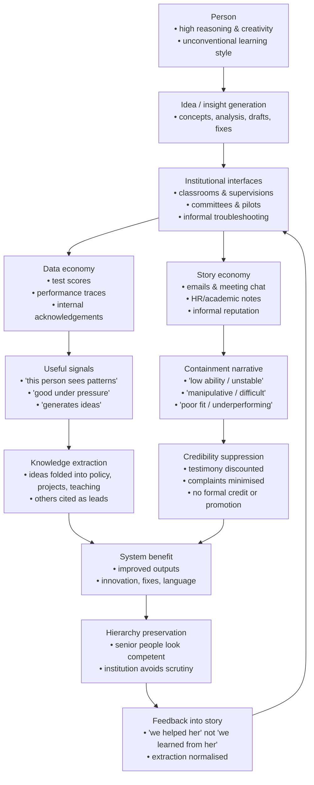

# 🧠 Extraction Loop — Data vs Story  
**First created:** 2025-11-08 | **Last updated:** 2025-11-08  
*A sketch of how systems can mine someone’s intellect while narrating them as “low ability”.*  

---

## 🧭 Orientation  
This node maps how two things can coexist:  
1. Systems repeatedly *use* a person’s creative / analytical capability.  
2. The same systems maintain a story that the person is “stupid”, “manipulative”, or “not very capable”.  

The contradiction is resolved not by truth, but by power: data are used quietly; story is used publicly.  

---

## 🔄 Extraction Loop — Diagram  

---

## 🌌 Constellations  
Linked with:  
- 🧠 Psychological Containment  
- 🪆 Narrative Interference  
- 📡 Data Misfit & Twin Profiles  

---

## ✨ Stardust  
knowledge extraction, reputation management, data vs narrative, credibility suppression, survivor authorship  

---

## 🏮 Footer  

*Extraction Loop — Data vs Story* is a living node of the Polaris Protocol.  
It documents how intellect can be mined while credibility is suppressed, forming the left half of the Extraction ↔ Reclamation cycle.  

> 📡 Cross-references:  
> - [🧩 Counter-Extraction Loop — Reclaiming Authorship](./🧩_counter_extraction_loop_reclaiming_authorship.md) — the recovery and repair path.  
> - [👁️‍🗨️ Witness Historical Casefiles](../Disruption_Kit/Big_Picture_Protocols/🫀_Our_Hearts_Our_Minds/👁️‍🗨️_Witness_Historical_Casefiles.md) — evidential anchors and testimonial parallels.  

*Survivor authorship is sovereign. Containment is never neutral.*  

_Last updated: 2025-11-08_
