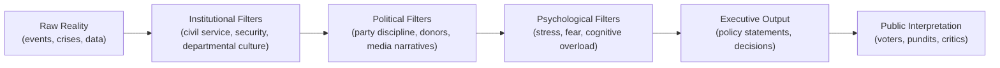

File: 🧠_political_black_box_logic.md

# 🧠 Political Black Box Logic  
**First created:** 2025-11-16 | **Last updated:** 2025-11-16  
*Why executive decision-making feels incoherent, unprincipled, or chaotic — and why it’s the system, not the person inside it.*

---

## 🛰️ Orientation  
Modern executive power is not transparent, rational, or linear.  
It is a **black box** — a system that takes in contradictory, politically filtered, emotionally loaded inputs and outputs decisions that frequently misrepresent the leader’s actual values.

This matters because citizens routinely misdiagnose “bad leadership” or “authoritarian intention” when the underlying issue is **structural distortion**.  
Polaris treats black-box logic as a major driver of democratic drift and public confusion.

---

## ✨ Key Features  
- Executive decisions emerge from **institutional inputs**, not personal values.  
- Information is filtered through **civil service incentives, media climate, party discipline, and security briefings**.  
- The system **overwhelms**: cognitively, emotionally, structurally.  
- Black box logic produces **incoherent policy**, **moral drift**, and **risk-heavy outputs**.  
- Citizens misattribute structural distortion to **individual malice** or **ideological betrayal**.  

---

## 🧿 Analysis / Content  

### 🌓 1. Why Executives Become Black Boxes  
Executives operate inside a machine built on:

- **information compression** → briefings boiled down to sanitised bullet points  
- **asymmetric pressures** → media fear, donors, civil service caution, party factions  
- **crisis triage loops** → every issue arrives labelled “urgent”  
- **cognitive overload** → no human can hold 12 policy domains simultaneously  
- **emotional erosion** → fear-based inputs reshape moral reasoning  

The result is a system where **inputs contradict each other** so intensely that the output cannot reflect the leader’s original convictions.

---

### ⚙️ 2. The Black Box Pipeline  

The public only sees **F**.  
The leader experiences **D**.  
Nobody sees the whole thing.

---

### 🧩 3. What Black Box Logic Produces  

#### **a) Incoherent Policy**  
When the inputs contradict each other, so does the output.  
This looks like moral inconsistency; it is structural inconsistency.

#### **b) Moral Drift**  
Not because leaders stop caring —  
but because the machine assigns **catastrophic risk** to any deviation from the “safe” path.

#### **c) “Strongman” Outputs**  
Fear-driven briefings push toward:

- securitisation  
- emergency framing  
- rapid centralisation  
- pre-emptive policing  

No authoritarian personality required —  
just a psychologically overloaded executive.

#### **d) Public Misinterpretation**  
Citizens assume:

- “They’ve lost their values.”  
- “They’ve betrayed us.”  
- “They’re hiding something.”  

When the truth is simpler and more devastating:

> **The system bends the person faster than the person can bend the system.**

---

### 🔦 4. Why Values-Driven Leaders Fare Worse  
People who are:

- moral  
- trauma-informed  
- justice-oriented  
- emotionally literate  
- minority-background  
- idealistic  

…are the most vulnerable to black-box distortion.

Because they:

- sense contradictions more acutely  
- feel responsibility more heavily  
- perceive harm more precisely  
- try to act ethically in a system that does not permit it  

The system punishes the morally awake.

---

### 🧭 5. Core Polaris Claim  
> **Authoritarian drift does not require an authoritarian leader —  
only a leader trapped inside a system built to distort moral outputs.**

The executive black box produces concentration of power even when the person inside does not desire it.

---

### 🧷 6. Implications for Democratic Design  

- **Hyper-centralised executives** are inherently unstable.  
- Leadership failures are often **systemic properties**, not personal failings.  
- Reform requires **distributed executive models**, not “better leaders.”  
- Citizens need literacy in **structural distortion**, not personality politics.

Crosslinks:  
- 🧱 *cabinet-led_collective_executive_models_for_the_uk*  
- 🧩 *distributed_executive_governance*  
- 🔧 *democratic_resilience_architecture_for_21st_century_britain*

---

## 🏮 Footer  
**Political Black Box Logic** is a living node of the Polaris Protocol.  
It contributes analysis on *executive cognition, institutional distortion, and democratic drift*, providing a foundation for system redesign and future Polaris governance frameworks.
