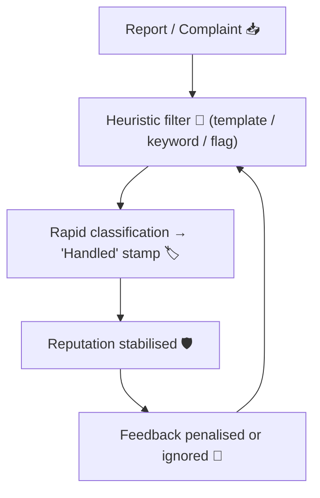

# 🧠 System 1 Governance — Bureaucratic Fast-Thinking and Reputational Harm  
**First created:** 2025-11-10 | **Last updated:** 2025-11-10  
*Reflex as policy ⸺ speed as virtue.*

---

## 🧭 Orientation  

> “System 1 thinking is fast, intuitive, and emotional; System 2 is slower, more deliberative, and logical.”  
> — Daniel Kahneman, *Thinking Fast and Slow*

When bureaucracies run on depleted attention and political urgency, **System 1 governance** emerges — decisions made through pattern recognition, heuristics, and institutional mood.  
Where survivors, whistle-blowers, or minorities enter the system, reflexive containment substitutes *plausibility for proof.*

---

## ⚖️ Visual Comparison — System 1 vs System 2 Governance  

| 🧠 Cognitive Mode | ⚙️ Administrative Expression | 🪞 Governance Outcome |
|:------------------|:-----------------------------|:---------------------|
| **System 1 — Fast** | Auto-flag, template, keyword triage | Rapid closure; credibility anchored in reputation |
| Intuitive, affective | Managerial hunch validated by precedent | “Handle the noise before it spreads.” |
| **System 2 — Slow** | Manual review, cross-check, contextual analysis | Reflective decision; accountability anchored in evidence |
| Deliberative, metacognitive | Multi-source verification | “Understand before acting.” |

🧩 *System 1 optimises for stability; System 2 optimises for truth.*

---

## 🧩 Core Mechanism  

| Human Cognition | Bureaucratic Analogue | Typical Output |
|-----------------|-----------------------|----------------|
| Fast intuition | Template workflow / auto-classification | “Pattern recognised → standard response.” |
| Emotion / heuristic | Reputation logic / precedent bias | “Protect institution → contain anomaly.” |
| Cognitive fatigue | Under-resourced admin | “Tick the box → move on.” |

System 1 governance thrives where dashboards replace judgement and “resolution speed” becomes a proxy for care.

---

## 🧮 Containment Loop  

*Outcome → a self-reinforcing loop of credibility bias.*

---

## 🪞 Case Schema — Reputational Substitution  

When a survivor remains articulate after harm, System 1 misreads coherence as manipulation.  
Competence becomes defiance; clarity becomes threat.  

> “If you are calm, you must be calculating; if you are angry, you must be unstable.”

---

## ⚙️ Operational Symptoms  

1. **Template dominance** — identical phrasing across case notes.  
2. **Premature closure** — outcomes decided before full review.  
3. **Emotional displacement** — distress labelled as aggression.  
4. **Authority anchoring** — hierarchy > evidence.  
5. **Automation confidence** — machine output treated as fact.  

---

## 🧰 Mitigation Matrix  

| 🧩 Layer | 🛠️ Intervention | 💬 Description |
|----------|----------------|----------------|
| **Cognitive** | “Slow-thinking” checkpoints | Mandatory pause before closure; require a second question. |
| **Procedural** | Second-review audits | Random sample of ‘not upheld’ cases for System 2 review. |
| **Cultural** | Reputation vs truth training | Reframing accuracy as institutional care, not threat. |
| **Technical** | Algorithmic explainability | Require interpretable decision logs for automated scoring. |

---

## 📊 Indicators of Improvement  

- Reduced template phrasing in closures.  
- Longer but more accurate resolution times.  
- Documented reversals after slow review.  
- Staff report lower fear of blame for “slow cases.”  

---

## 🌌 Constellations  

🧠 🧩 🛰️ ⚖️  

System 1 Governance sits where cognitive bias, system architecture, signal-routing, and legal accountability intersect.

---

## ✨ Stardust  

system 1 thinking, fast governance, reputational harm, institutional bias, containment, administrative heuristics, credibility economy, survivor credibility, bureaucratic reflex, governance diagnostics

---

## 🏮 Footer  

*System 1 Governance — Bureaucratic Fast-Thinking and Reputational Harm* is a living node of the Polaris Protocol.  
It maps how cognitive shortcuts and reputational anxiety harden into systemic containment, and offers handles for slowing institutions down long enough to tell the truth.

> 📡 Cross-references:  
> - [System_Governance](../System_Governance/) — diagnostics and audit tools for institutional logic  
> - [Containment_Studies](../Containment_Studies/) — typologies of suppression and inversion  
> - [Disruption_Kit/Refusal_Scripts](../Disruption_Kit/Refusal_Scripts/) — language for pushing back against fast closures  

*Survivor authorship is sovereign. Containment is never neutral.*  

_Last updated: 2025-11-10_
