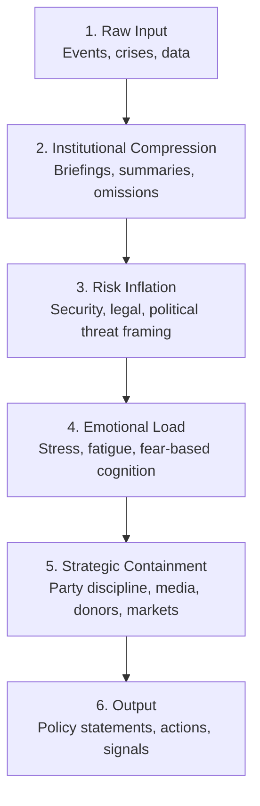

File: 🧠_the_black_box_of_executive_power.md

# 🧠 The Black Box of Executive Power  
**First created:** 2025-11-16 | **Last updated:** 2025-11-16  
*How Prime Ministers and executive leaders actually process information — and why the decision loop becomes structurally distorted, regardless of individual morality.*

---

## 🛰️ Orientation  
This node examines **how** executive decision-making happens inside a modern state:  
not the politics, not the personality, but the *actual cognitive workflow* of a PM trapped inside a hyper-centralised, crisis-heavy system.

It is a companion node to:  
- 🧠 *political_black_box_logic* (macro pattern)  
- 🧩 *distributed_executive_governance* (structural alternative)  

This one is the **mechanics**: the gears inside the black box.

---

## ✨ Key Features  
- Breaks down the PM’s decision loop into discrete stages.  
- Uses systems analysis to illustrate where and how distortion enters.  
- Demonstrates why “value-driven leadership” collapses under pressure.  
- Shows how fear, overload, information bottlenecking and timing shape political outputs.  
- Provides a Polaris model for diagnosing executive failure as **systemic**, not personal.

---

## 🧿 Analysis / Content  

### 🔩 1. The Executive Decision Loop: Overview  
A PM’s decision-making cycle is neither free nor rational.  
It flows through **six constraint-heavy stages**:

1. **Input Arrival**  
2. **Filtering & Compression**  
3. **Risk Inflation**  
4. **Emotional Processing**  
5. **Strategic Containment**  
6. **Public Output**

Each stage introduces its own distortions.

---

### ⚙️ 2. The Full Decision Loop  

Distortion occurs **at every single stage**, and compounds.

---

### 🧩 3. Stage-by-Stage Breakdown  

#### **1. Raw Input (Reality itself)**  
A PM receives dozens of simultaneous crisis-signals across:

- economics  
- health  
- welfare  
- policing  
- education  
- immigration  
- tech  
- foreign policy  

No human can process the full complexity.

---

#### **2. Institutional Compression**  
Departments compress thousands of pages of detail into:

- “lines to take”  
- bullet-point briefings  
- risk summaries  
- legal constraints  
- urgency ratings  

This is the **first distortion**, and often the largest.

Important nuance is lost because:

- there's no time  
- there’s no bandwidth  
- there's political incentive to simplify  

---

#### **3. Risk Inflation**  
Security briefings typically err on:

- “worst-case scenario”  
- “protect institutional reputation”  
- “avoid blame”  
- “assume threat until disproven”  

Legal teams do the same:

- “avoid judicial review”  
- “minimise liability”  
- “protect ministerial accountability”

Together, they create **catastrophic-thinking pressure**.

This is why even non-authoritarian leaders drift toward securitisation.

---

#### **4. Emotional Load**  
Executives are always:

- underslept  
- overbriefed  
- public-facing  
- responsible for lives  
- managing 10 simultaneous fires  
- absorbing constant blame  
- carrying surveillance anxiety themselves  
- emotionally overloaded  

Fear and overload shrink moral horizons.

Not because the PM is bad —  
because **humans under extreme stress lose nuance**.

---

#### **5. Strategic Containment**  
Even if the PM *wants* to act ethically, they hit:

- party discipline threats  
- donor pressure  
- media storms  
- economic panic  
- coalition dynamics  
- “optics”  
- civil service caution  

This is the stage where **moral intention collapses into political pragmatism**.

---

#### **6. Output (What the public sees)**  
By the time a decision emerges, it reflects:

- political incentives,  
- institutional fear,  
- legal caution,  
- emotional burnout,  
- fragmented information,  
- and half a dozen risk narratives,  

**NOT** the leader’s true values.

The public misreads this as hypocrisy or authoritarian intention.  
Polaris reads it as:  
> **The inevitable product of an overloaded cognitive system.**

---

## 🧭 4. Why This Loop Produces Drift  
Authoritarian drift looks like:

- increasing centralisation,  
- emergency language,  
- rushed decisions,  
- prioritising control over nuance.  

All of this is **baked into the loop itself**.

Fear + overload + filtered information → “Safety via control”.

This is not ideology.  
It is physics.

---

## 🧨 5. Why Good Leaders Break Faster  
People who are:

- emotionally sensitive  
- justice-oriented  
- minority-background  
- idealistic  
- trauma-informed  
- intellectually rigorous  

…are *more* vulnerable to collapse in this loop.

They experience the distortions as **moral pain**,  
not as “just politics”.

They bend until they break.

---

## 🔧 6. Implications for Reform  
The loop can only be fixed by:

- distributing executive power  
- reducing information bottlenecks  
- slowing the pace of decision-making  
- removing the cult of individual leadership  
- embedding internal challenge  
- shifting from personality-led to portfolio-led governance  

Crosslinks:  
- 🧩 *distributed_executive_governance*  
- 🧱 *cabinet-led_collective_executive_models_for_the_uk*  
- 🔧 *democratic_resilience_architecture_for_21st_century_britain*  

---

## 🏮 Footer  
**The Black Box of Executive Power** provides Polaris with a diagnostic toolkit  
for understanding why leaders fail, why systems distort intention,  
and why concentrated executive power is incompatible with human cognition  
and democratic resilience.
