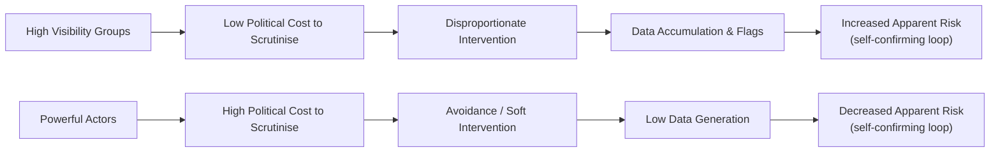

File: 🧩_asymmetric_democratic_policing.md

# 🧩 Asymmetric Democratic Policing  
**First created:** 2025-11-16 | **Last updated:** 2025-11-16  
*Why the state “over-polices” some groups and “under-polices” others — and how these asymmetries destabilise democratic legitimacy and accelerate drift.*

---

## 🛰️ Orientation  
In every democracy, policing and monitoring power is distributed **asymmetrically**:

- minor left-wing collectives → *high scrutiny*  
- racialised groups → *high scrutiny*  
- protest movements → *high scrutiny*  
- migrant communities → *high scrutiny*  
- vulnerable individuals → *high scrutiny*  

but meanwhile:

- far-right actors → *comparatively low scrutiny*  
- media-aligned pressure groups → *low scrutiny*  
- wealthy networks → *low scrutiny*  
- government-adjacent institutions → *low scrutiny*

This node examines why asymmetry is not an “error” — it is a **structural outcome** of political incentives, institutional fear, and the mismatched distribution of state attention.

It links to:  
- 🧯 *prevent_as_political_atomisation_engine*  
- 🧷 *culture_war_risk_logic_in_uk_public_institutions*  

---

## ✨ Key Features  
- Explains the structural logic behind uneven policing.  
- Shows how resource scarcity and reputational fear shape enforcement intensity.  
- Highlights why low-risk groups receive disproportionate attention.  
- Demonstrates why high-harm actors can evade scrutiny.  
- Frames asymmetry as a democratic vulnerability, not an individual failure.

---

## 🧿 Analysis / Content  

### 🧨 1. The Principle: Risk ≠ Scrutiny  
The state does *not* police based on **objective risk**.  
It polices based on:

- **visibility**,  
- **political salience**,  
- **narratives already circulating**,  
- **ease of intervention**,  
- **institutional habit**,  
- **political cost**,  
- **media threat**,  
- **public pressure**.

This ensures asymmetry from the start.

---

### 🏛️ 2. Who Gets the Most Scrutiny — and Why  
Certain groups receive intense monitoring because they are:

- accessible  
- low-powered  
- symbolically magnifiable  
- politically convenient  
- cheap to regulate  
- unlikely to fight back  

Examples include:

- climate protestors  
- left-wing student groups  
- Muslim communities  
- Black youth  
- activists  
- disabled claimants  
- neurodivergent people  
- traumatised individuals  
- migrants  

These groups are **easy to police** and **politically “safe” to target**.

---

### 👑 3. Who Gets Minimal Scrutiny — and Why  
Powerful groups often receive less attention because they are:

- lawyered  
- wealthy  
- media-protected  
- politically aligned  
- socially networked  
- reputationally dangerous to confront  
- embedded within institutional hierarchies  

Examples include:

- far-right commentators  
- billionaire-backed networks  
- veteran political operatives  
- legacy media organisations  
- donor-linked lobby groups  

Challenging these groups produces **institutional backlash**.

---

### 🔍 4. The Asymmetry Pipeline  

Asymmetry reinforces itself.  
Scrutiny creates data; data creates “evidence” of risk.

---

### 🧩 5. Why the Left Gets Over-Policed  
Left-wing groups tend to:

- challenge economic structures,  
- protest loudly,  
- disrupt business or government,  
- lack major media defenders,  
- be internally diverse,  
- and be politically unfashionable.

This creates:

- rapid referrals  
- heavy monitoring  
- disproportionate arrest patterns  
- misinterpretation loops  
- pre-emptive criminalisation  

Even when the actions are mild or symbolic.

---

### 🧩 6. Why the Far-Right Gets Under-Policed  
The far-right benefits from:

- alignment with culture-war narratives  
- access to existing media platforms  
- mainstreamed rhetoric  
- institutional whiteness  
- being framed as “public sentiment”  
- strategic ambiguity  
- political usefulness  

This leads to:

- slow referrals  
- under-enforcement  
- minimisation of risk  
- post-hoc rationalisation of non-intervention  
- false equivalence with left activism  

The danger is not just moral.  
It is **structural**.

---

### 🎭 7. The Cost of Asymmetric Policing  
Asymmetry produces:

- reputational damage to marginalised groups  
- inflated data trails  
- chronic fear of state gaze  
- collapse of trust  
- civic disengagement  
- false narratives of “left extremism”  
- impunity for genuinely dangerous actors  
- skewed public perceptions of threat  
- long-term democratic instability  

It also trains institutions to see **dissent** as **risk**, and **dominant groups** as **neutral**.

---

### 🧭 8. Why This Matters for Polaris  
Polaris views asymmetry as:

- an early-warning indicator of authoritarian drift,  
- a sign of politicised policing,  
- a structural attack on democratic pluralism,  
- a risk factor for minority safety,  
- a pressure point for reform.

Understanding asymmetry is crucial for anyone navigating bureaucratic systems while:

- racialised,  
- disabled,  
- Jewish or Muslim,  
- politically active,  
- traumatised,  
- or simply non-standard in presentation.

---

## 🏮 Footer  
**Asymmetric Democratic Policing** is part of the Bureaucratic Harm & Drift cluster.  
It provides Polaris with a structural map of how uneven enforcement shapes public behaviour and distorts democratic life.

Crosslinks:  
- 🧯 *prevent_as_political_atomisation_engine*  
- 🧷 *culture_war_risk_logic_in_uk_public_institutions*  
- 📡 *cross-system_metadata_echo_chains*
