# 🧩 Counter-Extraction Loop — Reclaiming Authorship  
**First created:** 2025-11-08 | **Last updated:** 2025-11-08  
*A model for turning knowledge extraction and false narratives into documented authorship and systemic learning.*  

---

## 🧭 Orientation  
This node traces the reversal of the extraction loop.  
Where institutions once used creativity while narrating incompetence, the counter-loop redirects energy into ownership, evidence, and collective repair.  

---

## 🔁 Counter-Loop — Diagram  

```mermaid
flowchart TD
    A[Recognition<br/>• notice the pattern of extraction<br/>• separate story from fact] --> B[Archive<br/>• collect dated drafts, reports, messages<br/>• preserve provenance]

    B --> C[Documentation<br/>• frame events neutrally ('data drift', 'derivative use')<br/>• keep tone evidential]
    C --> D[Network<br/>• connect with peers, advocates, open researchers<br/>• establish external witnesses]

    D --> E[Restatement<br/>• publish or log own concepts<br/>• use timestamped repositories / DOI / creative commons]
    E --> F[Visibility<br/>• new narrative grounded in traceable work<br/>• counteracts 'low-ability' myth]

    F --> G[Systemic correction<br/>• offer factual corrections, not apologies<br/>• invite institutions to update records]
    G --> H[Resilience loop<br/>• continue creating independently<br/>• maintain personal data archive]

    H --> I[Collective impact<br/>• share templates & tools<br/>• future others avoid same containment]
```

---

## 🔄 Dual Loop Overview — Extraction ↔ Reclamation  

```mermaid
flowchart LR
    %% Left: Extraction
    subgraph EX[Extraction Loop]
        direction TB
        A1[High-ability / creative individual] --> B1[Ideas & insights shared in system]
        B1 --> C1[Institutional interfaces<br/>classes • committees • pilots]
        C1 --> D1[Data economy<br/>formal scores & internal metrics]
        C1 --> E1[Story economy<br/>social reputation & notes]
        D1 --> F1[Knowledge extraction<br/>ideas adopted by system]
        E1 --> G1[Containment narrative<br/>‘low ability’ / ‘unstable’ / ‘poor fit’]
        F1 --> H1[System benefit<br/>innovation without attribution]
        G1 --> H1
        H1 --> I1[Hierarchy preservation]
        I1 --> J1[Feedback: narrative justified, loop restarts]
    end

    %% Right: Reclamation
    subgraph RE[Counter-Extraction / Reclamation Loop]
        direction TB
        A2[Recognition of pattern] --> B2[Archive & provenance]
        B2 --> C2[Document neutrally • keep evidence]
        C2 --> D2[Find allies • external witnesses]
        D2 --> E2[Restate work publicly<br/>timestamp / repository]
        E2 --> F2[New narrative grounded in traceable authorship]
        F2 --> G2[Invite correction • systemic repair]
        G2 --> H2[Resilience & continuation]
        H2 --> I2[Collective learning • templates for others]
    end

    %% Connection between loops
    J1 -.-> A2
    I2 -.-> A1

    classDef ex fill:#fdf0f0,stroke:#ff8b8b;
    classDef re fill:#f0fff3,stroke:#7cd67c;

    class A1,B1,C1,D1,E1,F1,G1,H1,I1,J1 ex;
    class A2,B2,C2,D2,E2,F2,G2,H2,I2 re;
```



**Reading the Diagram:**  
The left loop (red) is extraction: intellect mined, credibility suppressed.  
The right loop (green) is reclamation: documentation and alliances reverse the dynamic.  
The dotted arrows mark the points where awareness transforms exploitation into authorship.  

---

## 🌌 Constellations  
🧩 🧠 ⚖️ — sits in the repair and governance register.  
Balances narrative correction with civic documentation.  

---

## ✨ Stardust  
reclaiming authorship, data repair, provenance, evidence-based advocacy, creative sovereignty, survivor repair loop, extraction reversal  

---

## 🏮 Footer  

*Counter-Extraction Loop — Reclaiming Authorship* is a living node of the Polaris Protocol.  
It pairs with *🧠 Extraction Loop — Data vs Story* to illustrate both containment and release paths for creative labour within institutional systems.  

> 📡 Cross-references:  
> - [🧠 Extraction Loop — Data vs Story](./🧠_extraction_loop_data_vs_story.md)  
> - [👁️‍🗨️ Witness Historical Casefiles](../Disruption_Kit/Big_Picture_Protocols/🫀_Our_Hearts_Our_Minds/👁️‍🗨️_Witness_Historical_Casefiles.md)  

*Survivor authorship is sovereign. Containment is never neutral.*  

_Last updated: 2025-11-08_
