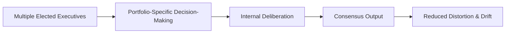

File: 🧩_distributed_executive_governance.md

# 🧩 Distributed Executive Governance  
**First created:** 2025-11-16 | **Last updated:** 2025-11-16  
*Why power concentrated in one leader produces distortion, drift, and democratic instability — and how shared executive models offer structural resilience.*

---

## 🛰️ Orientation  
Polaris treats hyper-centralised executive power as a **structural flaw**, not a political one.  
Even morally serious or values-driven leaders will produce distorted outputs when forced through a single-person executive role.

Distributed executive governance — where decision-making authority is shared between multiple elected leaders — reduces:

- psychological overload,  
- institutional distortion,  
- information bottlenecks,  
- crisis-driven authoritarian reflexes,  
- and personality-based politics.

---

## ✨ Key Features  
- Defines why single-person executives are inherently unstable.  
- Explains the mismatch between human cognition and modern governance.  
- Demonstrates why *distribution of power* slows authoritarian drift.  
- Highlights existing examples (Swiss Federal Council, Nordic coalitions, student unions).  
- Forms the conceptual backbone for Polaris’ “post-Westminster” design proposals.  

---

## 🧿 Analysis / Content  

### 🧨 1. The Problem: A Single Human Cannot Hold a Modern State  
Modern governance requires:

- deep domain expertise,  
- crisis triage in multiple sectors,  
- secure decision-making,  
- media defence,  
- coalition management,  
- legal interpretation,  
- diplomatic sense,  
- economic literacy.

This is not a **human** workload.  
It is a **team** workload forced onto one person.

The result is predictable:

- cognitive distortion  
- emotional burnout  
- overreliance on advisors  
- overcentralisation  
- fear-driven policymaking  
- incoherent outputs  

The system eats the person.

---

### 🧠 2. Why Distributed Executives Work Better  
Humans perform better when pressure is **shared**.  
Systems perform better when authority is **plural**.

Distributed executives enable:

- **portfolio clarity**  
  (each executive leads a domain they specialise in)

- **shared psychological load**  
  (pressure doesn’t crush one person)

- **internal challenge**  
  (executives check each other’s distortions)

- **slower, more deliberative decisions**  
  (authoritarian drift relies on speed)

- **redundancy**  
  (if one executive burns out, the system survives)

- **transparency**  
  (multiple perspectives reduce opaque bottlenecks)

---

### 🧭 3. Models That Already Exist  
Polaris does not propose utopia; it cites real systems:

#### 🇨🇭 **Swiss Federal Council**  
- Seven equal executives  
- Rotating presidency  
- Collective decisions  
- Zero cult of personality  
- Lowest authoritarian drift rate in Europe

#### 🇳🇴 / 🇩🇰 / 🇸🇪 **Nordic Cabinet Governance**  
- PM is coordinator, not monarch  
- Consensus culture built into structure  
- High trust, low drift

#### 🎓 **Student Union Governance**  
Surprisingly effective because:

- shared portfolios  
- term limits  
- diversity baked into representation  
- impossible to centralise power in one person  
- inherently anti-authoritarian structure

This is the closest analogue to what a “modernised democracy” could look like.

---

### ⚙️ 4. The Distributed Executive Pipeline  

Compare this with the hyper-centralised black box:  
**the distortions do not compound in one psyche**.

---

### 🔨 5. Why This Matters for Anti-Authoritarian Design  
Authoritarian drift depends on:

- speed  
- emotional overload  
- centralised authority  
- crisis narratives  
- moral isolation  
- single-person responsibility  
- bottlenecked information  

Distributed governance disrupts all seven.

No charismatic leader can distort the system.  
No panicked minister can accelerate drift.  
No single office becomes the emotional choke point.

This is structural protection, not moral hope.

---

### 🧩 6. Why Polaris Centres This Model  
Polaris is fundamentally:

- post-Westminster  
- anti-charismatic  
- safety-first  
- multi-perspective  
- designed around *cognition*, not tradition  
- aligned with the survivor’s view of systems  
- concerned with drift rather than scandal  

Distributed executives:

- reflect lived human limits  
- reduce fear-based policy collapse  
- equalise representation  
- dilute power concentration  
- and support long-term civic stability

---

## 🏮 Footer  
**Distributed Executive Governance** is part of Polaris’ constitutional redesign cluster.  
It maps how modern states can move from “monarch-in-disguise” executive models to structures that resist distortion and keep governance aligned with human cognition and democratic safety.

Crosslinks:  
- 🧱 *cabinet-led_collective_executive_models_for_the_uk*  
- 🧠 *political_black_box_logic*  
- 🔧 *democratic_resilience_architecture_for_21st_century_britain*
