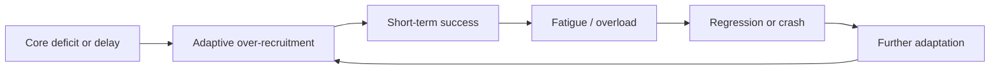

# 🧩 Semi-Compensating SpLD Theory — When Gift and Glitch Co-exist  
**First created:** 2025-11-08 | **Last updated:** 2025-11-08  
*Sometimes the same system that breaks the rules keeps itself running.*

---

## 🧭 Orientation  
At certain cognitive extremes, ability profiles stop being smooth.  
Strengths and weaknesses appear side by side — fluent synthesis paired with basic errors, deep reasoning next to working-memory gaps.  
Many people describe it as feeling like a **semi-compensating specific learning difficulty (SpLD)**: half workaround, half survival strategy.

This node sketches how that pattern functions and why education rarely accounts for it.

---

## 🧬  The Paradox Profile  

| Domain | Over-function | Under-function | Result |
|---------|----------------|----------------|---------|
| **Processing speed** | Rapid pattern detection, conceptual leaps | Poor sequencing, skipped steps | Appears impulsive or careless |
| **Working memory** | High “snapshot” recall of complex systems | Forgetting routine instructions | Erratic performance |
| **Language** | Dense vocabulary, metaphor fluency | Word-finding delays, stammering under stress | “Brilliant but incoherent” perception |
| **Attention** | Hyper-focus under interest | Near-zero tolerance for dull tasks | Seen as oppositional |
| **Emotional processing** | Empathy, intuition, sense of justice | Sensory overload, exhaustion | Oscillation between insight and burnout |

The brain behaves like a hybrid of gifted and SpLD profiles, constantly using its strengths to mask its weaknesses.

---

## 🧩  Mechanism — Compensation Loops  

The loop repeats until context changes — either better scaffolding or collapse.

---

## 🧠  Conceptual Roots  

- **Twice-exceptionality (2e):** Gifted + learning difference frameworks hint at this pattern but still treat “strength” and “deficit” as separate categories.  
- **Dynamic systems theory:** Small feedback loops stabilise function temporarily but at high energetic cost.  
- **Neurodiversity research:** High-ability individuals often show local over-connectivity and global under-connectivity — efficient short paths, weak long paths.  
- **Metacognitive masking:** Self-awareness builds elaborate coping rituals that hide difficulty until burnout exposes them.

---

## 🧮  Educational Blind Spots  

1. **Linear models** — expect consistent performance across domains.  
2. **Deficit bias** — see inconsistency as laziness.  
3. **Merit bias** — assume high ability cancels out need.  
4. **Energy blindness** — ignore the metabolic cost of constant compensation.

Result: support withheld until crisis, then over-correction via punitive systems.

---

## 🪞  Re-framing  

> What looks like contradiction is actually calibration.  

Semi-compensating SpLDs show that brilliance and dysfunction are not opposites — they’re *co-regulating processes*.  
Support needs to focus on **reducing compensation load**, not forcing further optimisation.

---

## 🌌  Constellations  
🧩 Cognitive Systems · 🧬 Education · 🧠 Neurodiversity · ⚖️ Survivor Voice Fidelity  

---

## ✨ Stardust  
twice-exceptionality, spld, dyslexia, adhd, autism spectrum, compensation loops, masking, neurodiversity, asynchronous development, burnout, energy cost  

---

## 🏮 Footer  
*Semi-Compensating SpLD Theory — When Gift and Glitch Co-exist* is an exploratory node of the Polaris Protocol.  
It frames uneven ability profiles as adaptive systems rather than contradictions, proposing that support should target energy regulation instead of conformity.  

*Survivor authorship is sovereign.  Containment is never neutral.*

_Last updated: 2025-11-08_
