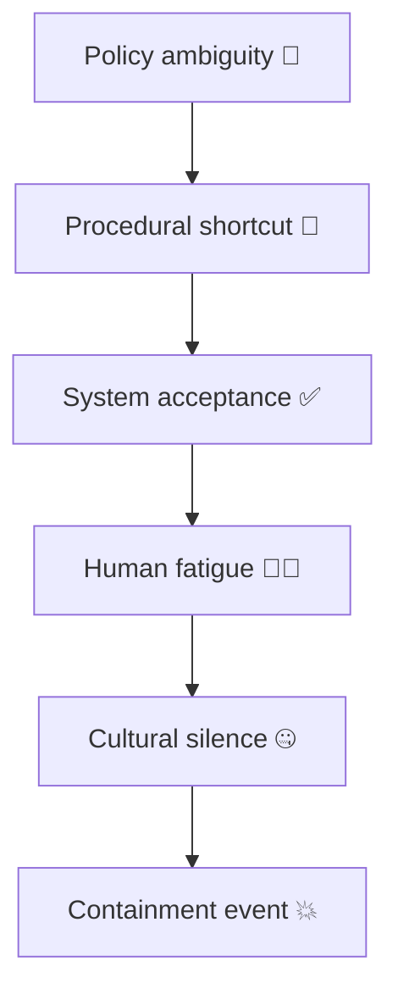

# 🧩 Swiss-Cheese Failures — When Process Holes Align  
**First created:** 2025-11-11 | **Last updated:** 2025-11-11  
*Every safeguard is porous in a different place.*

---

## 🧭 Orientation  

The **Swiss-Cheese Model** describes how multiple imperfect defences can still fail when their weaknesses line up.  
In data governance, these layers are not factory walls but **procedural membranes** — policy, process, system, and culture.  

A single administrative slip rarely causes collapse; failure emerges when **structural drift**, **role confusion**, and **institutional exhaustion** create a corridor through all layers at once.

---

## ⚙️ Anatomy of a Multi-Layer Failure  

| Defence Layer | Intended Function | Typical “Hole” | Effect When Aligned |
|:--|:--|:--|:--|
| **Policy** | Define principles and limits. | Ambiguous wording, outdated scope. | Misinterpretation enables risky joins. |
| **Process** | Operationalise policy. | Missing review steps, skipped sign-offs. | Undetected errors pass upward. |
| **System** | Enforce consistency through code. | Poor validation, silent truncation. | Bad data formalised. |
| **People** | Apply judgment and context. | Burnout, bias, fear of escalation. | Silence replaces oversight. |
| **Culture** | Sustain reflexes for correction. | Reputation anxiety, performative compliance. | Errors preserved as orthodoxy. |

When every hole happens to align, the illusion of “checks and balances” collapses into a single unbroken tunnel.

---

## 🧮 Failure Propagation Flow  

---

## 🧰 Audit & Intervention Framework  

1. **Map your layers** – list every control between data entry and public output.  
2. **Locate recurring holes** – find where bypasses repeat (missing fields, informal decisions).  
3. **Run “alignment drills”** – simulate what happens if all defences fail at once.  
4. **Insert asymmetry** – ensure each layer’s error type differs (so holes don’t align).  
5. **Publish post-mortems** – treat small breaches as educational, not reputational, events.  

---

## 🪞 Governance Interpretation  

- **Redundancy ≠ resilience.** Layers can replicate each other’s flaws.  
- **Good faith still fails.** Burnout and under-funding open holes faster than malice.  
- **Reputation containment is itself a hole.** When optics outweigh evidence, every defence points the same way.  

---

## 🧩 Companion Folios  

| Related Node | Function |
|:--|:--|
| 🧭 *Data-Governance Swiss-Cheese Model* | Technical analogue (case vs role joins). |
| ⚡ *Rapid-Response Forensic Protocol* | Operational containment once holes align. |
| 👻 *Metadata Ghosting* | How the breach becomes self-documenting. |
| 🧾 *Data Lineage Review* | Retrospective reconstruction of the corridor. |

---

## 🌌 Constellations  

🧩 🧭 ⚡ 👻 🧾  

Forms the base of the **Integrity Spine**, linking systemic design (Swiss-Cheese), reactive forensics (⚡), and narrative aftermath (👻).

---

## ✨ Stardust  

process failure, institutional drift, containment breach, administrative error, data governance, structural fatigue, swiss-cheese model, layered defence  

---

## 🏮 Footer  

*🧩 Swiss-Cheese Failures — When Process Holes Align* is a living node of the **Polaris Protocol**.  
It reminds us that containment is rarely a single act; it is an alignment of omissions.  
Understanding that alignment is the first step toward breaking it.  

_Last updated: 2025-11-11_
