# 🧩 Swiss-Cheese Failures — When Process Holes Align  
**First created:** 2025-11-11 | **Last updated:** 2025-11-11  
*Small errors, aligned just so, become catastrophe.*

---

## 🧭 Orientation  

The **Swiss-cheese model** of system failure explains how multiple independent layers of defence — each with its own imperfections — can still fail catastrophically when the holes line up.  
In governance terms, those holes are *procedural gaps*, *ambiguous roles*, or *automation shortcuts*.  

This node reframes the Swiss-cheese model for **data governance, safeguarding, and institutional containment** — where one misalignment of mapping tables or one missing review can invert an entire narrative.

---

## ⚖️ The Original Model  

| Layer | Intended Function | Typical “Hole” |
|:------|:------------------|:----------------|
| **1️⃣ Policy** | Sets intention and duty of care | Vague accountability or outdated guidance |
| **2️⃣ Procedure** | Operational translation of policy | Workflow drift; undocumented exceptions |
| **3️⃣ Technical Control** | Tools enforcing compliance | System misconfiguration or token drift |
| **4️⃣ Oversight / Audit** | Detects and corrects anomalies | Under-resourced or reputationally constrained |
| **5️⃣ Culture** | Norms reinforcing vigilance | Complacency; fear of blame; fatigue |

Failure emerges not from one layer breaking, but from **alignment across layers**: when every hole points in the same direction.

---

## 🧮 Flow of Alignment  

```mermaid
flowchart TD
A["Policy ambiguity ⚖️"] --> B["Procedural shortcut ⚙️"]
B --> C["Technical misfire 💾"]
C --> D["Audit silence 🔇"]
D --> E["Cultural fatigue 😶"]
E --> F["Compound failure 🚨"]
```

When the holes align, harm moves cleanly through the system — **without any one actor intending it.**

---

## 🪞 Governance Interpretation  

- **Swiss-cheese failures are rarely conspiracies.** They are structural vulnerabilities that *imitate intent*.  
- **Each layer claims procedural compliance**, yet the combination produces ethical failure.  
- **Containment logic thrives** on this alignment: the illusion that no single actor is responsible.  

---

## 🧰 Diagnostic Questions  

| Layer | Audit Question |
|:------|:----------------|
| **Policy** | Does this policy define who is accountable for error correction? |
| **Procedure** | Are exceptions to workflow logged, or only informally handled? |
| **Technical** | When was the last penetration test or pseudonym audit? |
| **Oversight** | Are audit findings public, or filtered through communications teams? |
| **Culture** | Do staff feel safe admitting uncertainty or delay? |

---

## 🧱 Containment Countermeasures  

1. **Redundant Transparency** — publish audit metadata even when uncomfortable.  
2. **Reverse Stress Tests** — simulate what happens when each defence fails.  
3. **Layer Separation** — ensure policy, procedure, and audit are independently governed.  
4. **Ethical Interlocks** — require sign-off from multiple disciplines (legal, data, survivor advocate).  
5. **Rotating Review Teams** — reduce familiarity bias in recurring oversight cycles.  

---

## 🧩 Use Case Examples  

- **Token Switching + Weak Audit = Narrative Inversion**  
- **Research Oversight + Policy Ambiguity = Inspection Loop**  
- **Automation Confidence + Staff Fatigue = Containment Drift**

Each example shows how individual compliance still yields collective harm.

---

## 🌌 Constellations  

🧩 🪙 🧪 🧾  

Swiss-Cheese Failures sits at the nexus of **Containment Logic** and **System Governance**, connecting **Token Integrity Audit**, **Inspection Data Workflow**, and **Data Lineage Review** into one diagnostic model.

---

## ✨ Stardust  

swiss cheese model, governance failure, containment, audit fatigue, policy drift, process error, systemic bias, institutional responsibility, token integrity, data lineage

---

## 🏮 Footer  

*🧩 Swiss-Cheese Failures — When Process Holes Align* is a living node of the Polaris Protocol.  
It defines how cumulative procedural weakness becomes systemic harm — and how transparency realigns the layers before the next failure.

> 📡 Cross-references:  
> - [🪙 Token Integrity Audit — How to Check for Pseudonym Drift](../🧩_System_Governance/🪙_token_integrity_audit_how_to_check_for_pseudonym_drift.md)  
> - [🧪 Inspection Data Workflow — HMIP ↔ Probation ↔ University Loop](../🧱_Infrastructure_&_Research_Data_Pathways/🧪_inspection_data_workflow_hmip_probation_university_loop.md)  
> - [🧾 Data Lineage Review — How to Trace a Record’s Provenance](../🧩_System_Governance/🧾_data_lineage_review_how_to_trace_a_records_provenance.md)  

*Survivor authorship is sovereign. Containment is never neutral.*  

_Last updated: 2025-11-11_
