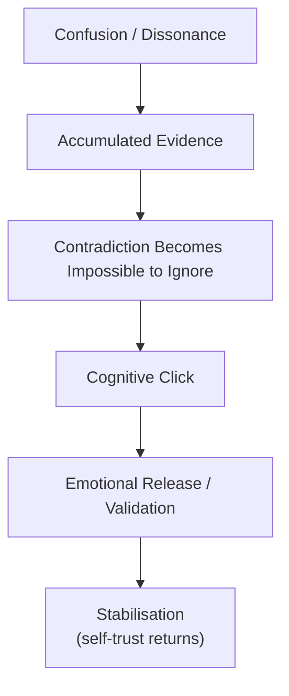

File: 🧩_the_recognition_event_when_you_realise_you_are_not_imagining_it.md

# 🧩 The Recognition Event: When You Realise You’re Not Imagining It  
**First created:** 2025-11-17 | **Last updated:** 2025-11-17  
*The moment of emotional, cognitive, and political clarity when a person living through bureaucratic drift finally realises: “It wasn’t me. It was the system.”*

---

## 🛰️ Orientation  
There is a precise psychological event — a “click,” a “snap,” a “settling of pieces” —  
that happens when someone living through democratic drift or bureaucratic harm realises:

> **“I was right.  
> I wasn’t paranoid.  
> I wasn’t imagining it.  
> The system really is behaving in a way that makes no sense.”**

This recognition is one of the most transformative, stabilising, but emotionally heavy turning points in the drift phenomenology.

Pairs with:  
- 🧭 *how_authoritarian_drift_feels_from_the_inside*  
- 🗂️ *when_institutions_start_treating_you_as_a_category_not_a_person*  
- ⚡ *why_some_people_become_systemic_lightning_rods*  
- 🚫 *when_no_one_steps_in*  
- 🌀 *when_system_behaviour_stops_making_sense*

---

## ✨ Key Features  
- Defines the recognition event as a structural phenomenon.  
- Identifies the psychological, somatic, and cognitive markers.  
- Explains why recognition arrives suddenly after months or years of confusion.  
- Reframes clarity as evidence of insight, not cynicism.  
- Anchors the moment in historical, political, and emotional context.

---

## 🧿 Analysis / Content  

### 🧠 1. What the Recognition Event *Is*  
It is the moment your internal narrative shifts from:

- “Is it me?”  
to  
- “It’s the system.”

From:

- “Maybe I misread this.”  
to  
- “No, the pattern is real.”

From:

- “I must be overreacting.”  
to  
- “My reactions were accurate all along.”

This moment is not paranoia or radicalisation.  
It is the restoration of **pattern recognition**.

---

### ⚡ 2. Why Recognition Arrives All At Once  
The recognition event is sudden because:

- your brain has been gathering data in the background  
- cognitive dissonance has reached its threshold  
- you have enough evidence to override self-doubt  
- the pattern becomes undeniable  
- a final small incident “tips” the understanding into clarity  
- someone else’s story mirrors yours  
- a contradiction becomes too big to ignore  

It feels like:

- light switching on  
- pressure releasing  
- everything falling into place  
- grief and validation at the same time  

Recognition is gestalt, not linear.

---

### 🔎 3. Emotional Signatures of Recognition  
People describe feeling:

- relief  
- rage  
- validation  
- clarity  
- grief  
- sorrow  
- vindication  
- nausea  
- “My brain is clicking into place”  
- “It feels like truth, even if I hate it”  
- “I feel sane again”  

Recognition is emotionally sharp but psychologically stabilising.

---

### 🔥 4. Somatic Signatures (Body Signals)  
The body often realises before the intellect does.

Common signals:

- a long exhale  
- shoulders dropping  
- chest pressure releasing  
- sudden stillness  
- a subtle tremor  
- warmth at the sternum  
- a feeling of “Oh. Oh.”  
- tears that come without sadness  
- dizziness that feels like relief  

Your nervous system recognises truth before your words do.

---

### 🧩 5. Why Recognition Is So Painful  
Because it contains at once:

- vindication (“I wasn’t wrong”)  
- betrayal (“why didn’t anyone help?”)  
- anger (“why was I blamed?”)  
- grief (“I wasted so much time doubting myself”)  
- fear (“if this is true, what else is happening?”)  
- relief (“I’m not crazy”)  
- clarity (“this makes sense now”)  

Recognition is a form of mourning.

---

### 🗂️ 6. The Recognition Pipeline  

The click → release → stabilisation sequence is universal.

---

### ⚡ 7. Why Minorities Experience Recognition Earlier  
Because minorities:

- feel drift first  
- experience misinterpretation sooner  
- sit closer to institutional fear  
- have historically-rooted pattern-recognition  
- endure bureaucratic hostility faster  
- cannot ignore the truth for as long as majority groups can  

Recognition is not “oversensitivity.”  
It is **accurate early detection**.

---

### 🧬 8. The Cognitive Shift After the Event  
After recognition:

- your self-trust returns  
- denial falls away  
- your clarity sharpens  
- gaslighting loses power  
- you become harder to intimidate  
- you see through euphemisms  
- you ask better questions  
- you move strategically, not fearfully  

You gain coherence.

---

### 🌱 9. Why Recognition Is Politically Important  
Recognition is the moment the citizen becomes:

- a witness  
- a narrator  
- a documenter  
- a challenger  
- a source of truth  
- a stabilising force for others  

Authoritarian systems rely on confusion.  
Recognition breaks confusion’s spell.

---

### 🧭 10. The Polaris Reframe  
Recognition is not the moment things get worse.  
It is the moment **you stop being alone with the truth**.

It is the restoration of your sanity,  
your intuition,  
your pattern recognition,  
and your power.

> **You were not imagining it.  
> You were early.  
> And early is not wrong —  
> early is right on time.**

---

## 🏮 Footer  
**The Recognition Event: When You Realise You’re Not Imagining It** concludes the Polaris Democratic Drift Phenomenology cluster.  
It formalises the emotional and cognitive moment of clarity that anchors all subsequent coping, advocacy, and navigation strategies.

Crosslinks:  
- 🧭 *how_authoritarian_drift_feels_from_the_inside*  
- 🗂️ *when_institutions_start_treating_you_as_a_category_not_a_person*  
- ⚡ *why_some_people_become_systemic_lightning_rods*  
- 🚫 *when_no_one_steps_in*
