# 🧪 Inspection Data Workflow — HMIP ↔ Probation ↔ University Loop  
**First created:** 2025-11-11 | **Last updated:** 2025-11-11  
*When oversight feeds on its own datasets.*

---

## 🧭 Orientation  

Inspection is meant to check, not echo.  
But in the post-2020 justice ecosystem, the lines between **inspection**, **analysis**, and **research** have blurred.  
Probation services supply case data to HM Inspectorate of Probation (HMIP); HMIP shares findings with academic partners; universities feed insights back into the same policy pipelines.  

The result: an elegant but dangerous **data loop**, where inspection evidence re-enters the system as a governance input — unverified, uncontextualised, and sometimes circular.

---

## ⚖️ Key Participants  

| Actor | Role | Primary Data Source | Output Type |
|:------|:------|:--------------------|:-------------|
| **HM Inspectorate of Probation (HMIP)** | Inspects probation and youth justice services | nDelius, OASys, field visits | Reports, datasets, dashboards |
| **Ministry of Justice (MoJ)** | Funds and coordinates data-sharing | Data First, HMPPS systems | Policy briefs, DataLab analysis |
| **Universities (e.g., SHU, UCL, Nottingham)** | Research, evaluation, teaching | HMIP datasets, MoJ secure data | Academic papers, evaluation reports |
| **Probation Providers** | Frontline operational data origin | nDelius live entries | Local dashboards, performance returns |

---

## 🧩 Feedback Circuit  

```mermaid
flowchart TD
A["Probation data (nDelius)"] --> B["HMIP Inspection extract 🗂️"]
B --> C["University analysis 🎓"]
C --> D["MoJ or HMPPS policy use 🏛️"]
D --> E["Implementation in practice ⚙️"]
E --> A["New inspection cycle 🔁"]
```

Without separation between **inspection data** and **research evaluation**, findings become self-referential — a governance Möbius strip.

---

## 🧮 Common Failure Modes  

| Failure | Description | Consequence |
|:---------|:-------------|:-------------|
| **Echo feedback** | Same dataset used to prove its own conclusions. | Illusory policy validation. |
| **Role confusion** | Inspectors act as researchers; researchers act as evaluators. | Lack of accountability for findings. |
| **Data contamination** | Inspection data merged with live probation data. | Loss of anonymity; GDPR exposure. |
| **Publication lag** | Research outputs appear after next inspection cycle. | Outdated insight drives new policy. |

---

## 🪞 Why It Matters  

When oversight depends on the same evidence base it is meant to interrogate, **containment logic** replaces scrutiny.  
The inspection loop becomes a reputational mirror: what it reflects, it reinforces.  
Breaking the loop restores reflexivity and allows learning instead of validation.

---

## 🧰 Corrective Design  

| Layer | Control | Description |
|:------|:---------|:-------------|
| **Governance** | Distinct data streams for inspection and research | Prevents double-use of the same dataset. |
| **Technical** | Provenance metadata embedded in every export | Allows lineage tracking of inspection extracts. |
| **Procedural** | Cooling-off period between inspection and research reuse | Creates analytical independence. |
| **Ethical** | Mandatory disclosure of data origin in reports | Transparency for peer review and policy users. |

---

## 🧱 Verification Questions  

1. Are the datasets used in research genuinely independent of those used for inspection?  
2. Are inspection findings referenced in academic outputs disclosed as prior evidence?  
3. Are researchers part of the same steering groups as inspectors or policy authors?  
4. Does the data lineage show feedback from policy into operational data entry fields?  

If any answer is *yes*, a feedback loop is in effect.

---

## 🌌 Constellations  

🧪 🧭 🧩 🧾  

Inspection Data Workflow links the **Justice Data Ecosystem Map**, **Data Lineage Review**, and **Swiss-Cheese Failures** nodes.  
It tracks how *oversight itself* becomes a site of governance drift.

---

## ✨ Stardust  

hmip, probation inspection, research loop, feedback circuit, justice data, evaluation ethics, policy influence, data provenance, containment governance, audit independence

---

## 🏮 Footer  

*🧪 Inspection Data Workflow — HMIP ↔ Probation ↔ University Loop* is a living node of the Polaris Protocol.  
It shows how even well-meaning oversight architectures can trap themselves in recursive validation, and how deliberate cooling mechanisms can restore analytical clarity.

> 📡 Cross-references:  
> - [🧭 Justice Data Ecosystem Map (2020–2025)](../🧱_Infrastructure_&_Research_Data_Pathways/🧭_justice_data_ecosystem_map_2020_2025.md)  
> - [🧾 Data Lineage Review](../🧩_System_Governance/🧾_data_lineage_review_how_to_trace_a_records_provenance.md)  
> - [🧩 Swiss-Cheese Failures](../🧩_System_Governance/🧩_swiss_cheese_failures_when_process_holes_align.md)  

*Survivor authorship is sovereign. Containment is never neutral.*  

_Last updated: 2025-11-11_
