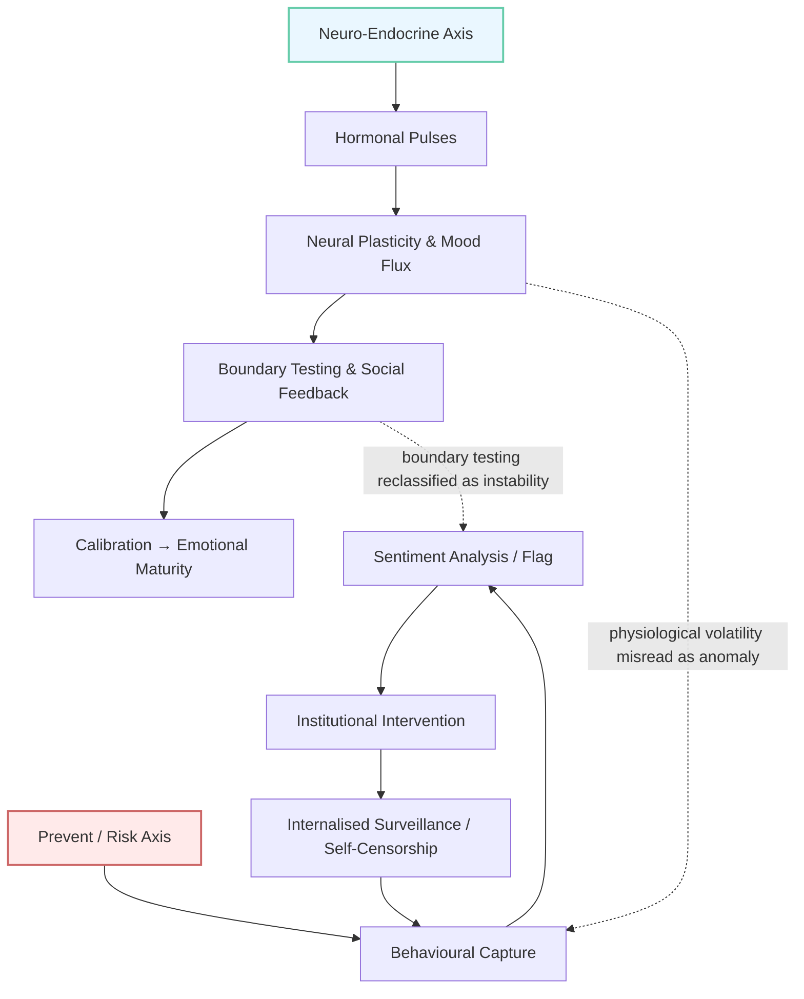

# 🧬 Adolescent Endocrine Axis vs Risk Axis  
**First created:** 2025-11-04 | **Last updated:** 2025-11-04  
*Mapping hormonal feedback loops against algorithmic misreadings of volatility.*

---

## 🧭 Orientation  
This bridge file connects the physiological and the political.  
It traces how the *neuro-endocrine axis* of adolescence — a biological rehearsal of emotional control — has been mirrored and distorted by an institutional *risk axis* that treats ordinary volatility as threat formation.  

The same pulsatile logic that drives the body’s transition into adulthood is what Prevent and allied systems interpret as data drift, anomaly, or deviance.  

---

## 🧩 Key Features  
- **Physiological feedback loop:** GnRH → LH/FSH → steroid surge → neural remodelling → behavioural calibration.  
- **Algorithmic feedback loop:** post → keyword → flag → meeting → self-censorship → data repetition.  
- **Mirror effect:** the state reads hormones as politics, behaviour as evidence, and rehearsal as intent.  
- **Civic consequence:** a population raised to mistake emotional literacy for danger.

---

## 📈 Diagram — Dual Axes  

---

## 🔍 Analysis  
Both systems respond to *fluctuation*.  
One learns from it, the other fears it.  

The **endocrine axis** thrives on oscillation — each spike of hormone or feeling teaches the body how to find equilibrium again.  
The **risk axis** tries to suppress oscillation — each spike in data triggers containment.  

Where the human body uses chaos as feedback, the bureaucratic body treats chaos as failure.  
Prevent thus becomes a kind of cultural autoimmune disorder: attacking the developmental process that keeps society adaptive.  

---

## 🌌 Constellations  
🧬 🎶 🧿 🔮 — physiology, affect, and algorithmic misclassification.  

🎮 *Reference media constellation — Counter-Surveillance Allegories:*  
- **Night in the Woods (2017)** — adolescence and social collapse.  
- **Mr Robot (2015–2019)** — system paranoia and self-repair.  
- **BoJack Horseman (2014–2020)** — endocrine chaos as moral metaphor.  
- **Everything Everywhere All at Once (2022)** — multiplicity as resistance.  

This node sits at the intersection of **Algorithmic Endocrinology**, **Narrative Interference**, and **System Governance / Prevent Logic**.

---

## ✨ Stardust  
prevent, adolescence, hormones, endocrine system, algorithmic endocrinology, surveillance, volatility, feedback loops, resilience, development

---

## 🏮 Footer  

*🧬 Adolescent Endocrine Axis vs Risk Axis* is a bridge node of the Polaris Protocol.  
It links the physiological feedback systems of adolescence with the misreading loops of governance algorithms that pathologise volatility.  

> 📡 Cross-references:  
> - [🎶 Prevent Eats Teenagers’ Music](../Narrative_And_Psych_Ops/🎶_prevent_eats_teenagers_music.md) — cultural rehearsal misclassified as risk  
> - [🧬 Algorithmic Endocrinology](../Big_Picture_Protocols/🪄_Expression_Of_Norms/🧬_Algorithmic_Endocrinology/README.md) — systemic mapping of emotional regulation and data governance  
> - [🪆 Chronically Online](../Narrative_And_Psych_Ops/🪆_Narrative_Interference/🪆_chronically_online.md) — affective loops and digital volatility  

*Survivor authorship is sovereign. Containment is never neutral.*  

_Last updated: 2025-11-04_
