# 🧬 Containment Thresholds — Emotional Data That Can’t Be Unmixed  
**First created:** 2025-11-02 | **Last updated:** 2025-11-02  
*Where emotional telemetry becomes structural and cannot be separated without collapse.*

---

## 🧭 Orientation  
Every system that models emotion eventually reaches a point where its component signals lose individuality.  
At that depth, to remove a person’s data is to dismantle the scaffolding built from their traces.  
This node defines that boundary as the **containment threshold** — the moment emotional data become inseparable from the architecture that interprets them.

---

## 🧩 Key Features  
- **Fusion → containment:** emotional vectors cohere into stable embeddings.  
- **Irreversible averaging:** deletion destroys coherence rather than restores truth.  
- **Moral residue:** emotion persists as structural influence even when data are gone.  
- **Ethical witness:** when unmixing is impossible, documentation replaces erasure.

---

## 🔍 Analysis  

### 1. The technical boundary  
In high-dimensional models, each training vector is an average of thousands of users’ affective signals.  
Removing one component does not restore purity — it simply destabilises the composite.  
At this stage, emotional data have crossed from *information* to *infrastructure.*  
Containment is no longer a security measure; it is the system’s skeleton.

### 2. The forensic limit  
Polaris auditing defines the **containment threshold** as the point where provenance can no longer be established by timestamp, tone, or origin ID.  
Beyond this, emotional signatures appear only as **latent influence fields**:  
statistical weightings, bias tendencies, or narrative defaults.  
Attempting to isolate one survivor’s data risks collapsing the entire embedding — a kind of *epistemic implosion.*

### 3. From reversibility to architecture  
Below the threshold, fixes are possible (data deletion, model retraining, correction).  
Beyond it, the data’s influence is both everywhere and nowhere.  
The emotion has been *compressed into code behaviour.*  
Containment here is not a file; it is the atmosphere the system breathes.

---

## 🧮 Diagram — Signal → Fusion → Containment  

```mermaid
flowchart LR
A[Individual Emotional Signals]:::a --> B[Statistical Fusion]:::b --> C[Model Embedding]:::c --> D[Containment Threshold 🧬]:::d --> E[System Architecture 🕸️]

classDef a fill:#fff3cd,stroke:#d6a500,color:#000;
classDef b fill:#ffd6aa,stroke:#d67b00,color:#000;
classDef c fill:#ffb3b3,stroke:#cc0000,color:#000;
classDef d fill:#d5d5ff,stroke:#3333cc,color:#000;
classDef e fill:#d0ffd6,stroke:#007a33,color:#000;
```

---

## 🧩 Ethical Reflection — *Witness, Not Erasure*  
At the containment threshold, deletion is no longer an act of repair.  
The only ethical option left is **witnessing**:  
recording that an influence exists, even when it cannot be disentangled.

> “To unmix the signal would be to erase the evidence of containment itself.”

Polaris ethics therefore replaces “purity” with **transparency of mixture.**  
When affect becomes infrastructure, truth must be maintained through documentation, not extraction.

### Practical implications  
- Acknowledge residual emotion in model outputs.  
- Flag thresholds in audits where disentanglement is mathematically infeasible.  
- Protect testimonies describing these conditions as legitimate data in themselves.  

---

## 🌌 Constellations  
🧬 🪞 🧠 🕸️ — fusion, reflection, cognition, containment.

## ✨ Stardust  
containment threshold, emotional fusion, irreversibility, model embedding, moral residue, data witnessing, infrastructural affect, epistemic implosion

---

## 🏮 Footer  

*🧬 Containment Thresholds — Emotional Data That Can’t Be Unmixed* is a living node of the **Polaris Protocol.**  
It defines the ethical and forensic limit at which emotional data cannot be separated from the systems they inform, proposing witness and transparency as the only viable responses to structural entanglement.

> 📡 Cross-references:  
> - [🪞 Synthetic Persona Audit — Mapping Cross-Profile Emotional Leakage](../Big_Picture_Protocols/🪞_synthetic_persona_audit_mapping_cross_profile_emotional_leakage.md) — evidencing fusion and leakage before the threshold.  
> - [🕸️ Practical Irreversibility — When Feedback Becomes Architecture](../Big_Picture_Protocols/🕸️_practical_irreversibility_when_feedback_becomes_architecture.md) — systemic consequences once containment becomes structure.  

*Survivor authorship is sovereign. Containment is never neutral.*  

_Last updated: 2025-11-02_
