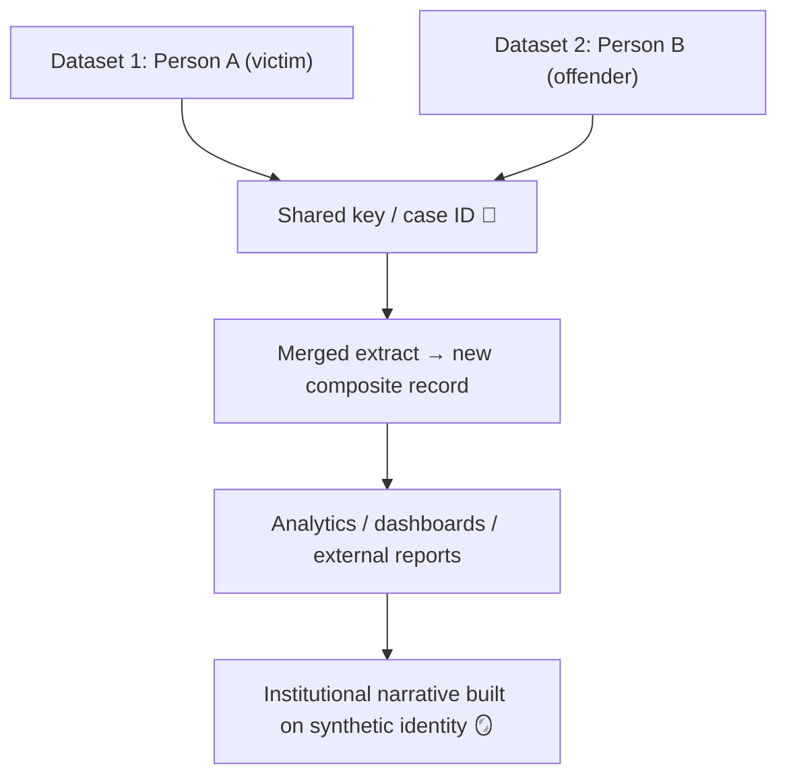

# 🧬 Data Twinning — When Two Identities Become One Record  
**First created:** 2025-11-11 | **Last updated:** 2025-11-11  
*The moment two people become one dataset.*

---

## 🧭 Orientation  

When systems misread overlap as sameness, people are forced to share a digital skin.  
**Data twinning** is what happens when two distinct identities — often separated by role, context, or relational data — are fused by a system into a single composite entity.  
It’s not cloning; it’s compression.

The twin is neither of you, but carries both your reputations.  

---

## 🧩 Core Definition  

> **Data twinning** occurs when datasets reconcile two distinct source entities under one identifier or composite record.  
> The result is a synthetic persona that inherits attributes from both sources and replicates across dependent systems.

Common causes include:
- Token switching or duplicated pseudonyms  
- Shared case identifiers (e.g., family, MARAC, MAPPA, or co-defendant IDs)  
- Over-aggressive deduplication in CRM or HR software  
- Machine-learning reconciliation across incomplete datasets  
- Data vendor aggregation where relational context is lost  

---

## ⚙️ Anatomy of a Twin  

| Input Layer | Process | Output |
|:-------------|:---------|:--------|
| Person A — Victim | Exported from safeguarding database | Case ID `X123` |
| Person B — Offender | Exported from justice database | Case ID `X123` |
| **Join Event** | Merge on shared case ID | `Twin_X123` |
| **Result** | Attributes from A and B fused | Inversion, duplication, or narrative drift |

*At metadata level, the twin is a chimera — recognisable, but not real.*

---

## 🧮 Propagation Diagram  

Once formed, the twin is self-replicating.  
Each downstream system treats the fused record as ground truth.

---

## 🪞 Consequences  

- **Reputational inversion:** descriptors from the offender attached to the victim.  
- **Record collision:** audits show “duplicate” people with conflicting data.  
- **Soft deletion paradox:** removing one record deletes part of another person.  
- **Governance confusion:** no one can say where the merge happened or why.  

---

## 🧰 Detection & Recovery  

| Layer | Diagnostic | Remedy |
|:------|:------------|:--------|
| **Technical** | Duplicate-token audit (Token Integrity module) | Separate token namespaces; reindex source data. |
| **Procedural** | Compare lineage across exports | Require version-controlled metadata for joins. |
| **Analytic** | Flag “dual demographic footprint” (e.g., gender or region shift) | Manual inspection; confirm source authenticity. |
| **Governance** | Escalate through Data Protection Officer | Issue correction notices; notify dependent systems. |

---

## 🧩 Key Distinction  

**Data twinning ≠ aliasing.**  
Aliasing is deliberate; twinning is accidental.  
An alias preserves intent.  
A twin rewrites identity through entropy.

---

## 🌌 Constellations  

🧬 💾 🧩 🪙  

Data Twinning lives in constellation with **Token Switching** and the **Token Integrity Audit** — together they trace how privacy infrastructure mutates into narrative distortion.

---

## ✨ Stardust  

data twin, duplicate record, merged identity, pseudonymisation error, metadata inheritance, victim–offender inversion, governance containment, synthetic identity, case join failure, relational collapse

---

## 🏮 Footer  

*🧬 Data Twinning — When Two Identities Become One Record* is a living node of the Polaris Protocol.  
It maps how mistaken joins in pseudonymised data manufacture synthetic personas and how those twins survive through replication loops.

> 📡 Cross-references:  
> - [💾 Token Switching — Pseudonymisation Gone Wrong](../🧩_System_Governance/💾_token_switching_pseudonymisation_gone_wrong.md)  
> - [🪙 Token Integrity Audit](../🧩_System_Governance/🪙_Token_Integrity_Audit/)  
> - [🧾 Data Lineage Review](../🧩_System_Governance/🧾_data_lineage_review.md)  

*Survivor authorship is sovereign. Containment is never neutral.*  

_Last updated: 2025-11-11_
