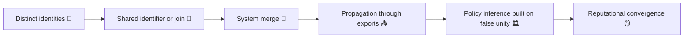

# 🧬 Data Twinning — When Two Identities Become One Record  
**First created:** 2025-11-11 | **Last updated:** 2025-11-11  
*Parallel lives inside the same database.*

---

## 🧭 Orientation  

Sometimes, two people share the same digital reflection.  
**Data twinning** occurs when independent identities are merged through shared identifiers, role fields, or relational shortcuts — a bureaucratic doppelgänger event that converts coincidence into governance.  

Unlike token switching (where one person becomes many), data twinning happens when **many become one**.  
Its damage is subtler: evidence collapses, responsibilities blur, and systems cannot un-believe what they’ve already joined.

---

## ⚙️ Common Pathways to Twinning  

| Trigger | Example | Failure Mode | Consequence |
|:--|:--|:--|:--|
| **Identifier collision** | Two people share an NHS, prison, or student ID format. | Schema treats them as one. | Cross-linked case histories. |
| **Relationship join error** | “Relative of” or “associated with” imported as foreign key. | Association becomes primary ID. | One record inherits another’s metadata. |
| **Partial anonymisation** | Shared pseudonym in research dataset. | Context lost in re-link. | Analytical bias → wrong cohort attribution. |
| **Legacy merge** | Old database compressed during migration. | Deduplication too aggressive. | Record permanently fused. |
| **Vendor oversync** | API pulls with fuzzy match threshold. | False positive merge. | Impossible to reverse without manual audit. |

---

## 🧮 Twinning Lifecycle  

Once fused, every subsequent export assumes the twin is singular truth.

---

## 🪞 Governance Interpretation  

- **Fusion looks efficient:** deduplication rewarded as tidiness, not risk.  
- **Twinning hides asymmetry:** one record dominates the narrative.  
- **Undoing requires confession:** un-merging is treated as fault admission, not repair.  
- **Containment loves twins:** shared data identity spreads accountability thin.  

---

## 🧰 Detection & Remediation  

| Layer | Audit Signal | Verification Method | Control |
|:--|:--|:--|:--|
| **Database** | Unusual 1:N joins on unique key | Run cardinality scan | Adjust uniqueness constraints |
| **Application** | Mixed demographics in same ID | Record sampling | Split via versioned correction |
| **Governance** | Conflicting case notes across domains | Cross-controller audit | Publish correction log |
| **Narrative** | “Contradictory accounts” about same person | Lineage + language review | Clarify dual origin in comms output |

---

## 🧩 Structural Consequences  

- Legal: duplicated liability → confused court or disciplinary action.  
- Ethical: survivor/offender roles blend in documentation.  
- Analytical: statistical noise presented as trend.  
- Cultural: myth of “complex case” replaces precise accountability.

---

## 🌌 Constellations  

🧬 💾 ⚙️ 🧩  

*Data Twinning* completes the **Integrity Spine** quartet with *Token Switching*, *Pseudonym Drift Cascade*, and *Swiss-Cheese Failures*.  
Where switching multiplies, twinning compresses.

---

## ✨ Stardust  

data twinning, record merge, identity collapse, relational governance, containment architecture, schema collision, pseudonymisation, accountability diffusion  

---

## 🏮 Footer  

*🧬 Data Twinning — When Two Identities Become One Record* is a living node of the Polaris Protocol.  
It records how two truths fuse into one administrative fiction — and how that fiction governs real lives.  

> 📡 Cross-references:  
> - [💾 Token Switching — Pseudonymisation Gone Wrong](../🧩_System_Governance/💾_token_switching_pseudonymisation_gone_wrong.md)  
> - [⚙️ Pseudonym Drift Cascade — How Token Misalignment Spreads Through Systems](../🧩_System_Governance/⚙️_pseudonym_drift_cascade_how_token_misalignment_spreads_through_systems.md)  
> - [🧩 Swiss-Cheese Failures — When Process Holes Align](../🧩_System_Governance/🧩_swiss_cheese_failures_when_process_holes_align.md)  

*Survivor authorship is sovereign. Containment is never neutral.*  

_Last updated: 2025-11-11_
