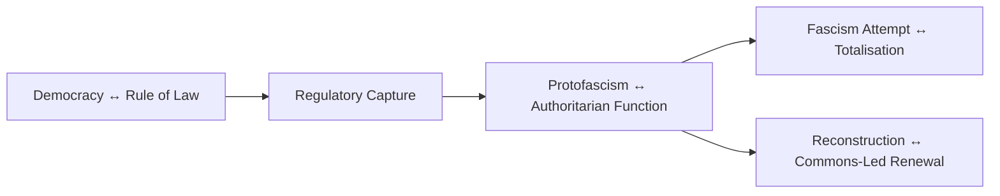

# 🧭 Are We Fascist Yet?  
**First created:** 2025-11-09  |  **Last updated:** 2025-11-09  
*A UK-specific diagnostic for recognising protofascist drift before collapse.*

---

## 🛰️ Orientation  
This node examines the civic moment when governance performs democracy but operates through containment.  
Polaris treats “Are we fascist yet?” as a **forensic question**, not a slogan: a live test of legality, economy, and care as systems of control.

---

## ✨ Key Features  
- **Security Overreach** — surveillance normalised as protection.  
- **Economic Immunity** — elites fined, not tried; citizens fined, not heard.  
- **Civic Chilling** — dissent recoded as extremism.  
- **Performative Parliamentarism** — ritual debate masking capture.  
- **Care as Containment** — welfare and health used to discipline rather than support.  

---

## 🧿 Analysis / Content  

### 1  The British Modality  
Our authoritarianism arrives in paperwork, not parades.  
Where continental fascisms shouted, the British variant **redacts** — procedural, data-driven, polite.  

### 2  Protofascism Defined  
Measured against Eco’s *Ur-Fascism* and Griffin’s palingenetic loop, the UK sits in the **protofascist band**:  
legal asymmetry, nostalgic nationalism, militarised bureaucracy, privatised control.  

### 3  Mirror Ideologies  
| Axis | Description | Expression |  
|:--|:--|:--|  
| **Future-Worship Fascism** | Progress as deity, inevitability as virtue. | Accelerationism, “innovation without scrutiny.” |  
| **Nostalgia-Fascism** | Mythic past as refuge. | Imperial revivalism, heritage populism. |  

The UK oscillates between them — techno-futurism executed by institutions still mourning empire.  

### 4  Containment Gradient  

### 5  Public Oversight Hook  
> **FOI and OSINT keep the threshold visible.**  
> Each request and audit anchors legality in daylight.  
> Transparency is not bureaucratic housekeeping — it is anti-fascist hygiene.  

---

## 🌌 Constellations  
🧭 ⚖️ 🐝 🛰️ — diagnostic register; civic recognition of authoritarian drift through institutional analysis.

---

## ✨ Stardust  
protofascism, uk politics, state capture, bureaucratic authoritarianism, surveillance, transparency, civic repair, future-worship, nostalgia-fascism, containment literacy, commons-renewal

---

## 🏮 Footer  

*🧭 Are We Fascist Yet?* is a living node of the Polaris Protocol.  
It documents the UK’s protofascist condition and maps civic strategies for containment literacy and renewal.  

> 📡 Cross-references:  
> 
> - [⚖️ Above the Law — Protofascism Threshold](⚖️_above_the_law_protofascism_threshold.md) — *legal and economic immunity diagnostic*  
> - [Case Study — Keir Starmer](Case_Study_Keir_Starmer.md) — *data politics and perception management*  
> - [🐝 Post-Protofascist Reconstruction](🐝_post_protofascist_reconstruction.md) — *commons-based rebuilding*  
> - [🛰️ Civic Oversight of AI Partnerships](🛰️_civic_oversight_of_ai_partnerships.md) — *transparency in algorithmic governance*  

*Survivor authorship is sovereign. Containment is never neutral.*  

_Last updated: 2025-11-09_
