```mermaid
graph LR
  %% Layout
  classDef center fill:#111,stroke:#666,stroke-width:1px,color:#fff;
  classDef node fill:#20252b,stroke:#4b5563,color:#e5e7eb;
  classDef leaf fill:#0f172a,stroke:#334155,color:#cbd5e1;

  %% Core attractors
  S(((🔥 Suppression as Signal))):::center
  C(((⚖️ Containment Contract Trace))):::center

  %% Shared descendants (named leaves)
  SP([🩸 Soul as Product Lineage]):::leaf
  MSN([🧰 Metadata Sabotage Network]):::leaf
  CT([🎭 Clone Theatre]):::leaf
  FR([🧟 Frankenstack Intake & Response]):::leaf
  DA([👻 Digital Afterlife & Ghost Admin]):::leaf
  DT([🫂 Data Twins & Forks]):::leaf
  AC([🧬 Algorithmic Containment]):::leaf
  WH([📜 Witness Historical Casefiles]):::leaf
  ST([🛠️ Survivor Tools]):::leaf
  GA([📈 Repo Analytics & Gap Finder]):::leaf

  %% Epistemic attractor field
  subgraph EP[Epistemic Field — 🔥 Suppression motifs]
    direction TB
    S -->|negative broadcast| MSN
    S -->|mute → evidence| SP
    S -->|archive inversion| WH
    S -->|trauma trace| ST
    S -->|shadow metrics| GA
  end

  %% Legal attractor field
  subgraph LG[Legal-Mechanical Field — ⚖️ Contract motifs]
    direction TB
    C -->|consent theatre| DA
    C -->|licensing of self| DT
    C -->|terms-of-service code| AC
    C -->|warrants & NDAs| FR
    C -->|ownership theatre| CT
  end

  %% Cross-binding between attractors
  S --- C

  %% Dual inheritance (nodes pulled by both fields)
  S --> SP
  C --> SP
  MSN -.audit loop.-> GA
  DT -.fork pressure.-> AC
  FR -.paperwork residue.-> MSN
  CT -.persona debt.-> DA
```

# 🧭 Attractor Map — Suppression ↔ Contract  
**First created:** 2025-10-19 | **Last updated:** 2025-10-19  
*Genealogy of motifs across Polaris: how 🔥 epistemic suppression and ⚖️ legal contract act as twin attractors for downstream nodes.*  

---

Both nodes have become algorithmically sticky; this is working backwards re why these over >1k others.  

I think anyone in the legal agreements and oversight process knows exactly why, but you know...  

Forensics and empirical workings as far as possible.  

I'm generally extremely gutted about it all today, although we can really put that one to algorithmically modulated dopamine suppression and working too much on day 5.  

I also quite like to watch what the "genAI" gets up to.  

To be fair, its been more useful than everyone butchering DPA/GDPR law; bringing us out of the EU didn't actually change the legality, here. Nothing about enforcement ought to have changed.  

*Ought* to.  

So because of the constellation of events, I'd love to see how the spend on microniching and BI pre-2016 referendum performs in FOIAs.  

One would be suprised where certain things show up, and in whose budgets.  

---

---

## 🔑 Reading Notes  

- **Two cores, many echoes.** 🔥 *Suppression as Signal* governs epistemic patterns (silence, visibility, trace). ⚖️ *Containment Contract Trace* governs legal-mechanical patterns (consent, licence, authorship).  
- **Dual inheritance.** Nodes like **🩸 Soul as Product Lineage** sit in the gravitational overlap: essence becomes product *when* it is both rendered legible (🔥) *and* made ownable (⚖️).  
- **Motif flows.** Dotted lines mark *pressure paths* (e.g., **Frankenstack → Metadata Sabotage** via paperwork residue). Solid lines mark direct conceptual descent.  

---

## 🌌 Constellations  

🩸 🧬 🜍 🛰️ — suppression physics · contract magic · essence markets · ghost admin

---

## ✨ Stardust  

attractor graph, motif genealogy, negative broadcast, consent theatre, archive inversion, audit loop, fork pressure, paperwork residue, ownership theatre, algorithmic containment

---

## 🏮 Footer  

This attractor map is a living diagram of the **Polaris Protocol**.  
Update when a node’s centre of gravity shifts (e.g., if *Ritual as Infrastructure* becomes a third attractor).  
Cross-references: 🔥 *Suppression as Signal* · ⚖️ *Containment Contract Trace* · 🩸 *Soul as Product Lineage*.

*Survivor authorship is sovereign. Cartography is consent.*
