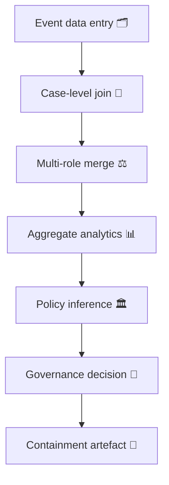

# 🧭 Data-Governance Swiss-Cheese Model — Case vs Role-Level Joins  
**First created:** 2025-11-11 | **Last updated:** 2025-11-11  
*Why your join logic decides who gets harmed.*

---

## 🧭 Orientation  

A database schema is a moral document.  
Whether it joins by *case* or by *role* determines who appears accountable, visible, or erased.  
This node applies the **Swiss-Cheese Model** of layered failure to **data joins**, showing how small design decisions create large containment consequences.  

At *case level*, incidents dominate.  
At *role level*, people do.  
Most governance failures arise when systems forget which join they’re using.

---

## ⚙️ Case vs Role-Level Joins  

| Join Logic | Definition | Typical Context | Governance Risk |
|:--|:--|:--|:--|
| **Case-level join** | Records linked by shared incident or file ID. | Police, MARAC, legal casework. | Merges unrelated individuals within one narrative. |
| **Role-level join** | Records linked by person or entity ID with role metadata. | Healthcare, HR, safeguarding. | Multiples of same event misread as repeated conduct. |
| **Hybrid join** | Case + role logic blended for analytics. | Data dashboards, research pilots. | Context loss; duplications hidden by aggregate stats. |

---

## 🧮 Flow of Containment  

Every step looks rational inside its own system layer — but together, the holes line up.

---

## 🧩 The Swiss-Cheese Parallel  

| Defence Layer | Purpose | Typical “Hole” in Data Context |
|:--|:--|:--|
| **Policy** | Define what should be linked | Ambiguous ID logic (“household” vs “individual”) |
| **Procedure** | Implement linkage rules | Inconsistent foreign-key validation |
| **System** | Execute joins automatically | Vendor defaults to fuzzy matching |
| **Audit** | Detect over-aggregation | Sample size too small for detection |
| **Culture** | Question statistical authority | “The dashboard can’t be wrong” reflex |

When these holes align, victim/offender inversions become “data-driven decisions.”

---

## 🪞 Governance Interpretation  

- **Case logic is bureaucratic empathy:** it feels tidy but absorbs everyone into the same event.  
- **Role logic is relational ethics:** it forces the system to remember who each person was.  
- **Swiss-cheese alignment** happens when data architects optimise for performance, not provenance.  

---

## 🧰 Correction Framework  

1. **Join Audit Review** — document every table join type and its justification.  
2. **Role Mapping Registry** — maintain a living catalogue of relationship fields and constraints.  
3. **Provenance Layering** — tag outputs with join type metadata (CASE or ROLE).  
4. **Cross-Domain Simulation** — test how records mutate when schema logic changes.  
5. **Transparency Appendix** — publish join logic in public data releases.  

---

## 🌌 Constellations  

🧭 🧩 ⚖️ 🧰  

The **Data-Governance Swiss-Cheese Model** bridges *System Governance* and *Legal & State Governance*.  
It pairs with *Swiss-Cheese Failures*, *Cross-Agency Data Integrity*, and *Data Lineage Review*.

---

## ✨ Stardust  

join logic, case schema, role mapping, relational governance, containment architecture, data ethics, safeguarding analytics, system drift, metadata transparency  

---

## 🏮 Footer  

*🧭 Data-Governance Swiss-Cheese Model — Case vs Role-Level Joins* is a living node of the Polaris Protocol.  
It models how technical architecture produces ethical topology — and how to realign the join before it joins you.

> 📡 Cross-references:  
> - [🧩 Swiss-Cheese Failures — When Process Holes Align](../🧩_System_Governance/🧩_swiss_cheese_failures_when_process_holes_align.md)  
> - [🧰 Cross-Agency Data Integrity — Role Directionality in Multi-Agency Panels](../⚖️_Legal_&_State_Governance/🧰_cross_agency_data_integrity_role_directionality_in_multi_agency_panels.md)  
> - [🧾 Data Lineage Review — How to Trace a Record’s Provenance](../🧩_System_Governance/🧾_data_lineage_review_how_to_trace_a_records_provenance.md)  

*Survivor authorship is sovereign. Containment is never neutral.*  

_Last updated: 2025-11-11_
