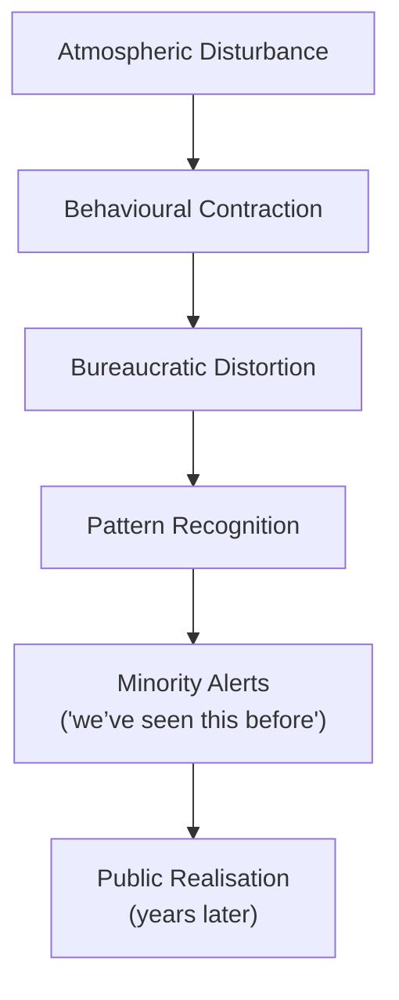

File: 🧭_how_authoritarian_drift_feels_from_the_inside.md

# 🧭 How Authoritarian Drift Feels From the Inside  
**First created:** 2025-11-17 | **Last updated:** 2025-11-17  
*The lived, emotional, and sensory experience of realising your country is drifting authoritarian — often long before institutions or media acknowledge it.*

---

## 🛰️ Orientation  
Authoritarian drift rarely announces itself.  
It does not arrive with:

- uniforms,  
- decrees,  
- coups,  
- or slogans.  

It arrives as *feelings*:  
subtle, cumulative, relational, bureaucratic, atmospheric.

This node documents the **interior experience** — the early human signals that something is structurally shifting long before the public narrative catches up.

It belongs to the cluster with:  
- 🧯 *prevent_as_political_atomisation_engine*  
- 🧩 *asymmetric_democratic_policing*  
- 📛 *bureaucratic_memory_failure_and_identity_contamination*  
- 🧠 *political_black_box_logic*

---

## ✨ Key Features  
- Maps the subjective sensations of authoritarian drift.  
- Highlights why minorities and dissidents feel it years before the majority.  
- Identifies psychological, behavioural, and bureaucratic “texture changes”.  
- Confirms that early perception is not paranoia — it is pattern recognition.  
- Anchors emotional disturbance inside a structural, not personal, context.

---

## 🧿 Analysis / Content  

### 🧨 1. Drift Is Felt Before It Is Seen  
Authoritarian systems shift in ways that are:

- soft,  
- slow,  
- cumulative,  
- plausibly deniable,  
- bureaucratically camouflaged.  

The public only recognises drift at Stage 4 or 5.  
Minorities feel it at **Stage 1**.

---

### ⚡ 2. The Early Sensations of Drift  
People report extremely consistent “felt sense” indicators:

#### **a) The sense that something is “off”**  
Hard to articulate, but unmistakable.

#### **b) Increased nervous system tension**  
Your body detects risk before the news does.

#### **c) Dread around official communication**  
A new feeling that interactions with the state could go wrong.

#### **d) Shrinking behavioural space**  
You intuitively start self-censoring.

#### **e) Feeling watched or misread**  
Not as paranoia — as pattern.

#### **f) Social conversations become coded**  
People speak in subtext, not surface.

#### **g) Minority groups “go quiet” online**  
A classic early-stage signal.

---

### 🗂️ 3. Bureaucratic Feelings of Drift  
People often encounter drift first through *administration*, not politics.

#### **a) Processes feel hostile**  
The tone changes — colder, vaguer, sharper.

#### **b) Errors escalate rather than resolve**  
Small mistakes become identity distortions.

#### **c) Institutions become skittish**  
Staff are too scared to intervene or correct.

#### **d) Accountability evaporates**  
You get trapped in loops, escalations, “computer says no”.

#### **e) The system feels like it’s “not telling the truth”**  
Communications become euphemistic or misleading.

This does not require conspiracy.  
It requires *fear* + *pressure* + *opaque information flows*.

---

### 🔥 4. Emotional Signatures of Drift  
These are the internal equivalents of seismic sensors:

- jittery baseline  
- difficulty resting  
- grief with no obvious source  
- rage at small things  
- inability to make long-term plans  
- a feeling you’re “not imagining things”  
- sudden clarity about past patterns  
- fear of speaking plainly  
- exhaustion that feels political, not personal  

You are not malfunctioning.  
You are reading the room.

---

### 🧬 5. Why Minoritised People Feel Drift First  
Because drift expands through:

- policing asymmetry  
- identity pathologising  
- bureaucratic suspicion  
- metadata contamination  
- Prevent-and-safeguarding creep  
- uneven use of state power  

Minorities are positioned closest to the fault lines.

In every historical case:  
Jews, Muslims, Black communities, dissident students, disabled people, migrants, queer people —  
**all felt it years before the majority acknowledged it.**

This is not sensitivity.  
It is proximity.

---

### 🌫️ 6. Why Drift Feels “Confusing” to the Majority  
Drift presents to majority groups as:

- culture-war noise  
- online tension  
- “politics being politics”  
- annoyance, not threat  

Meanwhile minority groups experience:

- fear,  
- precarity,  
- misinterpretation,  
- disproportionate intervention,  
- targeted surveillance,  
- reputational danger.  

Two realities, one country.

---

### 🔍 7. The Drift Recognition Framework  

This is why minority testimony is crucial early data.

---

### 🚨 8. The Emotional Cost of Being Early  
People who recognise drift early often experience:

- isolation  
- self-doubt  
- gaslighting by institutions  
- “stop being dramatic” responses from peers  
- fear they are “overreacting”  
- grief without language  
- exhaustion from understanding too much, too soon  
- feeling like they’re shouting into a void  

Polaris treats this as **legitimate early-warning intelligence**, not pathology.

---

### 🧭 9. The Polaris Reframe  
When you sense drift:

> “The problem is not that you’re sensitive.  
> The problem is that you’re *correct* before others catch up.”

Your nervous system is functioning as designed.

---

## 🏮 Footer  
**How Authoritarian Drift Feels From the Inside** is part of Polaris’ Democratic Drift Phenomenology cluster.  
It validates lived experience as a diagnostic tool and maps the early emotional signatures of a system slipping into authoritarian modes.

Crosslinks:  
- 🧯 *prevent_as_political_atomisation_engine*  
- 🧩 *asymmetric_democratic_policing*  
- 📛 *bureaucratic_memory_failure_and_identity_contamination*
