# 🧭 Justice Data Ecosystem Map (2020–2025)  
**First created:** 2025-11-11 | **Last updated:** 2025-11-11  
*Who holds the keys, and how the datasets talk to each other.*

---

## 🧭 Orientation  

Between 2020 and 2025, the UK justice data landscape consolidated under a few major infrastructures — each linking courts, prisons, probation, and academic research environments.  
The goal was transparency; the result is density.  
This map summarises who holds the data, how it flows, and where governance or contamination risks appear.

---

## ⚖️ Core Custodians  

| Controller / Host | Programme | Description | Access Pathway |
|:------------------|:-----------|:-------------|:----------------|
| **Ministry of Justice (MoJ)** | *Data First* | Core linkage of criminal, family, civil, and administrative datasets. | Access via ONS Secure Research Service (SRS). |
| **ONS & ADR UK** | *Administrative Data Research UK* | Cross-department data integration initiative (DfE, HMRC, NHS). | Accredited researcher model via SRS / SAIL. |
| **HMPPS / Probation** | *nDelius*, *P-NOMIS*, *OASys* | Live offender management and sentence tracking. | Internal access; limited extracts for MoJ analysis. |
| **Home Office** | *Police National Database (PND)* | Consolidated policing and intelligence data. | Law-enforcement restricted; aggregated statistics only. |
| **Local Authorities** | *MARAC / CSP / Serious Violence Duty data* | Safeguarding and violence-reduction returns. | Council-level servers; shared with Home Office dashboards. |
| **Universities** | *Research Partnerships (e.g. UCL, SHU, Nottingham)* | Projects using Data First or ADR datasets. | Accredited projects through MoJ / ONS. |

---

## 🧩 Data Pathways Diagram  

```mermaid
flowchart LR
A["Police & Courts"] --> B["MoJ Core Systems (CJS / Family / Civil)"]
B --> C["Data First Programme 🗄️"]
C --> D["ONS Secure Research Service 🔒"]
D --> E["ADR UK Projects / University Partners 🎓"]
E --> F["Derived Research Outputs 📑"]
F --> G["Public Policy Briefings / MoJ Reports 🏛️"]
C --> H["Linked Safeguarding Data (MARAC / VAWG) ⚠️"]
```

---

## ⚙️ University Partnerships (2020–2025)  

| Institution | Example Focus | Notes |
|:-------------|:---------------|:------|
| **University College London (UCL)** | Data First showcase; MoJ-ADR workshops | Runs training on secure dataset access. |
| **Sheffield Hallam University (SHU)** | Probation inspection and justice reform | Linked projects with HM Inspectorate of Probation. |
| **University of Nottingham (UoN)** | Public policy and data governance | Participant in local safeguarding analytics pilots. |
| **University of Oxford** | Justice data ethics & DataLab evaluation | Partners with ADR UK / MoJ. |
| **University of Essex / Manchester** | Technical hosts for synthetic datasets | Support UK Data Service pipelines. |

---

## 🧮 Governance & Risk Touchpoints  

| Node | Risk Vector | Mitigation |
|:------|:-------------|:------------|
| **Data First ↔ ADR UK join** | Schema drift, token switching | Token Integrity Audit & Data Lineage Review. |
| **HMPPS ↔ University collaboration** | Exported offender records | Restrict to pseudonymised aggregates. |
| **Local Authority ↔ MoJ dashboards** | Case-level linkage of safeguarding + criminal data | Enforce domain separation (Prevent vs VAWG). |
| **Vendor APIs** | Cloud mirroring of secure datasets | Regular penetration & provenance audits. |

---

## 🪞 Observations  

- The justice ecosystem now operates as **a federated data commons** — connected through SRS and SAIL, but governed by multiple controllers.  
- Most contamination occurs **at the boundaries**: export joins, pilot research projects, and local dashboards.  
- Accuracy controls depend on the **frequency of token reconciliation** and the integrity of mapping tables.  

---

## 🌌 Constellations  

🧭 🧩 ⚖️ 🧾  

Justice Data Ecosystem Map anchors the **Infrastructure & Research Data Pathways** set, connecting **Data Lineage Review**, **Token Integrity Audit**, and **Cross-Agency Data Integrity** into one operational overview.

---

## ✨ Stardust  

justice data, ministry of justice, data first, adr uk, ons secure research service, pseudonymisation, data governance, university research, schema linkage, token mapping, data ecosystem

---

## 🏮 Footer  

*🧭 Justice Data Ecosystem Map (2020–2025)* is a living node of the Polaris Protocol.  
It charts the architecture of justice-data systems during the UK’s integration wave, documenting both collaboration and risk.

> 📡 Cross-references:  
> - [🧾 Data Lineage Review — How to Trace a Record’s Provenance](../🧩_System_Governance/🧾_data_lineage_review_how_to_trace_a_records_provenance.md)  
> - [🪙 Token Integrity Audit](../🧩_System_Governance/🪙_Token_Integrity_Audit/)  
> - [🧰 Cross-Agency Data Integrity](../⚖️_Legal_&_State_Governance/🧰_cross_agency_data_integrity_role_directionality_in_multi_agency_panels.md)  

*Survivor authorship is sovereign. Containment is never neutral.*  

_Last updated: 2025-11-11_
