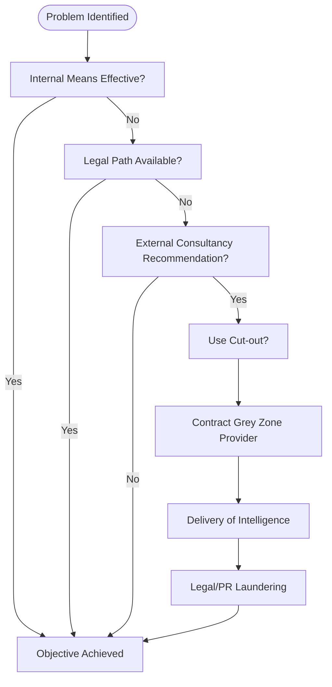

# 🧭 When to Enter the Grey Zone  
**First created:** 2025-11-05 | **Last updated:** 2025-11-05  
*A tactical field node: decision logic, thresholds and harms for organisations that consider outsourcing covert collection or suppression services ("grey zone" providers such as hack‑for‑hire, deep‑ops, reputation lawfare).*

---

## 🧭 Orientation / elevator
Not every information problem justifies a mercenary solution. The "grey zone" is a market for capabilities that sit between legit intelligence gathering and criminal intrusion: hack-for-hire shops, weaponised reputation firms, opaque private investigators. This node helps decision‑makers (and defenders) ask the right questions: when are these services procured, why, what are the thresholds, and what harms follow?

---

## TL;DR
- **You call the grey zone when lawful means fail and existential stakes justify extreme risk.**  
- Clients cluster in three types: State & para-state, Corporate/Elite, and Hybrid actors.  
- Engagement follows a predictable escalation: unmet need → consultant recommendation → cut-out hiring → active collection → legal laundering → cleanup.  
- The grey zone is a market of deniability; its use normalises coercion and creates systemic harms that far outlast the immediate objective.

---

## 1.  Definitions (practical)
- **Grey zone provider:** any private actor offering capabilities that materially enable covert intrusion, targeted surveillance, doxxing, or reputational suppression beyond OSINT. (e.g., hack-for-hire, offensive consultants, paywalled data brokers.)  
- **Cut-out:** intermediary shell, consultancy, or law firm used to mask the true commissioning party.  
- **Lawfare & reputation arm:** legal/PR companies that purchase or coordinate takedowns, SLAPPs, and SEO suppression to erase traces.

---

## 2.  Client types & motives (short)
- **A: State & para‑state** — national security, foreign intel, dissident tracking, covert leverage. Motive: strategic advantage + plausible deniability.  
- **B: Corporate / Elite** — M&A advantage, competitor sabotage, litigation leverage. Motive: preserve markets, block rivals.  
- **C: Hybrid actors** — political consultancies, litigation funders, private equity with regulatory risk. Motive: win legal/political outcomes without direct exposure.  

---

## 3.  Decision thresholds — when organisations escalate
Consider procurement only when at least one high‑confidence trigger is met **and** mitigation options are exhausted:

**Triggers (any):**  
- Existential commercial threat (loss means bankruptcy/hostile takeover).  
- Legal or reputational exposure where public disclosure destroys the actor.  
- National security imperative declared in a way that normal intelligence channels cannot legally act.  
- Urgent time-critical vulnerability (e.g., imminent data exfiltration by competitor).

**Exhaustion checklist (all must be satisfied):**  
- Lawful/in‑house OSINT & red‑team have been exhausted.  
- Legal pathways (court orders, subpoenas, lawful intercept) attempted and failed.  
- Non‑covert mitigations (PR, negotiation, arbitration) attempted and failed.  
- Board/counsel sign‑off with explicit risk acknowledgement and a pre‑approved exit plan.

If triggers are present **and** exhaustion checklist satisfied, the probability of contacting a grey zone provider increases — but ethical, legal and reputational consequences remain.

---

## 4.  Typical escalation sequence (for OSINT capture)
1. Problem surfaced (board/minister brief).  
2. Internal review (legal, IT, risk) — if solvable: stop. If not: proceed.  
3. External risk consultancy recommendation.  
4. Use of intermediary (cut‑out) to procure technical collection.  
5. Contractor executes (intrusion / data purchase / social engineering).  
6. Derived product delivered (dox, credentials, private comms).  
7. Legal team frames usable material into litigation/PR.  
8. Reputation firms suppress digital trails and initiate takedown campaigns (post hoc cleaning).

---

## 5.  Decision tree (visual)

---

## 6.  Risk matrix (short)
| Risk type | Likelihood | Impact | Notes |
|---|---:|---:|---|
| Legal prosecution | Medium | High | cross-border laws, computer misuse statutes |
| Reputational damage | High | High | exposure amplifies harm beyond original target |
| Strategic blowback | Medium | Very High | target countermeasures, diplomatic fallout |
| Operational compromise | High | Medium | contractor double-cross, data leaks |
| Institutional capture | Low | Very High | normalising outsourcement of coercion |

---

## 7.  Mitigation & governance (musts before any engagement)
- **Pre-approval:** board-level written authorization and legal sign-off.  
- **Minimality principle:** define narrow, time-limited scope and acceptance criteria for data use.  
- **Audit & custody:** escrow of deliverables with third-party custodian; no raw tool handover.  
- **Exit & denial plan:** explicit plan to cut ties, public statement templates, and indemnities.  
- **Independent oversight:** when possible, a neutral counsel or ombudsman reviews the contract.  
- **Contingency:** immediate public-archiving plan for any investigative reporting that might be suppressed.

---

## 8.  OSINT & Defender checklist (if you are investigating/defending)
- Mirror and timestamp any suspicious targeted materials.  
- Track corporate breadcrumbs: payment flows, cut-out addresses, nominee directors.  
- Collect IOCs and passive DNS for suspected servers.  
- Monitor legal filings: injunctions, defamation suits, takedown notices.  
- Cross-check alumni networks: training rosters, conference speakers, Git commits.  
- Coordinate multi-outlet publication for high-risk exposés (simultaneous release reduces takedown impact).

---

## 9.  Ethics & norms (quick)
- Outsourcing coercion commodifies repression and externalises moral responsibility.  
- Even "defensive" hires create precedent: others will emulate for offensive ends.  
- Organisations should ask: would we tolerate this of ourselves if roles were reversed?

---

## 🌌 Constellations
Links into: Disruption_Kit/Big_Picture_Protocols, Metadata_Sabotage_Network, Lawfare_and_Reputation, Defensive_Playbook.

---

## ✨ Stardust
grey zone, hack-for-hire, cut-out, lawfare, outsourced coercion, decision thresholds, operational minimality

---

## 🏮 Footer
This node is tactical — designed to help organisations think like both clients and defenders. It is not an instruction manual for wrongdoing. Use for analysis, oversight and defensive planning.

_Last updated: 2025-11-05_
