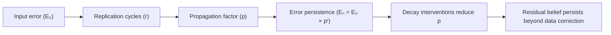

# 🧮 Data-Error Decay Table  
**First created:** 2025-11-11 | **Last updated:** 2025-11-11  
*Tracking how informational integrity erodes over time.*

---

## 🧭 Orientation  

Every dataset carries within it the seeds of its own decay.  
Errors accumulate, replicate, and eventually harden into institutional memory — sometimes faster than anyone notices, sometimes over decades.  

This node defines the **half-life of data error**: the time it takes for a local inaccuracy to propagate through networks of trust, replication, and automated reuse.  
It links technical governance (integrity checks, version control) with narrative governance (who still believes the old story).

---

## ⚖️ Conceptual Frame — *Error as Radiation*  

| Decay Stage | Description | Typical Timeframe | Containment Countermeasure |
|:--|:--|:--|:--|
| **1️⃣ Local corruption** | A typo, mis-key, or missed validation. | Minutes → Days | Data-entry guardrails; live correction logs. |
| **2️⃣ System propagation** | Error copied into parallel systems via export or sync. | Days → Weeks | Automated reconciliation; checksum verification. |
| **3️⃣ Inter-agency contamination** | Datasets shared across controllers; error becomes “authoritative.” | Weeks → Months | Data lineage review; cross-domain audit. |
| **4️⃣ Policy entrenchment** | Reports, dashboards, or KPIs derived from corrupted data. | Months → Years | Publish lineage metadata; freeze input schema. |
| **5️⃣ Narrative sedimentation** | Error referenced in media or governance rhetoric; becomes *truth*. | Years → Indefinite | Retraction protocols; narrative correction layer. |

---

## 🧩 Formula of Decay  

Even when a record is fixed, the **belief** it generated decays more slowly than the data itself.

---

## 🧮 Error Half-Life Index  

| Domain | Typical Half-Life | Notes |
|:--|:--|:--|
| **Operational databases** | 7-14 days | Depends on refresh frequency and overwrite rules. |
| **Analytical dashboards** | 1-3 months | Errors survive in cached extracts. |
| **Cross-agency datasets** | 6-12 months | Drift sustained by asynchronous updates. |
| **Published statistics** | 3-5 years | Revisions rare; reputational cost discourages correction. |
| **Public narrative** | Indefinite | Only counter-storytelling reverses perception. |

---

## 🪞 Governance Interpretation  

Error decay is a governance phenomenon, not just a technical one.  
- **Institutional inertia** keeps obsolete figures in circulation.  
- **Vendor lock-in** prevents rapid correction.  
- **Audit latency** means mis-facts outlive accountability cycles.  

The longer the half-life, the more **containment converts into mythology**.

---

## 🧰 Mitigation Framework  

| Layer | Control Mechanism | Frequency | Owner |
|:--|:--|:--|:--|
| **Data** | Scheduled reconciliation audits | Weekly | Data Steward |
| **System** | Versioned exports + checksums | Monthly | IT Governance |
| **Policy** | Lineage citation in reports | Quarterly | Dept. Head |
| **Narrative** | Public correction & timestamping | Continuous | Communications Lead |

---

## 🌌 Constellations  

🧮 🧾 🪙 🧩  

The **Data-Error Decay Table** anchors the *Integrity Spine*, connecting:  
- *🧾 Data Lineage Review* — how to trace back decay origins.  
- *🪙 Token Integrity Audit* — how to measure cryptographic drift.  
- *🧩 Swiss-Cheese Failures* — how multiple small omissions align.

---

## ✨ Stardust  

data decay, error propagation, lineage, audit frequency, half-life of misinformation, institutional inertia, governance entropy, narrative persistence

---

## 🏮 Footer  

*🧮 Data-Error Decay Table* is a living node of the Polaris Protocol.  
It defines how mistakes age faster than accountability — and how to design decay-resistant governance.

> 📡 Cross-references:  
> - [🧾 Data Lineage Review — How to Trace a Record’s Provenance](../🧩_System_Governance/🧾_data_lineage_review_how_to_trace_a_records_provenance.md)  
> - [🪙 Token Integrity Audit — How to Check for Pseudonym Drift](../🧩_System_Governance/🪙_token_integrity_audit_how_to_check_for_pseudonym_drift.md)  
> - [🧩 Swiss-Cheese Failures — When Process Holes Align](../🧩_System_Governance/🧩_swiss_cheese_failures_when_process_holes_align.md)  

*Survivor authorship is sovereign. Containment is never neutral.*  

_Last updated: 2025-11-11_
