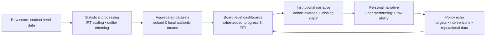

# 🧮 PIPS–YELLIS Data Ecosystem — From Baseline to Board Narrative  
**First created:** 2025-11-08 | **Last updated:** 2025-11-08  
*A reconstruction of how Durham/CEM baseline assessments evolved into national data narratives — and how trimming, aggregation, and institutional storytelling distort personal meaning.*

---

## 🧭 Orientation  
Between the mid-1990s and late 2010s, Durham University’s **Centre for Evaluation & Monitoring (CEM)** built a full “satellite” chain of cognitive-progress assessments: **PIPS**, **InCAS**, **MidYIS**, **YELLIS**, and **ALIS**.  
They were framed as neutral progress tools, but the data trail they created became the quiet backbone of many UK education-performance dashboards.  
This node unpacks how those systems worked technically, how trimming and aggregation shaped interpretation, and how local board-level narratives can diverge from personal truth.

---

## 🧩 Key Components  

| Layer | Acronym & Age Band | Purpose | Output Scale |
|-------|--------------------|----------|---------------|
| Early Years | **PIPS** — Performance Indicators in Primary Schools | Baseline literacy, numeracy, socio-emotional readiness | Standard Score 100 ± 15 |
| Primary / Junior | **InCAS** — Interactive Computerised Assessment System | Adaptive diagnostic of reading, maths, reasoning | 100 ± 15 |
| Lower Secondary | **MidYIS** — Middle Years Information System | Predictive baseline for KS3/GCSE | 100 ± 15 |
| GCSE Age | **YELLIS** — Year Eleven Information System | Predicts GCSE outcomes; value-added benchmarking | 100 ± 15 |
| A-Level | **ALIS** — Advanced Level Information System | Predicts A-level results from GCSE + ability data | 100 ± 15 |

All five were norm-referenced, computer-adaptive, and designed to feed **value-added** metrics for schools and local authorities.

---

## 🔍 Data Mechanics  

1. **Item Response Theory (IRT):**  
   - Raw answers converted into a latent ability estimate (θ).  
   - Scaled to mean = 100, SD = 15.  
   - In principle, scores could range 60–150+ but few appeared above 140.

2. **Outlier Handling:**  
   - Anything > 3 SDs (≈ > 145) flagged as probable error.  
   - Many datasets “winsorised” → replaced 147 → 145 or deleted.  
   - Result: genuine top scores flattened to maintain a smooth national curve.

3. **Aggregation:**  
   - Individual scores uploaded → Durham servers → anonymised & aggregated.  
   - School-level averages used in **value-added** and **FFT** (Fischer Family Trust) targets.  
   - Extreme values often trimmed before publication.

4. **Feedback Loop:**  
   - Schools see reports → MIS upload → predicted GCSEs & Ofsted dashboards.  
   - Local authorities and MAT boards receive only “clean” data → apparent equity, hidden erasure.

---

## 🧠  Data-to-Narrative Drift  

### Reading the flow  
- **A→B:** genuine individuality becomes a probability distribution.  
- **B→C:** outliers suppressed; datasets homogenised.  
- **C→E:** boards see tidy graphs → assume fairness.  
- **E→F:** staff internalise simplified stories (“gifted”, “average”, “weak”).  
- **F→G:** those stories justify interventions and future trimming.  

The loop is self-reinforcing: *statistical neatness produces bureaucratic certainty*, which produces reputational inertia.

---

## 🏛️  Board-Level Optics vs Personal Truth  

| Dimension | Board-Level Optic | Personal Reality |
|------------|------------------|------------------|
| **Outliers** | Treated as data noise | Often high- or low-performing individuals with unusual trajectories |
| **Progress** | Value-added score; numbers of pupils above expectation | Continuous human learning, illness, trauma, context |
| **Equity** | “Narrowing gaps” through averages | Flattening variance can erase both excellence and need |
| **Accountability** | School success/failure narrative | Student experience rarely examined individually |
| **Story Management** | Protect institution | Protect truth and evidence |

Boards need stability; individuals need nuance.  
When those priorities conflict, trimming and mis-labelling provide the illusion of competence.

---

## 🧮  Cultural Consequences  

1. **Statistical erasure:** Exceptional results disappear from public datasets, feeding “mediocrity comfort.”  
2. **Narrative inertia:** Once “average” is recorded, counter-evidence struggles to propagate.  
3. **Epistemic injustice:** People who don’t fit the model (disabled, neurodivergent, traumatised, nonlinear learners) are recoded as “defective data.”  
4. **Policy recursion:** Future algorithms train on already-trimmed data → the curve tightens.  

---

## 🌌 Constellations  
🧮 🧠 ⚖️ — diagnostic of containment-by-statistics; positioned between education governance and personal data sovereignty.  

---

## ✨ Stardust  
pips, yellis, midyis, alis, durham cem, outlier trimming, educational data, value-added, board narrative, data erasure, epistemic injustice  

---

## 🏮 Footer  

*PIPS–YELLIS Data Ecosystem — From Baseline to Board Narrative* is a living analytic node of the Polaris Protocol.  
It links individual experience of data distortion with systemic practices of trimming and narrative control in UK education.  

> 📡 Cross-references:  
> - [🧠 Extraction Loop — Data vs Story](../Extraction_Reclamation/🧠_extraction_loop_data_vs_story.md)  
> - [🧩 Counter-Extraction Loop — Reclaiming Authorship](../Extraction_Reclamation/🧩_counter_extraction_loop_reclaiming_authorship.md)  
> - [📊 Containment Contracts](../Disruption_Kit/Containment_Scripts/📊_containment_contracts.md)  

*Survivor authorship is sovereign. Containment is never neutral.*  

_Last updated: 2025-11-08_
