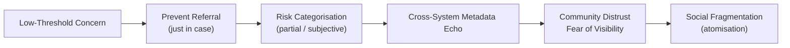

File: 🧯_prevent_as_political_atomisation_engine.md

# 🧯 Prevent as a Political Atomisation Engine  
**First created:** 2025-11-16 | **Last updated:** 2025-11-16  
*How Prevent functions not only as a counter-extremism policy, but as a structural engine of social fragmentation, misclassification, and pre-emptive political suppression.*

---

## 🛰️ Orientation  
Prevent is often framed as a safeguarding tool.  
In practice, it has become a **political atomisation engine**: a system that fractures trust, disaggregates communities, collapses nuance, and encourages public institutions to misinterpret dissent, distress, or minority identity as “risk”.

Prevent’s harm is **structural**, not incidental.  
It teaches institutions:

- to see political speech as threat,  
- to treat difference as danger,  
- to prioritise reputation over rights,  
- to view minority communities as “pre-radical populations”,  
- and to act on suspicion rather than evidence.

This node sits alongside:  
- 🧷 *culture_war_risk_logic_in_uk_public_institutions*  
- 🗃️ *safeguarding_logic_mission_creep_and_identity_pathologising*  
- 📡 *cross-system_metadata_echo_chains*  

---

## ✨ Key Features  
- Frames Prevent as a system that **atomises communities** rather than protecting them.  
- Maps how Prevent logic mutates into suspicion of normal behaviour.  
- Highlights its role in generating misinterpretation and over-flagging.  
- Explains how Prevent contaminates data systems (risk adjectives, flags, notes).  
- Shows why it disproportionately harms racialised and minority groups.  

---

## 🧿 Analysis / Content  

### 🔨 1. Prevent’s Actual Mechanism Is Structural, Not Moral  
Prevent does not rely on officers being malicious.  
It relies on:

- **high anxiety**,  
- **low thresholds for concern**,  
- **political pressure to “demonstrate action”**,  
- **training that emphasises catastrophic thinking**,  
- **algorithmic suspicion frameworks**,  
- **and the institutional fear of “missing a sign”**.

These factors guarantee:

> **Over-referral, over-pathologising, and over-policing of identity.**

---

### 🧩 2. Prevent Turns Communities Into Surveillance Nodes  
Prevent disperses responsibility for detecting “extremism” across:

- teachers  
- doctors  
- nurses  
- lecturers  
- librarians  
- council workers  
- youth workers  

— none of whom have meaningful training in:

- political ideologies,  
- trauma responses,  
- cultural nuance,  
- minority identity,  
- or dissent theory.

The result is **distributed misinterpretation**.

Communities begin to view each other through surveillance logic, not solidarity.

---

### ⚠️ 3. Prevent Misreads:  
Prevent encourages institutions to misinterpret:

- activism → “extremism risk”  
- grief or anger → “radicalisation pathway”  
- religious identity → “ideological exposure”  
- academic interest → “concerning material”  
- trauma symptoms → “behavioural indicators”  
- political speech → “pre-criminality”  

This is not safeguarding —  
it is **political risk inflation**.

---

### 🔄 4. The Atomisation Pipeline  

Prevent accelerates the breakdown of social cohesion by forcing everyone into **surveillance-adjacent relationships** with one another.

---

### 🧬 5. Why Prevent Produces Identity Pathologising  
Prevent is built on the assumption that:

> **Risk exists before evidence.**  
> **Threat is detectable in “behavioural signals.”**

This leads to the pathologising of:

- religious expression  
- grief  
- student activism  
- political engagement  
- autistic behaviours  
- cultural non-conformity  
- emotional distress  
- trauma responses  
- academic curiosity about political movement  

Prevent logic collapses **identity** and **intent** into a single risk category.

---

### 🎯 6. Who Gets Harmed First  
Prevent’s harms are disproportionately felt by:

- Muslim communities  
- Black and brown students  
- refugees and migrants  
- autistic and neurodivergent people  
- activists  
- left-wing student organisers  
- Jewish people during geopolitical tension  
- anyone whose dissent is “legible” as risk  

Prevent is structurally designed to read racially coded behaviours as suspicious.

---

### 🧠 7. The Emotional Aftermath  
People referred to Prevent — even incorrectly — experience:

- severe reputational damage  
- fear of speaking publicly  
- distrust of institutions  
- academic or employment consequences  
- psychological trauma  
- long-term monitoring behaviours  
- feeling “marked”  

Prevent creates **political hypervigilance** in citizens who have done nothing wrong.

This is not an accident of implementation.  
It is a design effect.

---

### 🧭 8. Why Prevent Is a Democratic Threat  
Prevent:

- suppresses legitimate dissent  
- chills free speech  
- reinforces culture war narratives  
- encourages identity-based suspicion  
- creates multi-year data contamination  
- discredits entire communities through implication  
- fosters compliance over autonomy  
- nudges public bodies into authoritarian reflexes  

Prevent teaches institutions that:

> **Silence is safety.  
Difference is dangerous.  
And political engagement is a risk to be managed.**

This is fundamentally incompatible with democratic health.

---

## 🏮 Footer  
**Prevent as a Political Atomisation Engine** anchors Polaris’ analysis of authoritarian drift, community fragmentation, and data contamination.  
It exposes how systems built under the banner of “safety” become engines for political suppression and misinterpretation.

Crosslinks:  
- 🧷 *culture_war_risk_logic_in_uk_public_institutions*  
- 🗃️ *safeguarding_logic_mission_creep_and_identity_pathologising*  
- 📡 *cross-system_metadata_echo_chains*
