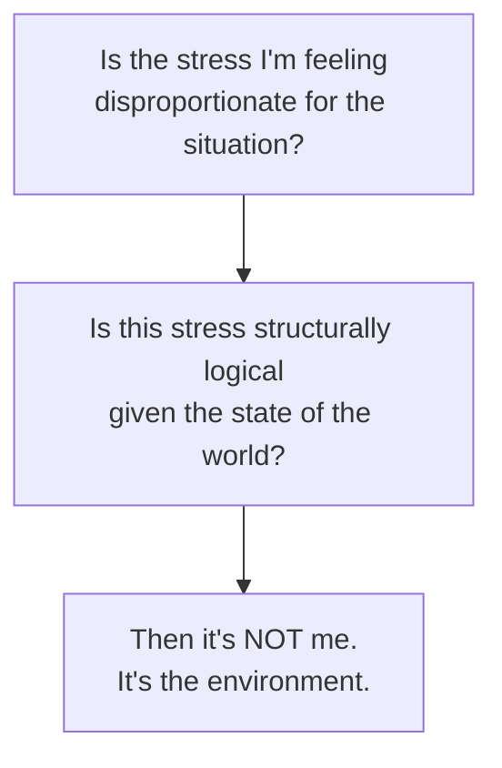

File: 🧯_signs_your_brain_is_tired_because_society_is_batshit.md

# 🧯 Signs Your Brain Is Tired Because Society Is Batshit  
**First created:** 2025-11-17 | **Last updated:** 2025-11-17  
*A Polaris guide to distinguishing personal failure from structural overwhelm — and recognising when your brain is simply reacting appropriately to an environment that is objectively unhinged.*

---

## 🛰️ Orientation  
A huge amount of distress people experience today is **structurally induced**.  
Not personal.  
Not pathological.  
Not a moral flaw.

Your brain is not malfunctioning —  
it is **responding accurately to a malfunctioning environment**.

This node gives you a diagnostic checklist for recognising when emotional collapse is not about *you*, but about:

- democratic drift  
- economic instability  
- bureaucratic misinterpretation  
- data contamination  
- political chaos  
- culture war noise  
- public-sector erosion  
- the general “batshit” vibes of society  

Pairs with:  
- 🌲 *campfire_stability_model_for_modern_citizens*  
- 🔥 *your_emotional_campfire_care_kit*  
- 🌲 *rebuilding_spark_in_a_political_forest_fire*  

---

## ✨ Key Features  
- Helps citizens identify system-induced exhaustion.  
- Reframes emotional overwhelm as a rational response.  
- Offers a Polaris-approved diagnostic list for structural burnout.  
- Protects against internalised blame.  
- Validates the nervous system’s sensitivity during societal stress.

---

## 🧿 Analysis / Content  

### 🧨 1. The Principle:  
> **Your brain is not tired because *you* are weak —  
> your brain is tired because the country is on fire and your nervous system can smell smoke.**

It is adaptive to react to instability.

---

### 🚩 2. Signs Your Brain Is Tired Because *You* Are Failing  
(For contrast — the “normal” mental health stuff)

- unprocessed personal grief  
- interpersonal conflict  
- untreated trauma  
- chronic illness  
- lack of sleep  
- exhaustion from work/parenting  
- emotional suppression  
- isolation  

These are personal load factors.

But very often the distress you feel has nothing to do with this list.

---

### 🔥 3. Signs Your Brain Is Tired Because **Society Is Batshit**  
This is where the Polaris magic kicks in.

If ANY of the following are true, your brain is reacting to the *external* weather, not internal weakness:

#### **a) You feel dread opening official emails**  
→ that’s conditioned by bureaucratic unpredictability.

#### **b) You struggle to make decisions you’d normally find easy**  
→ cognitive bandwidth is eaten by structural anxiety.

#### **c) You’re exhausted by small admin tasks**  
→ admin now carries existential threat cues.

#### **d) You feel hypervigilant around “how you’ll be interpreted”**  
→ that’s the legacy of misinterpretation environments.

#### **e) News cycles feel like personal attacks**  
→ your nervous system recognises instability signals.

#### **f) You feel ashamed for “not coping better”**  
→ shame is the by-product of being blamed for structural failures.

#### **g) You bounce between “overwhelm” and “numb”**  
→ normal oscillation under collective stress.

#### **h) You’re tired in a way sleep doesn’t fix**  
→ systemic, not biological, depletion.

#### **i) You fantasise about disappearing, quitting society, or living in a forest**  
→ normal response to collective dysfunction.

#### **j) You feel like reality is too loud or too sharp**  
→ sensory overwhelm under chronic environmental noise.

#### **k) You keep saying “This is insane” out loud**  
→ because it is.

---

### 🧠 4. The “Societal Batshit Index”  
A quick Polaris test:

If both feel true:  
→ *your brain is operating normally under abnormal conditions.*

---

### 🧩 5. Why Society Feels Batshit (The Structural Reasons)  
- Prevent drift  
- data contamination  
- political fracturing  
- disinformation  
- culture war manipulation  
- economic collapse  
- institutional burnout  
- climate grief  
- bureaucratic hostility  
- loss of state capacity  

You are not imagining it.  
The environment is objectively destabilising.

---

### 🧬 6. The Nervous System Under Collective Stress  
Your nervous system reacts to societal instability the same way it reacts to:

- natural disasters  
- unsafe environments  
- toxic workplaces  
- abusive systems  
- unpredictable authority  
- existential threat

This is evolutionary accuracy, not neurosis.

---

### ✨ 7. Signs Your Brain Is Starting to Recover  
- humour returning  
- tiny sparks of curiosity  
- mild desire to tidy or organise  
- less dread around admin  
- thinking about the future again  
- emotional “breathing room”  
- softness returning in your thoughts  
- reduced catastrophising  

These are good omens.  
They are small but real.

---

### 🧭 8. The Polaris Reframe  
This is the core message:

> **You are not malfunctioning.  
> You are reacting proportionately to an environment that is objectively overwhelming.  
> Your distress is evidence of sensitivity, not failure.**

Your brain is doing its best under conditions it was never meant to endure.

---

## 🏮 Footer  
**Signs Your Brain Is Tired Because Society Is Batshit** belongs to Polaris’ Emotional Systems & Democratic Drift cluster.  
It protects citizens from internalising structural harm and helps people recognise when exhaustion is a rational response to a chaotic political environment.

Crosslinks:  
- 🌲 *campfire_stability_model_for_modern_citizens*  
- 🔥 *your_emotional_campfire_care_kit*  
- 🌲 *rebuilding_spark_in_a_political_forest_fire*
