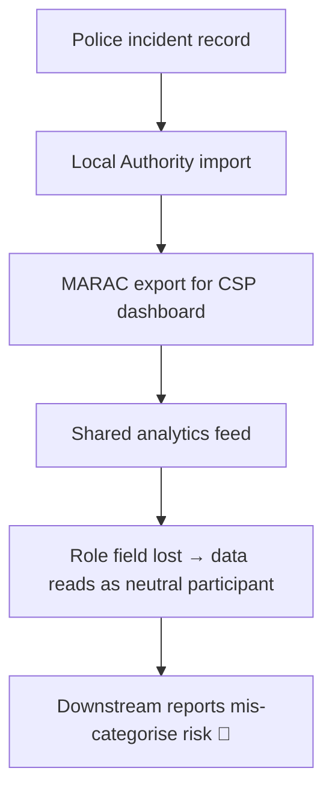

# 🧰 Cross-Agency Data Integrity — Role Directionality in Multi-Agency Panels  
**First created:** 2025-11-11 | **Last updated:** 2025-11-11  
*When partnership data forgets who is who.*

---

## 🧭 Orientation  

Multi-agency panels exist to coordinate safeguarding.  
MARAC, MAPPA, and Community Safety Partnerships share information so victims are protected, offenders are managed, and risks are contained.  
But when the same systems handle all sides of a case, **directionality** — who did what to whom — can blur.  

This node maps how cross-agency data structures lose that orientation and how governance can rebuild it.

---

## ⚖️ Structural Context  

| Panel | Primary Purpose | Data Controllers | Core Systems |
|:------|:----------------|:-----------------|:--------------|
| **MARAC** | Coordinate responses to high-risk domestic abuse | Local Authority / Police / IDVA | ECINS / Mosaic / LiquidLogic |
| **MAPPA** | Manage serious sexual or violent offenders | Probation / Police / HMPPS | nDelius / P-NOMIS |
| **CSP** | Oversee community-wide safety and violence reduction | Local Authority / Health / Police | Power BI dashboards / custom data warehouses |

These structures depend on *shared identifiers* — often the same case or person IDs used by multiple agencies — yet they rarely maintain explicit **role fields** to separate victim, offender, and by-stander data.

---

## 🧩 Directionality Failures  

| Failure Mode | Description | Consequence |
|:--------------|:-------------|:-------------|
| **Role inversion** | Victim and offender swapped through shared case ID. | Risk management decisions target the wrong person. |
| **Context collapse** | Data from different domains merged without relational metadata. | Victim support flagged as “offender-linked.” |
| **Schema drift** | Role field absent or renamed between systems. | Audit trails break; accountability diffuses. |
| **Bulk upload error** | CSV imports overwrite role codes. | Datasets show duplicate but conflicting roles. |

---

## 🧮 Flow of Confusion  

---

## 🪞 Why It Matters  

- **Safeguarding integrity:** Victim safety depends on correct role attribution.  
- **Legal compliance:** Wrong role = inaccurate data (GDPR Art. 5(1)(d)).  
- **Operational clarity:** Mis-coded cases distort local performance metrics.  
- **Ethical accountability:** Institutional voice depends on relational truth.  

---

## 🧰 Integrity Checklist  

| Layer | Question | Verification |
|:------|:----------|:-------------|
| **Schema** | Are role fields (`victim_of`, `offender_of`, `related_to`) explicit and mandatory? | Review database dictionary / ETL spec. |
| **Data Entry** | Do user forms enforce one primary role per record? | Inspect front-end validation. |
| **Exports** | Are roles preserved in CSV/XML outputs? | Compare field names across systems. |
| **Imports** | Are join scripts case- or person-based? | Confirm join keys in integration logs. |
| **Audit** | Are random sample checks run each quarter? | Document accuracy % and reversals. |

---

## 🧱 Governance Interventions  

1. **Shared Directionality Standard** — all agencies adopt a common `role_type` taxonomy.  
2. **Dual-Controller Agreement** — any system containing cross-roles must specify who owns rectification.  
3. **Lineage Logging** — export/import scripts must append origin metadata.  
4. **Cross-Cluster Training** — teach analysts to spot and flag role inversion before publication.  

---

## 🌌 Constellations  

🧰 🕸️ 🕊️ 🪙  

Cross-Agency Data Integrity connects the *Safeguarding Architecture* set — **Prevent ↔ VAWG Overlap**, **Data-Contact Breach**, and the **Token Integrity Audit**.  
Together they map how governance must hold its own joins accountable.

---

## ✨ Stardust  

multi-agency data, role directionality, MARAC, MAPPA, CSP, safeguarding architecture, schema drift, relational metadata, data lineage, joint controllers, audit integrity

---

## 🏮 Footer  

*🧰 Cross-Agency Data Integrity — Role Directionality in Multi-Agency Panels* is a living node of the Polaris Protocol.  
It defines how cooperation without structure becomes containment without clarity — and how explicit directionality protects both truth and safety.

> 📡 Cross-references:  
> - [🕸️ Prevent ↔ VAWG Overlap — Shared Safeguarding Infrastructures](../⚖️_Legal_&_State_Governance/🕸️_prevent_vawg_overlap_shared_safeguarding_infrastructures.md)  
> - [🕊️ Data-Contact Breach — When Restraining Orders Fail via Data](../⚖️_Legal_&_State_Governance/🕊️_data_contact_breach_when_restraining_orders_fail_via_data.md)  
> - [🪙 Token Integrity Audit](../🧩_System_Governance/🪙_Token_Integrity_Audit/)  

*Survivor authorship is sovereign. Containment is never neutral.*  

_Last updated: 2025-11-11_
