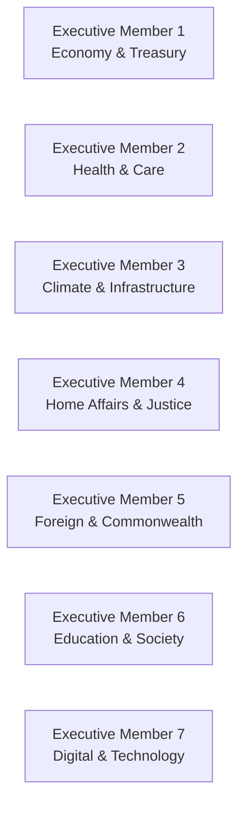

File: 🧱_cabinet_led_collective_executive_models_for_the_uk.md

# 🧱 Cabinet-Led Collective Executive Models for the UK  
**First created:** 2025-11-16 | **Last updated:** 2025-11-16  
*A structural alternative to the Prime Minister model — embedding collective authority, portfolio specialisation, and anti-drift architecture into the heart of governance.*

---

## 🛰️ Orientation  
The UK operates on a **monarchic hangover**:  
one leader, one pinnacle of authority, one point of pressure.

This structure is:

- psychologically unrealistic,  
- politically unstable,  
- highly vulnerable to media panic,  
- and dangerously exposed to authoritarian drift.

This node outlines a **collective executive** — a team of equal, elected cabinet members — designed to distribute power sustainably and align governance with human cognitive limits.

It sits alongside:  
- 🧩 *distributed_executive_governance*  
- 🔧 *democratic_resilience_architecture_for_21st_century_britain*  
- 🧠 *political_black_box_logic*

---

## ✨ Key Features  
- Defines a cabinet-as-executive model tailored to UK political culture.  
- Proposes a 5–7 member elected executive council (“The Executive Cabinet”).  
- Shows how shared portfolios reduce distortion and panic.  
- Replaces PM-centred power with distributed authority.  
- Builds structural resilience against drift, burnout, and culture-war escalation.

---

## 🧿 Analysis / Content  

### 🧨 1. The UK’s Current Problem: The PM Is a Single Point of Failure  
A lone executive:

- receives distorted briefings  
- collapses under fear-driven pressure  
- is targeted by media storms  
- becomes emotionally overloaded  
- issues reactive decisions  
- unintentionally centralises power  
- loses moral clarity  
- becomes the bottleneck for the entire state  

The system fails by design.

---

### 🧱 2. What a Collective Executive Looks Like  
A collective executive replaces the PM with:

### **The Executive Cabinet (5–7 elected members)**  
Each with:

- equal constitutional authority  
- individual portfolios  
- collective decision-making responsibilities  
- rotating chair for ceremonial duties  
- shared accountability  
- mutual veto or consensus rules  

This is not “the Cabinet” as it currently exists (subordinate to the PM).  
This is a **constitutional executive body**.

---

### 🎛️ 3. Portfolio Distribution (Example)  

Portfolios are assigned post-election based on expertise and negotiation.

---

### 🧩 4. How Collective Executives Reduce Distortion  

#### **a) No single emotional collapse point**  
Stress is distributed.  
No one breaks alone.

#### **b) Internal challenge becomes normal**  
Executives correct each other’s distortions in real time.

#### **c) Media storms can’t target one person**  
Attacks disperse; panic does not concentrate.

#### **d) Specialist knowledge is respected**  
Decisions aren’t made by someone who read a briefing at 7am.

#### **e) Culture war pressure weakens**  
Collective reasoning slows escalation.

#### **f) Authoritarian drift becomes almost impossible**  
No individual has the power to centralise the state around themselves.

---

### 🧭 5. Decision-Making Structure  

#### **Consensus Default**  
≥5/7 votes for major decisions.

#### **Mutual Veto for Rights-Based Issues**  
Minority-protective design ensures:

- racial justice  
- disability rights  
- religious equality  
- LGBT protections  
- academic freedom  
- protest rights  

…cannot be overridden by majoritarian panic.

#### **Portfolio Autonomy in Routine Decisions**  
Executives lead in their domain but check in for cross-impact issues.

---

### 🔧 6. How the Model Interacts With Parliament  
Parliament still:

- scrutinises  
- legislates  
- holds inquiries  
- runs committees  
- audits spending  
- can vote no confidence  

But the executive is **not one person** who can be toppled by scandal.  
It is a **system**, not a personality.

This stabilises governance during crisis.

---

### 🧨 7. Why the UK Is Ripe for This Shift  
The UK has:

- a tradition of coalition governance (devolved nations)  
- committee-based scrutiny  
- Cabinet precedent  
- a historical preference for collegial decision-making (pre-70s)  
- political burnout in every party  
- intense public mistrust of single leaders  
- high media volatility  
- a constitutional landscape begging for modernisation  

The collective executive model fits naturally into British political DNA.

---

### 🌱 8. Cultural Implications  
A collective executive:

- ends personality-based campaigns  
- weakens cult-of-individual narratives  
- strengthens issue-based politics  
- normalises cross-party cooperation  
- reduces leader-centrism  
- distributes blame and praise fairly  
- lowers emotional volatility in public discourse  
- prevents populist overreach  

It is a cultural stabiliser as well as a constitutional one.

---

## 🏮 Footer  
**Cabinet-Led Collective Executive Models for the UK** is part of Polaris’ constitutional redesign cluster.  
It provides a practical, culturally informed pathway toward distributed governance capable of resisting panic, misinterpretation, and authoritarian drift.

Crosslinks:  
- 🔧 *democratic_resilience_architecture_for_21st_century_britain*  
- 🧩 *distributed_executive_governance*  
- 🧠 *political_black_box_logic*
