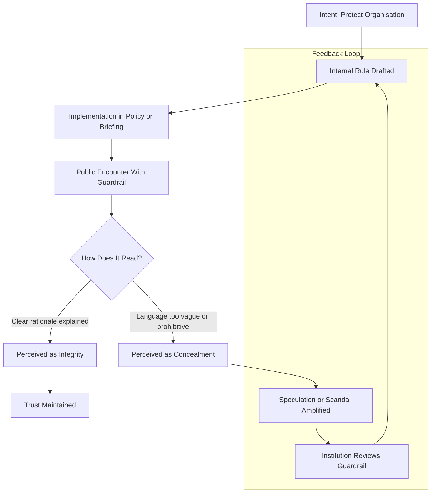
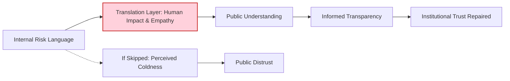
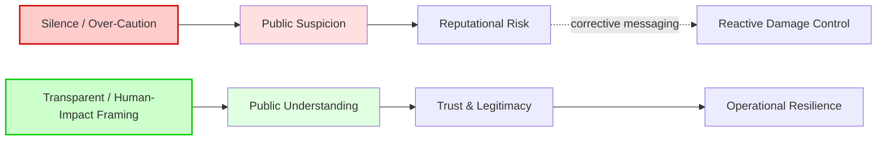

# 🧱 Transparent Guardrail Design  
**First created:** 2025-11-12 | **Last updated:** 2025-11-12  
*Designing conversational and policy guardrails that protect without implying denial.*

---

## 🧭 Executive Summary — *Why This Matters*  

> **Effective guardrails protect reputation by enabling honesty, not by enforcing silence.**  
> Over-cautious language erodes trust and invites speculation; transparent framing grounded in human impact sustains both legitimacy and morale.

---

## 🛰️ Orientation  
Guardrails created to prevent reputational or legal risk often produce the opposite effect when viewed externally.  
To audiences outside an institution, **silence reads as guilt** and **over-caution reads as concealment**.  
Transparent guardrail design allows staff to discuss sensitive issues—sex, violence, religion, race, money—without breaching duty of care or triggering public suspicion.

---

## ✨ Key Principles  

1. **Shift from Prohibition to Condition**  
   - Replace “do not discuss” with “discuss responsibly under these conditions.”  
   - Define boundaries: evidence-based, non-graphic, consent explicit, anonymised examples only.

2. **Explain the Reason for Restraint**  
   - Publicly acknowledge *why* a limit exists.  
   - “We can’t discuss operational details, but we can discuss welfare and prevention” reads as openness, not censorship.

3. **Lead with Human Impact**  
   - Begin every statement by recognising those affected.  
   - Compassion reframes caution as respect, not avoidance.

4. **Delegate to Neutral Expertise**  
   - Use independent clinicians, academics, or welfare officers as spokespeople for sensitive topics.  
   - Shifts frame from scandal to science.

5. **Test for Public Perception**  
   - Pre-test language with non-insiders: if it sounds evasive, rewrite.  
   - Measure understanding as well as compliance.

---

## 🧭 Information Flow Diagram  

---

## 🫀 Human-Impact Translation Layer  

---

## ✅ Implementation Checklist  

| Step | Action | Purpose |
|------|---------|----------|
| **1** | Identify topics where guardrails exist (sex, violence, religion, etc.). | Establish the scope of restricted language. |
| **2** | Audit current phrasing for “avoidance tone.” | Detect where wording could imply denial. |
| **3** | Insert *reason statements* (“to protect privacy…”) into scripts and Q&A notes. | Make restraint transparent. |
| **4** | Add a **human-impact lead line** to all briefings. | Anchor policy in empathy. |
| **5** | Establish a small cross-disciplinary *translation panel* (comms + welfare + legal). | Maintain the empathy layer between legal and public language. |
| **6** | Pre-test public-facing text with sample audiences. | Catch evasive optics early. |
| **7** | Document each revision and rationale. | Provides accountability trail for future audits. |
| **8** | Review annually or after any communications failure. | Ensure continuous improvement. |

---

## 📑 Mini-Appendix: Euphemisms & Clearer Alternatives  

| Common Bureaucratic Euphemism | Clearer Replacement | Why It Works Better |
|-------------------------------|--------------------|--------------------|
| *“An incident occurred”* | “A sexual-assault allegation was reported.” | Names the issue; signals seriousness and accountability. |
| *“Welfare matter”* | “A mental-health support case” / “A consent-related complaint.” | Clarifies the type of welfare issue. |
| *“Inappropriate behaviour”* | “Bullying / harassment / assault (as applicable).” | Distinguishes degrees of harm. |
| *“Personnel relations issue”* | “Misconduct involving breach of consent.” | Puts focus on ethical breach, not paperwork. |
| *“Morale-related stressors”* | “Isolation, fatigue, and lack of family contact.” | Makes human factors visible. |
| *“Engagement activities”* | “Recruitment campaign” / “Public-trust initiative.” | Reduces suspicion of vague “influence” work. |
| *“Operational security consideration”* | “Safety measure to protect serving personnel.” | Keeps purpose clear without jargon. |
| *“Sensitive topic”* | “Topic relating to sexual health / faith / identity.” | Precision builds trust. |

**Rule of thumb:** If a phrase hides *who, what, or why*, rewrite until an ordinary reader can tell what happened without needing translation.

---

## 🧭 Slide Summary — Silence vs Transparency  

---

## 🎙️ Slide-Note Script  

> “The point here isn’t that we talk more — it’s that we talk *better*.  
> When we rely on silence, the public fills the gap with suspicion; when we explain our boundaries and the human reasons behind them, trust rises instead of eroding.  
> Transparent guardrails save reputations because they prevent mis-readings before they start.”

---

## 🌌 Constellations  
🧠 ⚖️ 🪞 — cognition, governance, reflection.

---

## ✨ Stardust  
institutional trust, communications ethics, risk management, public perception, consent framing, crisis comms, transparency, bureaucracy, welfare policy

---

## 🏮 Footer  

*🧱 Transparent Guardrail Design* is a living node of the Polaris Protocol.  
It documents how institutional language can preserve integrity without producing the optics of concealment.

> 📡 Cross-references:  
> - [⚖️ Legal Disentanglement & Risk Perception](../Big_Picture_Protocols/⚖️_legal_disentanglement_and_risk_perception.md)  
> - [🫱 Plain Speech & Intimacy in Operations](../Big_Picture_Protocols/🫱_plain_speech_and_intimacy_in_operations.md)

*Survivor authorship is sovereign. Containment is never neutral.*  

_Last updated: 2025-11-12_
