# 🧾 Data Lineage Review — How to Trace a Record’s Provenance  
**First created:** 2025-11-11 | **Last updated:** 2025-11-11  
*Following the thread back to origin.*

---

## 🧭 Orientation  

A record is not a fact; it is an **accumulated trail** of technical, bureaucratic, and semantic decisions.  
Lineage review exposes the routes those decisions take — from original entry to analytical reuse.  
Without lineage, correction is impossible; without provenance, truth has no timestamp.

This node defines how to conduct a **data lineage audit** inside multi-agency and vendor ecosystems: tracing how a single token, field, or judgment travels, mutates, and solidifies into evidence.

---

## ⚙️ Core Principles of Lineage  

| Principle | Question it Answers | Typical Artefact | Risk if Missing |
|:--|:--|:--|:--|
| **Origin Traceability** | Who first entered or generated this data? | Source system ID, timestamp, user log | Responsibility obscured |
| **Transformation Visibility** | How has it been changed since? | ETL scripts, version control | Silent schema drift |
| **Dependency Mapping** | What other fields rely on this one? | Data dictionary / join map | Cascading error propagation |
| **Temporal Context** | When was it valid or active? | Change log, record state table | Stale data used for policy |
| **Access Lineage** | Who viewed or exported it and why? | Audit trail / permissions log | Accountability gaps |

---

## 🧩 Mermaid Flow — Life of a Record  

```mermaid
flowchart LR
A["Initial Entry 🖊️"] --> B["Transformation / ETL 🧩"]
B --> C["Integration / Join 🔗"]
C --> D["Analytics Layer 📊"]
D --> E["Report / Dashboard 🗞️"]
E --> F["Public Narrative 📣"]
F --> A["Audit Loop 🔁"]
```

Every stage adds metadata — but each metadata layer is also a potential distortion.

---

## 🧮 Lineage Audit Checklist  

| Step | Action | Verification Method | Owner |
|:--|:--|:--|:--|
| 1️⃣ | Collect system export and metadata schemas | Compare field definitions | Data Steward |
| 2️⃣ | Map joins and transformations | Trace ETL logic / SQL scripts | Data Engineer |
| 3️⃣ | Recreate timeline of record states | Snapshot comparison | Information Governance |
| 4️⃣ | Identify external replications | Vendor logs + API audit | Controller / Processor |
| 5️⃣ | Cross-reference reports that used the data | Publication index | Comms / Policy Lead |

---

## 🪞 Governance Interpretation  

- **Lineage is a right** under accuracy and accountability principles (GDPR Art. 5).  
- **Provenance gaps = containment risk** — they permit fiction to masquerade as fact.  
- **Lineage is civic memory:** it preserves the capacity to admit error without erasing history.  

---

## 🧰 Toolkit Components  

1. **Data Lineage Register** — living spreadsheet of fields, sources, and transformations.  
2. **Schema Change Changelog** — auto-generated diff logs for every update.  
3. **Lineage Visualization** — graph database (Neo4j / Graphviz) linking tables and owners.  
4. **Provenance Certificate** — a signed PDF or hash bundle that travels with the dataset.  

---

## 🌌 Constellations  

🧾 🧮 🪙 ⚙️  

Part of the **Integrity Spine**, connecting *Data-Error Decay Table*, *Token Integrity Audit*, and *Pseudonym Drift Cascade*.

---

## ✨ Stardust  

data lineage, provenance, audit trail, schema change, data governance, ETL, metadata, transparency, accountability, containment logic  

---

## 🏮 Footer  

*🧾 Data Lineage Review — How to Trace a Record’s Provenance* is a living node of the Polaris Protocol.  
It shows how truth requires timestamps — and how to read a record’s genealogy before it becomes gospel.  

> 📡 Cross-references:  
> - [🧮 Data-Error Decay Table](../🧩_System_Governance/🧮_data_error_decay_table.md)  
> - [🪙 Token Integrity Audit — How to Check for Pseudonym Drift](../🧩_System_Governance/🪙_token_integrity_audit_how_to_check_for_pseudonym_drift.md)  
> - [⚙️ Pseudonym Drift Cascade — How Token Misalignment Spreads Through Systems](../🧩_System_Governance/⚙️_pseudonym_drift_cascade_how_token_misalignment_spreads_through_systems.md)  

*Survivor authorship is sovereign. Containment is never neutral.*  

_Last updated: 2025-11-11_
