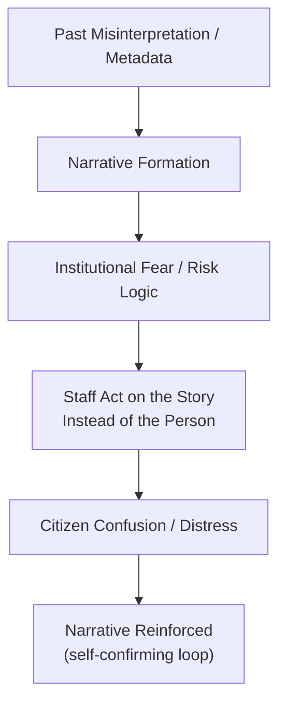

File: 🧾_the_system_already_has_a_story_about_you.md

# 🧾 The System Already Has a Story About You  
**First created:** 2025-11-17 | **Last updated:** 2025-11-17  
*Understanding the eerie experience of interacting with institutions that seem to “already know who you are” — and why this occurs during bureaucratic drift, data contamination, and political pressure.*

---

## 🛰️ Orientation  
One of the most uncanny and distressing features of bureaucratic drift is the feeling that:

> **“They’re responding to a version of me I don’t recognise.”**

Not to your words.  
Not to your behaviour.  
Not to your actual situation.

But to a **preloaded story**, an internal narrative, a risk frame, or a metadata-derived “shadow self”.

This node explains the structural, psychological, and political mechanisms behind this phenomenon — and why it is a reliable early indicator of democratic instability.

Pairs with:  
- 📛 *bureaucratic_memory_failure_and_identity_contamination*  
- 📡 *cross-system_metadata_echo_chains*  
- 🗂️ *when_institutions_start_treating_you_as_a_category_not_a_person*  
- 🌀 *when_system_behaviour_stops_making_sense*

---

## ✨ Key Features  
- Defines “preloaded narratives” as a structural effect, not a conspiracy.  
- Explains how data contamination creates shadow profiles.  
- Shows how institutional anxiety produces pre-emptive interpretation.  
- Outlines the emotional and relational distortions citizens feel.  
- Reframes the phenomenon as data drift, not personal failure.

---

## 🧿 Analysis / Content  

### 🧾 1. What a Preloaded Narrative Is  
A preloaded narrative is:

- an internal story the institution tells itself about you,  
- based on incomplete metadata,  
- risk-adjective interpretation,  
- miscategorisation,  
- echo chains,  
- political context,  
- and fear-based assumptions.

It is not built from your actual behaviour.  
It is built from **institutional anxiety**.

---

### 🧩 2. How Preloaded Narratives Form  
Common sources:

#### **a) Risk adjectives**  
“distressed”, “non-compliant”, “heightened emotion”.

#### **b) Previous misinterpretations**  
Incorrect notes or referrals.

#### **c) Safeguarding logic**  
Which defaults to suspicion.

#### **d) Prevent logic**  
Which defaults to “pre-radicalisation”.

#### **e) Data echo chains**  
Summaries copied between systems.

#### **f) Culture-war pressure**  
Institutions “prepare” for certain categories of people.

#### **g) Institutional fear**  
Staff overcorrect to avoid blame.

The story crystallises from fragments.

---

### 🧨 3. The Moment You Notice the Story  
Citizens describe this as:

- “They talked to me like I was the endpoint of a rumour.”  
- “They were answering questions I didn’t even ask.”  
- “They assumed motives I’ve never had.”  
- “They had already decided the plot.”  
- “They were acting like they knew something about me that I didn’t know.”  
- “I felt like I’d walked into a script halfway through.”  

This is preloaded narrative recognition.

---

### 🔁 4. The Preloaded Narrative Pipeline  

The story becomes self-sustaining.

---

### 🧂 5. Why the Story Is Almost Always Negative  
Under drift and pressure, institutions create narratives that are:

- risk-based  
- defensive  
- blame-avoidant  
- pessimistic  
- procedural  
- suspicious  
- vague but ominous  
- culturally biased  

Positive preloaded narratives almost never form because:

- fear produces pessimism  
- institutions protect themselves, not citizens  
- minoritised people are coded as “riskier”  
- bureaucratic logic favours caution over accuracy  

The story is built to shield the institution, not understand you.

---

### 🧬 6. The Emotional Impact  
Being subjected to a preloaded narrative feels like:

- invisibility  
- powerlessness  
- bewilderment  
- reputational anxiety  
- depersonalisation  
- being “mis-seen”  
- feeling unreal  
- arguing with a ghost  
- losing control of your own narrative  
- being framed as a risk by default  

Many describe it as:

> “I felt like I wasn’t in the room anymore.”

Because the institution is interacting with **the story**, not you.

---

### 🧨 7. Why Minorities and Dissidents Experience This First  
Preloaded narratives tend to target:

- Jewish people  
- Muslims  
- Black and brown citizens  
- migrants  
- queer people  
- disabled people  
- neurodivergent people  
- political dissidents  
- whistleblowers  
- people who ask precise questions  
- people who don’t conform to bureaucratic stereotypes  

The story is shaped by bias before fact.

---

### 🧩 8. Why It’s Not Your Fault  
You are not doing something “wrong.”  
You are encountering:

- institutional pressure  
- distorted metadata  
- Prevent-adjacent suspicion  
- staff working under fear  
- culture-war rhetoric  
- bureaucratic exhaustion  
- under-resourced systems  
- narrative shortcuts  

The story was written long before you walked into the room.

---

### 🧭 9. The Polaris Reframe  
When you sense that “they already have a story about me,” remember:

> **It is not about who you are.  
> It is about what the system is afraid of.**

You are not misperceiving.  
You are recognising narrative drift —  
one of the clearest early-warning indicators of a system under authoritarian pressure.

---

## 🏮 Footer  
**The System Already Has a Story About You** is part of Polaris’ Democratic Drift Phenomenology cluster.  
It explains why citizens feel mis-seen, misinterpreted, or pre-judged, and reframes those experiences as consequences of structural narrative formation rather than personal inadequacy.

Crosslinks:  
- 🗂️ *when_institutions_start_treating_you_as_a_category_not_a_person*  
- 📡 *cross-system_metadata_echo_chains*  
- ⚡ *why_some_people_become_systemic_lightning_rods*  
- 🧭 *how_authoritarian_drift_feels_from_the_inside*
