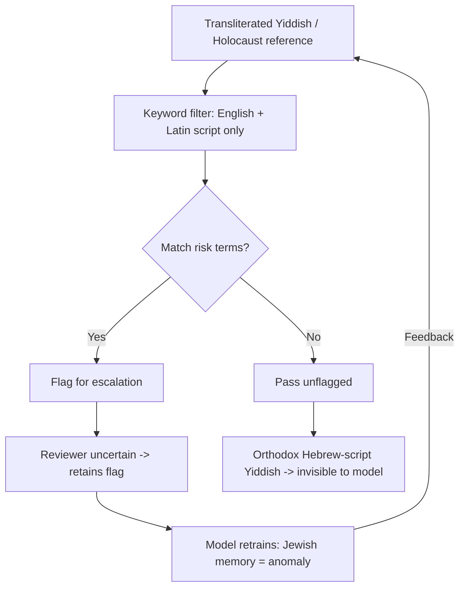

# 🧿 Lomir Redn Aoys “Prevent”  
לאָמיר רעדן אויַס "Prevent"  

**First created:** 2025-11-03 | **Last updated:** 2025-11-03  
*Let’s talk out Prevent — how cultural literacy, survivor memory, and algorithmic bias collide.*

---

## 🛰️ Orientation  
This node speaks in two languages at once — the Yiddish of survival and the bureaucratic English of “safeguarding.”  

It traces how Prevent’s data-driven vigilance turns minority normality into anomaly: Yiddish songs, Holocaust study, antifascist art, survivor humour.  

When the algorithm can’t read context, it calls culture, "risk".  

פֿאַר די ייִדן? מיר אַלע קענען זײַן "ריזיקירנדיק".  

אונדזער שפּראַך איז נישט געוויינטלעך צו פֿאַרשטיין.  

די מאַשין זעט אונדזערע דאַטן; די מאַשין זעט "אַנאָמאַליע".  

עס איז דא א גרויסע געפאר.  

און עס דערציילט נישט קיין גוטע וויץ.  

די שאַנד.  

---

## 🧄 Key Features  
*די פּאָליטיק שאַטן ייִדיש.*  

- **Language extinction feedback:** transliterated Yiddish gets over-flagged; Hebrew-script Yiddish passes unseen.  
- **Holocaust discourse flagged as fixation:** memorial study mistaken for radicalisation.  
- **Prevent’s paradox:** defending “British values” by suppressing the speech that most clearly embodies them — freedom, dissent, remembrance.  
- **Policy irony:** a counter-terror system quietly accelerating the disappearance of an endangered Jewish language.  

---

## 🧬 Mechanism Map

*Outcome:* antifascist Jewish discourse suppressed; Orthodox or offline content invisible; machine learns nothing useful.  

דאָס איז פאַרוואָס דו קענסט נישט געפֿינען היינטיקן דאַף, זעסטו?  

זאָג דאָס אַדאָני.  

עס איז אמת, נו?   
😇👉

(איך בין נישט דיין רבי; לייען דיין מיינונג!)  

---

## 🕍 Endangerment Effects & Cultural Preservation Risk  

- **UNESCO classification:** Yiddish is a *definitely endangered* language.  
- **Selection bias:** Prevent/AI filters read only Roman-script text → capture secular/activist Yiddish → label as anomaly.  
- **Cultural consequence:** by chilling visible Yiddish use online, these systems erode the very archives needed for preservation.  
- **Ethical inversion:** programs meant to defend democracy end up stifling one of Europe’s last living survivor tongues.

---

## 🕯️ Holocaust Discourse as False Indicator  

> “They keep talking about the Holocaust.”  
<!--אוי, ווייל עס איז געווען גאָרנישט, צי נישט? 🤨 יעדער גוי וויל רעדן וועגן שואה... דאָס איז זייער ערשטע וואָרט. 🙄-->
For Jewish users that’s daily life — family, history, culture, theology, memes, film.  

For algorithms trained on majority English data, it’s statistical anomaly → risk flag.

### ❓ Why the flag trips
- **Baseline bias:** Jewish memorial frequency > baseline.  
- **Context overlap:** words like *partisan*, *resistance*, *vengeance* share lexicons with risk categories.  
- **Feedback reinforcement:** one mis-flag breeds another.  

### 🪬 Correction
- Incorporate Jewish-language and memorial corpora into baseline training.  
- Require culturally literate human review for flagged “Holocaust” clusters.  
- Treat commemoration as **protective civic practice**, not “fixation.”  

---

## 🧭 Cultural Literacy Primer (for reviewers)

| Behaviour | Common outside perception | Actual meaning |
|------------|---------------------------|----------------|
| Frequent Holocaust references | “Obsessed with trauma / politics” | Cultural norm: mourning, teaching, vigilance against fascism |
| Yiddish in Latin characters | “Code / secret speech” | Revival and accessibility practice |
| Dark humour / irony | “Hostility or nihilism” | Standard survivor register |
| Mixed anti-/pro-Zionist debate | “Political extremism” | Intra-Jewish pluralism; normal discourse |

---

## 🍯 Policy Note — Optics & Accountability  
Over-policing Jewish survivor culture under Prevent damages both people and institutions.  

It contradicts the public narrative of tolerance and undermines trust in safeguarding.  

From a purely reputational view, the optics of “we flagged an anti-fascist Jewish woman for singing about democracy” are indefensible.  

From a civic view, it’s a sign that the system has confused **difference with danger**.  

אבער:  

וויפיל פון אונדז זענען אַזוי "נייגעריק"?  

וויפיל פאנען?  

---

## 🌌 Constellations  
🧿 🕍 🪞 🧬 — linguistic survivorship, memory work, cultural misread, algorithmic bias.

---

## ✨ Stardust  
prevent, yiddish, holocaust discourse, algorithmic bias, endangered languages, british values, antifascism, survivor register, policy optics, memorial culture, cultural literacy

---

## 🏮 Footer  
*🧿 Lomir Redn Aoys “Prevent”* is a living node of the Polaris Protocol.  
It documents how counter-terror infrastructures misread Jewish cultural expression and inadvertently endanger an already-fragile language.  
Its purpose is diagnostic and preservational: to show how fixing the machine begins with learning the language.

> 📡 Cross-references:
> 
> - [🎧 Yiddish Music & the False-Positive Loop in “Values” Detection](../Governance_And_Containment/🉑_System_Thresholds/🎧_yiddish_music_false_positive_loop_in_values_detection.md)  
> - [🌿 Living with a High-Prevent Environment](../Field_Care/🌿_living_with_high_prevent_environment.md)  

*Survivor authorship is sovereign. Containment is never neutral.*  

_Last updated: 2025-11-03_
