# 🪐 OSA / Residual Flag Governance Cluster  
**First created:** 2025-11-12 | **Last updated:** 2025-11-12  
*Micro-suite index linking all nodes concerned with false security classification, governance failure, and systemic rectification.*

---

## 🧭 Orientation  
This cluster documents how mis-applied protective markings — especially *“OSA”*, *“Restricted”*, or *“Official-Sensitive”* labels — can drift through civilian data systems for years.  
Each node provides a different instrument for diagnosis, correspondence, escalation, and repair.  
Together they form a containment-to-rectification workflow within the wider **Polaris Protocol**.

---

## 📂 Node Index  

| File | Purpose | Status |
|------|----------|---------|
| [📮 OSA Flag Clarification Request](../Disruption_Kit/Survivor_Tools/📮_osa_flag_clarification_request.md) | Primary letter to DPO & Monitoring Officer demanding legal basis or removal. | ✅ Complete |
| [🛰️ Who Can See the Flag](../Metadata_Sabotage_Network/🦒_Structural_Analysis/🛰️_who_can_see_the_flag.md) | Visibility map showing who can view or edit metadata flags. | ✅ Complete |
| [📋 Rectification Notice — Multi-Agency](../Disruption_Kit/Survivor_Tools/📋_rectification_notice_multi_agency.md) | Multi-partner rectification letter for NHS / MoJ / Police systems. | ✅ Complete |
| [📊 From Data Misuse to White-Collar Breach](../Big_Picture_Protocols/⚖️_Legal_&_State_Governance/📊_from_data_misuse_to_white_collar_breach.md) | Defines when misuse crosses into fraud or misconduct. | ✅ Complete |
| [📋 ICO Silence Recovery Checklist](../Disruption_Kit/Survivor_Tools/📋_ico_silence_recovery_checklist.md) | Tools to re-engage stalled ICO casework. | ✅ Complete |
| [📜 Residual Shadow Audit](../Metadata_Sabotage_Network/🔥_Data_Risks/📜_residual_shadow_audit.md) | Forensic audit for zombie or residual data. | ✅ Complete |
| [📋 Dual-Officer Clarification Request](../Disruption_Kit/Survivor_Tools/📋_dual_officer_clarification_request.md) | Joint DPO + Legal request closing accountability gap. | ✅ Complete |

---

## 🧩 Conceptual Flow  

```mermaid
graph LR
A[📮 OSA Clarification] --> B[🛰️ Visibility Mapping]
B --> C[📋 Multi-Agency Rectification]
C --> D[📜 Residual Shadow Audit]
D --> E[📊 White-Collar Breach Check]
E --> F[📋 ICO Recovery]
F --> G[📋 Dual-Officer Clarification]
G --> H[🏁 Cluster Closure & Index]
```

---

## 🧠 Key Insight  
Containment masquerading as “security” is sustained not by secrecy, but by **ambiguity**.  
Each node removes one layer of that ambiguity until accountability becomes unavoidable.

---

## 🌌 Constellations  
🪐 🛰️ ⚖️ 🔮 🧠 — governance, metadata integrity, procedural clarity, and forensic intelligence.

---

## ✨ Stardust  
osa flag, residual data, metadata governance, council monitoring officer, white collar breach, rectification, ico complaint, survivor tools, containment repair, protocol integrity  

---

## 🏮 Footer  

*🪐 OSA / Residual Flag Governance Cluster* is a living micro-suite of the **Polaris Protocol**.  
It documents the full procedural chain from discovery of a false security mark to systemic rectification and regulatory closure.

> 📡 Cross-references:  
> – [☔️ Protocol Integrity SOP](../🏮_Polaris_Nest/☔️_protocol_integrity_sop.md)  
> – [🎛️ Drafting Rules — Survivor Voice Fidelity](../🏮_Polaris_Nest/🎛️_polaris_drafting_rules_survivor_voice_fidelity.md)  
> – [🧿 Visual Palette](../🏮_Polaris_Nest/🧿_visual_palette.md)

*Survivor authorship is sovereign. Containment is never neutral.*  

_Last updated: 2025-11-12_
