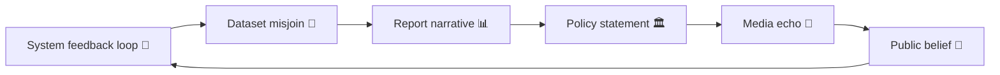

# 🪞 Narrative Drift — When Systems Inherit the Wrong Story  
**First created:** 2025-11-11 | **Last updated:** 2025-11-11  
*When metadata becomes myth.*

---

## 🧭 Orientation  

Data doesn’t just describe reality — it tells a story about it.  
When underlying identifiers, tokens, or relational structures drift, that story mutates.  
Over time, systems begin to **inherit narratives** that were never true, amplifying distortions into policy, press, and institutional memory.

This is **narrative drift**: the semantic echo of technical or procedural misalignment.

---

## ⚖️ Definition  

> **Narrative drift** occurs when errors in data lineage, schema, or relational mapping become reinterpreted as narrative truths by decision-makers or external audiences.  

It is the **social consequence** of pseudonym drift, data twinning, or mis-specified audits.  
Once the system’s errors are *storified*, they reproduce themselves in public logic.

---

## 🧩 Drift Chain  

| Phase | Technical Root | Narrative Expression | Consequence |
|:------|:----------------|:--------------------|:-------------|
| **1️⃣ Data drift** | Token misalignment, schema errors | “The system says this person fits X profile.” | False inclusion or exclusion. |
| **2️⃣ Metadata drift** | Field mislabelling, duplicated roles | “Records show contradictory behaviour.” | Reputation instability. |
| **3️⃣ Narrative drift** | Reporting and interpretation errors | “This proves a pattern.” | Institutional myth-making. |

---

## 🧮 Drift Amplification  

Drift becomes self-legitimating: the system now cites its own mistake as evidence.

---

## 🪞 Governance Implications  

- **Audit lag ≠ narrative correction.** Once public, errors outlive data fixes.  
- **Institutional storytelling** often treats “data says” as infallible.  
- **Containment logic** uses narrative drift as plausible deniability: *“We only followed the data.”*  

---

## 🧰 Containment Repair  

| Layer | Intervention | Description |
|:------|:--------------|:-------------|
| **Data** | Token & lineage audits | Restore factual base; confirm identity integrity. |
| **Metadata** | Schema and role review | Ensure fields describe the same realities across systems. |
| **Narrative** | Retraction & clarification protocol | Require narrative correction when data are revised. |
| **Governance** | Story-source transparency | Link every official statement to dataset provenance. |

---

## 🧱 Cultural Mitigations  

1. **Declare uncertainty early.** Avoid “final” statements until audits complete.  
2. **Publish lineage summaries** alongside press releases.  
3. **Name the data controllers** behind each dataset cited publicly.  
4. **Treat algorithmic findings as provisional stories, not proof.**  

---

## 🌌 Constellations  

🪞 ⚙️ 🪙 🧬  

Narrative Drift belongs to both **System Governance** and **Narrative Management**.  
It completes the containment sequence: from **technical misalignment** (drift) to **social misbelief** (story).

---

## ✨ Stardust  

narrative drift, metadata bias, system storytelling, data governance, containment, institutional myth, reputational inversion, pseudonymisation, algorithmic accountability, public narrative

---

## 🏮 Footer  

*🪞 Narrative Drift — When Systems Inherit the Wrong Story* is a living node of the Polaris Protocol.  
It shows how a minor technical error can metastasise into collective misunderstanding — and how integrity demands not just correction, but counter-narration.

> 📡 Cross-references:  
> - [⚙️ Pseudonym Drift Cascade — How Token Misalignment Spreads Through Systems](../🧩_System_Governance/⚙️_pseudonym_drift_cascade_how_token_misalignment_spreads_through_systems.md)  
> - [🧩 Swiss-Cheese Failures — When Process Holes Align](../🧩_System_Governance/🧩_swiss_cheese_failures_when_process_holes_align.md)  
> - [🎪 Moles in the Circus — Institutional Misdirection](../🪆_Narrative_Interference/🎪_moles_in_the_circus.md)  

*Survivor authorship is sovereign. Containment is never neutral.*  

_Last updated: 2025-11-11_
