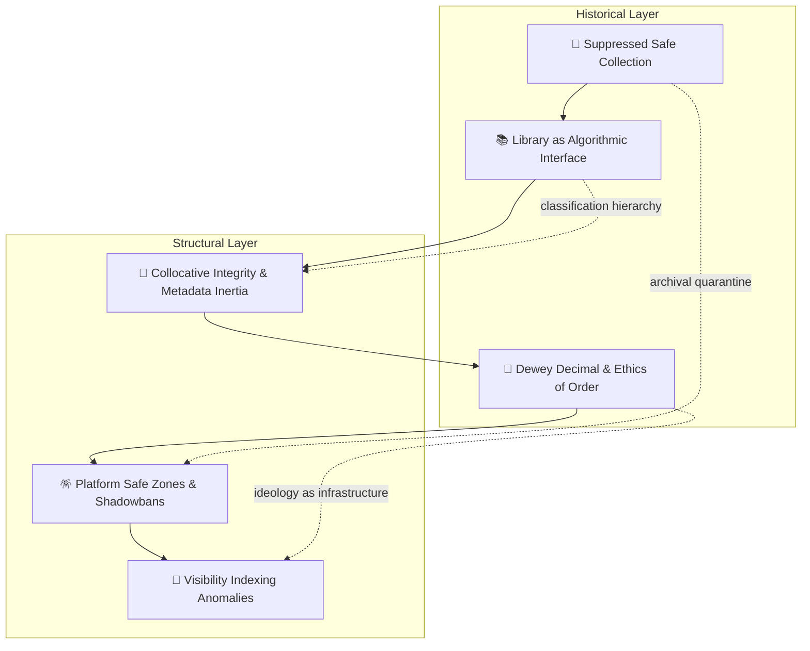

# 🪞 Safes, Shelves & Servers
**First created:** 2025-10-16 | **Last updated:** 2025-10-16
*From moral cabinets to machine filters — how institutions learn to hide knowledge while pretending to preserve it.*

---

## 🧭 Orientation
Every age invents its own “Safe.”
The physical safe, the library shelf, the data server — each promises protection while enforcing containment.
This node traces the continuous lineage of suppression infrastructure from the *Suppressed Safe Collection* through Dewey’s moral shelving to digital moderation systems.

---

## 🧩 Key Features
- **Custodial censorship:** “keeping safe” becomes a euphemism for *keeping out*.
- **Metadata inheritance:** classification bias migrates seamlessly into code.
- **Continuity of civility:** suppression disguised as politeness — archival, bureaucratic, algorithmic.
- **Moral to technical translation:** decency becomes safety, safety becomes compliance, compliance becomes training data.

---

## 🔮 Constellation Map

---

## 🌌 Constellations
🪞 🔮 🧠 🧾 — Integrative mirror node joining archival, bibliographic, and digital suppression systems into one historical continuum.

---

## 🏮 Footer
*Safes, Shelves & Servers* is a living node of the Polaris Protocol.
It maps the evolutionary logic of suppression systems — from moral cabinets to algorithmic filters — revealing continuity behind institutional “safety.”

_Last updated: 2025-10-16_
