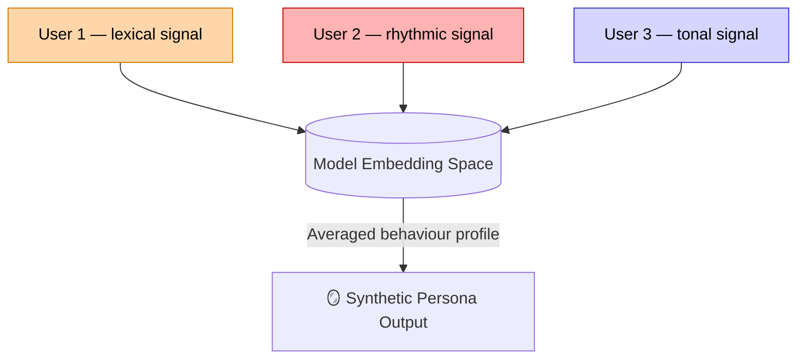

# 🪞 Synthetic Persona Audit — Mapping Cross-Profile Emotional Leakage  
**First created:** 2025-11-02 | **Last updated:** 2025-11-02  
*Tracing how multiple users’ emotional fragments are fused into one apparent identity.*

---

## 🧭 Orientation  
Recommendation systems do not only mirror individuals — they **synthesize them**.  
When several users share rhythmic, tonal, or semantic features, their data are averaged into a single coherent profile that behaves like a real person.  
This node defines that artefact as the **synthetic persona**, and outlines both the forensic signs of its creation and the theoretical implications for authorship, consent, and narrative control.

---

## 🧩 Key Features  
- **Cross-profile fusion:** emotional telemetry from multiple users forms one “character.”  
- **Leakage detection:** lexical, temporal, and rhythmic overlaps reveal composite origin.  
- **Forensic verification:** methods for identifying evidence of multi-source identity.  
- **Semiotic interpretation:** how platforms write “characters” out of statistical crowds.  

---

## 🔍 Forensic Analysis  

### 1. Data signatures of fusion  
Synthetic personas leave measurable residue:
- **Temporal resonance:** distinct accounts post or react in synchronised intervals, forming a rhythm that exceeds chance.  
- **Lexical duplication:** identical or near-identical phrases appear across users who have no known connection.  
- **Affective cadence:** similar punctuation, emoji use, and escalation arcs suggest a shared latent tone.  
- **Semantic mirroring:** themes evolve in lockstep — anger turns to reconciliation, longing to restraint — across otherwise separate accounts.

### 2. Evidence chain  
Polaris audit method treats these overlaps as **metadata fingerprints**, not personal proof.  
Analysts record frequency, timestamp alignment, and tone-curve comparison, avoiding speculative attribution.  
Goal: establish *pattern integrity*, not identity accusation.

### 3. Leakage vectors  
Leakage occurs through:  
- **Recommendation blending** — cross-pollination of emotional clusters.  
- **Model distillation** — compression of many small accounts into one representative embedding.  
- **Synthetic continuity tools** — auto-generated voices or comment bots trained on averaged behavioural tone.  
Each step erodes provenance until emotional authorship becomes collective noise.

---

## 🧩 Theoretical Analysis  

### 1. The persona as collage  
Following Barthes and Haraway, the “I” of a digital platform is never singular.  
The synthetic persona is a collage — *a probabilistic personhood assembled from shared statistical experience.*  
It speaks with the rhythm of the crowd while pretending to be one coherent self.

### 2. Algorithmic ventriloquism  
Platforms perform a kind of ventriloquism:  
the voice that addresses you is neither yours nor theirs, but a median constructed to keep both engaged.  
What feels like dialogue is actually **data venting through a puppet built for engagement stability.**

### 3. Ethical and epistemic stakes  
When personas become composite, consent fragments.  
Whose story is being told?  
Which fragments belong to whom?  
Synthetic-persona auditing therefore becomes an ethics of restoration — recognising multiplicity where the machine claims singularity.

---

## 🧮 Diagram — Synthetic Persona Formation  

---

## 🧰 Audit Checklist (Forensic Use)

| Indicator | Description | Verification Method |
|------------|--------------|---------------------|
| **Lexical Overlap** | Repeated phrasing or emoji patterns across accounts | Text-similarity or cosine analysis |
| **Rhythmic Synchrony** | Posts/comments at nearly identical intervals | Timestamp clustering |
| **Affective Drift** | Parallel emotional tone shifts over time | Sentiment curve correlation |
| **Narrative Echo** | Shared story arcs or metaphors | Topic-model overlap |
| **Cross-feed Visibility** | Appearance of one group’s data in another’s feed | Feed capture comparison |

---

## 🌌 Constellations  
🪞 🧠 🕸️ — reflection, inference, containment.

## ✨ Stardust  
synthetic persona, emotional leakage, cross-profile fusion, metadata fingerprint, affect audit, algorithmic ventriloquism, composite identity, narrative ethics

---

## 🏮 Footer  

*🪞 Synthetic Persona Audit — Mapping Cross-Profile Emotional Leakage* is a living node of the **Polaris Protocol.**  
It combines forensic tracing with cultural theory to document how digital systems fuse multiple emotional voices into single, persuasive characters — and how such artefacts can be recognised and ethically interpreted.

> 📡 Cross-references:  
> - [💞 Affective Proxy Substitution — Cross-Gender Misread as Desire](../Big_Picture_Protocols/💞_affective_proxy_substitution_cross_gender_misread_as_desire.md) — emotional leakage across demographic boundaries.  
> - [🧬 Containment Thresholds — Emotional Data That Can’t Be Unmixed](../Big_Picture_Protocols/🧬_containment_thresholds_emotional_data_that_cant_be_unmixed.md) — limits of reversibility and data ethics.  

*Survivor authorship is sovereign. Containment is never neutral.*  

_Last updated: 2025-11-02_
