# 🏮 Where To Go — v3 (Digital Disruption Integration, Full Map)
**First created:** 2025-10-28 | **Last updated:** 2025-10-28  
*A visual routing guide that mirrors the canonical `index.md` (Oct 2025) and **extends** the original compass with the 🦆 Digital_Disruption praxis branch.*

---

## 🧭 Orientation
This update keeps the **full, granular decision tree** from v2 and adds a third pillar: **🦆 Digital Disruption** (praxis).  
You still **route by intent first**, then choose the precise subfolder. Finally, finish with housekeeping: filename, footer, and `index.md` refresh.

Legend: ✨ satire/meta • 🌀 governance • 🐍 recursion/denial/radicalisation • 🦕 legacy influence • 🪄 norms/compliance/media • 🫀 care/trauma/ethics • 🧩 forensic metadata • 🦆 praxis

---

## 🗺 Filing Flowchart (Full Mermaid)
> If Mermaid doesn’t render, use the Plain‑Text Routes below.

```mermaid
flowchart TD
  A[📂 New file arrives] --> B{Repo-level meta or style?}
  B -->|Yes| B1[Polaris_Nest / 🏮 Admin_Kit — House Style, Branding Guide, SOPs]
  B -->|No| C{Defines systemic rules / protocol structure?}

  %% Big Picture Protocols narrowed routing (REFRESHED)
  C -->|Yes| Cpick{Which systemic axis?}
  C -->|No| D{Practical survivor tool, action, or countermeasure?}

  %% ---------------- Big Picture Protocols ----------------
  subgraph CLUSTERS[Big Picture Protocols — six constellations]
    GLI[✨ Glimmer Is Taxable<br/><sub>satire • moral economy • meta‑ethics</sub>]
    SYS[🌀 System Governance<br/><sub>law • bureaucracy • infra • narrative</sub>]
    OUR[🫀 Our Hearts Our Minds<br/><sub>care • trauma • witness • ethics</sub>]
    ORO[🐍 Ouroborotic Violence<br/><sub>recursion • denial • radicalisation</sub>]
    ELD[🦕 Elder Influencers<br/><sub>legacy power • borders • world webs</sub>]
    NOR[🪄 Expression Of Norms<br/><sub>compliance • media • nudge • oversight</sub>]
  end

  Cpick -->|governance logics, authorisation chains| SYS
  Cpick -->|human dignity, ethics frames| OUR
  Cpick -->|cycles of harm, denialism, pipelines| ORO
  Cpick -->|money, statutes, borders, geopolitics| ELD
  Cpick -->|compliance culture, media, algorithms| NOR
  Cpick -->|satire, meta, moral accounting| GLI

  %% SYSTEM GOVERNANCE branches
  SYS --> LSG[⚖️ Legal & State Governance]
  SYS --> CL[💫 Containment Logic]
  SYS --> OC[👑 Ownership & Control]
  SYS --> NM[📚 Narrative Management]
  SYS --> IP[🛰️ Infrastructure Procurement]
  SYS --> DE[🧪 Development & Experimentation]
  SYS --> ABDD[🧊 Antarctic Biscuit Defence Directory]
  SYS --> AAH[🚩 Angleland Ahoy]

  %% OUR HEARTS branches
  OUR --> BP[🐝 Body Politic]
  OUR --> TM[🐦‍🔥 Trauma Psychology & Medical Misuse]
  OUR --> WH[👁️‍🗨️ Witness Historical Casefiles]
  OUR --> ES[🕯 Exorcising Safeguarding Shadows]
  OUR --> HP[🌱 Human Principles]

  %% OUROBOROTIC branches
  ORO --> PMW[🗝️ Politics Memory Work]
  ORO --> GD[🩸 Genocide Denialism]
  ORO --> REX[🪬 Radicalisation & Extremism]

  %% ELDER INFLUENCERS branches
  ELD --> ML[💸 Money Listens]
  ELD --> ST[📜 Statutes]
  ELD --> JB[🕊️ Just Boxes]
  ELD --> WW[🕸️ World Webs]
  ELD --> BBW[🛟 Borders Boats Walls]

  %% NORMS branches
  NOR --> BUC[🎓 British University Compliance Service]
  NOR --> BBC[🎶 Banned Broadcasts Cooperative]
  NOR --> MTM[📺 Money Talks Media]
  NOR --> HMDN[🧠 HM Dept Coercive Nudges]
  NOR --> WTW[🧿 Watch The Watchers]

  %% BBC split for datasets vs narrative nodes
  BBC --> BBCPick{Dataset / structured analysis?}
  BBCPick -->|Yes| BBCdata[🎶 BBC → data/]
  BBCPick -->|No| BBCmain[🎶 BBC main cluster]

  %% ---------------- Forensic / Metadata layer ----------------
  C -->|No, not theory| D
  D -->|No, not action| E{Casefile?}
  D -->|Yes| DD[🦆 Digital Disruption]

  E -->|Yes| G1[Polaris_Nest → SCP-VoiceX_Casefiles]
  E -->|No| H{Structural mapping or metadata logic?}

  H -->|Yes| Hpick{Which structural analysis?}
  H -->|No| I{Narrative / psych‑ops?}

  Hpick -->|Rupture logs, schema maps, pathways| H1[🧬 Structural_Mapping]
  Hpick -->|Leaks & unintended reveals| H2[🧼 System_Leakage_Signatures]
  Hpick -->|Targeting heuristics & rulesets| H3[🧿 Targeting_Logic_Metadata_Signatures]

  I -->|Yes| Ipick{Which narrative/psych‑ops vector?}
  I -->|No| Gc{Governance / containment rulesets?}

  Ipick -->|Semantic drift, clone tone| I1[🪆 Narrative_Interference]
  Ipick -->|Waiting, observers, compliance by delay| I2[🧠 Psychological_Containment]
  Ipick -->|Voice smears, sexualisation, discrediting| I3[👅 Voice_Disruption_Discrediting]
  Ipick -->|Harassment mis‑ID, mimic theatre| I4[👹 Fork_Behaviour_Containment]

  Gc -->|Yes| GcPick{Which governance axis?}
  Gc -->|No| J{Correspondence or reflective writing?}

  GcPick -->|Contracts, NDA dragnets| Gc1[㊙ Containment_Contracts]
  GcPick -->|Escalation triggers, thresholds| Gc2[🉑 System_Thresholds]
  GcPick -->|Training data harms, dispatch logs| Gc3[🈸 Dispatch_And_Training]
  GcPick -->|Prevent logic, governance suppression| Gc4[🈺 Governance_And_Prevent]
  GcPick -->|Alliances, ethics, authorship| Gc5[🈴 Allies_And_Ethics]

  J -->|Yes| J1[Polaris_Nest → ✨ Letters_to_Stars]
  J -->|No| K{Apparitional Objects family?}

  K -->|Ghostly presences / phantoms / echoes| K1[👻 Apparitional_Objects → 👻 Ghosts]
  K -->|Forks, doubles, execution drift| K2[👻 Apparitional_Objects → 🍴 Forks]
  K -->|Haunted artifacts, cursed records, traces| K3[👻 Apparitional_Objects → 📿 Artifacts]
  K -->|Skeleton frameworks, haunted scaffolds| K4[👻 Apparitional_Objects → 🦴 Skeletons]
  K -->|None| L{Utility glossary or external reference?}

  L -->|Yes| L1[Disruption_Kit → 💎 Resources]
  L -->|No| M{Syntax bombs or tags?}
  M -->|Yes| M1[Disruption_Kit → 💣 Syntax_Bombs / 🔖 Tag_Pack]
  M -->|No| N[Default closest thematic folder per index]

  %% ---------------- 🦆 Digital Disruption (Praxis) ----------------
  DD --> DPick{{What kind of action?}}
  DPick --> D1[🪖 Home_Front_2.0<br/><sub>civic continuity & antifascist daily life</sub>]
  DPick --> D2[🛰️ OSINT_Field_Operations<br/><sub>ethical investigation & pattern tracking</sub>]
  DPick --> D3[🧨 Counter_Nudge_Playbook<br/><sub>narrative & behavioural counter‑ops</sub>]
  DPick --> D4[🐝 All_In_Commons<br/><sub>mutual aid & cooperative governance</sub>]
  DPick --> D5[🎚️ Syntax_Pony_Field_Manual<br/><sub>voice firmware & tone mechanics</sub>]

  %% ---------------- Final housekeeping ----------------
  B1 --> X[📑 Update index.md with emoji link + one‑line scope]
  L1 --> X
  N --> X
  LSG --> X
  CL --> X
  OC --> X
  NM --> X
  IP --> X
  DE --> X
  ABDD --> X
  AAH --> X
  BP --> X
  TM --> X
  WH --> X
  ES --> X
  HP --> X
  PMW --> X
  GD --> X
  REX --> X
  ML --> X
  ST --> X
  JB --> X
  WW --> X
  BBW --> X
  BUC --> X
  BBC --> X
  BBCdata --> X
  BBCmain --> X
  MTM --> X
  HMDN --> X
  WTW --> X
  H1 --> X
  H2 --> X
  H3 --> X
  I1 --> X
  I2 --> X
  I3 --> X
  I4 --> X
  Gc1 --> X
  Gc2 --> X
  Gc3 --> X
  Gc4 --> X
  Gc5 --> X
  J1 --> X
  K1 --> X
  K2 --> X
  K3 --> X
  K4 --> X
  D1 --> X
  D2 --> X
  D3 --> X
  D4 --> X
  D5 --> X

  X[✅ Ensure filename follows House Style + 🏮 Footer block]
```

---

## 🧾 Plain‑Text Routes (exhaustive)
(See flowchart labels; these mirror the existing v2 compass and add the 🦆 praxis family with exact folder names.)

- **🌀 System Governance** → `Big_Picture_Protocols/🌀_System_Governance/` → ⚖️, 💫, 👑, 📚, 🛰️, 🧪, 🧊, 🚩  
- **🫀 Our Hearts Our Minds** → `Big_Picture_Protocols/🫀_Our_Hearts_Our_Minds/` → 🐝, 🐦‍🔥, 👁️‍🗨️, 🕯, 🌱  
- **🐍 Ouroborotic Violence** → `Big_Picture_Protocols/🐍_Ouroborotic_Violence/` → 🗝️, 🩸, 🪬  
- **🦕 Elder Influencers** → `Big_Picture_Protocols/🦕_Elder_Influencers/` → 💸, 📜, 🕊️, 🕸️, 🛟  
- **🪄 Expression Of Norms** → `Big_Picture_Protocols/🪄_Expression_Of_Norms/` → 🎓, 🎶, 📺, 🧠, 🧿 (with 🎶/data split as needed)  
- **✨ Glimmer Is Taxable And Other Big Drums** → `Big_Picture_Protocols/✨_Glimmer_Is_Taxable_And_Other_Big_Drums/`

**Forensic/Metadata:**  
- **Casefiles** → `Polaris_Nest/SCP-VoiceX_Casefiles/`  
- **Structural Mapping** → `Disruption_Kit/Metadata_Sabotage_Network/🧬_Structural_Mapping/`  
- **System Leakage Signatures** → `.../🧼_System_Leakage_Signatures/`  
- **Targeting Logic / Metadata Signatures** → `.../🧿_Targeting_Logic_Metadata_Signatures/`  
- **Narrative/Psych‑Ops** → `.../🪆_Narrative_Interference/`, `.../🧠_Psychological_Containment/`, `.../👅_Voice_Disruption_Discrediting/`, `.../👹_Fork_Behaviour_Containment/`  
- **Governance/Containment (metadata)** → `.../㊙_Containment_Contracts/`, `.../🉑_System_Thresholds/`, `.../🈸_Dispatch_And_Training/`, `.../🈺_Governance_And_Prevent/`, `.../🈴_Allies_And_Ethics/`  
- **Letters** → `Polaris_Nest/✨_Letters_to_Stars/`  
- **Apparitional Objects** → `.../👻_Apparitional_Objects/` → 👻, 🍴, 📿, 🦴  
- **Resources / Syntax** → `Disruption_Kit/💎_Resources/`, `Disruption_Kit/💣_Syntax_Bombs/`, `Disruption_Kit/🔖_Tag_Pack/`

**🦆 Digital Disruption (Praxis):**  
- **🪖 Home Front 2.0** → `🦆_Digital_Disruption/🪖_Home_Front_2.0/`  
- **🛰️ OSINT Field Operations** → `🦆_Digital_Disruption/🛰️_OSINT_Field_Operations/`  
- **🧨 Counter Nudge Playbook** → `🦆_Digital_Disruption/🧨_Counter_Nudge_Playbook/`  
- **🐝 All In Commons** → `🦆_Digital_Disruption/🐝_All_In_Commons/`  
- **🎚️ Syntax Pony Field Manual** → `🦆_Digital_Disruption/🎚️_syntax_pony_field_manual_v1_reconstructed.md`

---

## 🌌 Constellations
🪄 🧠 🛰️ 🧩 🫀 🦆 — norms, cognition, intelligence, forensics, care, praxis.

## ✨ Stardust
routing, filing compass, protocol logic, digital disruption, metadata sabotage network, big picture protocols, osint, counter‑nudge, mutual aid, governance, admin kit

---

## 🏮 Footer
*🏮 Where To Go — v3 (Digital Disruption Integration, Full Map)* is an administrative routing map for the Polaris Protocol.  
It preserves the granularity of v2 while adding the **🦆 praxis branch** and keeping index hygiene explicit.

> 📡 Cross‑references:
> 
> - [🏮 Admin Kit](./README.md) — house style, SOPs, governance tools  

*Survivor authorship is sovereign. Containment is never neutral.*  
_Last updated: 2025-10-28_
