# 🏮 Where to Go  
**First created:** 2025-09-12 | **Last updated:** 2025-10-18  
*Decision tree for filing new nodes into the Polaris Protocol repository.*  

---

## 🌱 Scope  

This document is the **filing compass** for Polaris.  
Whenever a new file arrives, follow the flowchart below to decide its correct home.  
Each branch points to an exact folder and subfolder, with scope notes built in.  

**Routing note for banned/muted media:** narrative or case-study nodes go to **🎶 Banned_Broadcasts_Cooperative**; datasets/CSVs/scripts route to **🎶 Banned_Broadcasts_Cooperative/data/**.

---

## 🗺 Filing Flowchart  

```mermaid
flowchart TD
  A[📂 New file arrives] --> B{Repo-level meta or style?}
  B -->|Yes| B1[Polaris_Nest / 🏮 Admin_Kit — House Style, Branding Guide]
  B -->|No| C{Defines systemic rules / protocol structure?}

  %% Big Picture Protocols narrowed routing (REFRESHED)
  C -->|Yes| Cpick{Which systemic axis?}
  C -->|No| D{Practical survivor tool / countermeasure?}

  Cpick -->|Governance logics, authorisation chains| C1[🌀 System_Governance]
  Cpick -->|Human dignity, ethics frames| C1b[🌱 Human_Principles]
  Cpick -->|University compliance & discipline| C1c[🎓 British_University_Compliance_Service]
  Cpick -->|Media / broadcast bans & circulation| C7[🎶 Banned_Broadcasts_Cooperative]
  Cpick -->|Trauma, psychology & medical misuse| C2[🐦‍🔥 Trauma_Psychology_Medical_Misuse]
  Cpick -->|Forensic witness histories reshaped / suppressed| C3[👁️‍🗨️ Witness_Historical_Casefiles]
  Cpick -->|Memory, narrative suppression, politicised identity| C4[🗝️ Politics_Memory_Work]
  Cpick -->|UK gov nudge units & coercive applications| C5[🧠 HM_Dept_Coercive_Nudges]
  Cpick -->|Radicalisation, Prevent & platform dynamics| C6[🪬 Radicalisation_Extremism]
  Cpick -->|Laws & statutory architectures| C8[📜 Statutes]
  Cpick -->|Money, donors, media capture| C9[📺 Money_Talks_Media]
  Cpick -->|Safeguarding industry shadows| C10[🕯 Exorcising_Safeguarding_Shadows]
  Cpick -->|Global entanglements & diasporas| C11[🕸️ World_Webs]
  Cpick -->|Borders, asylum & maritime control| C12[🛟 Borders_Boats_Walls]
  Cpick -->|Oversight of oversight| C13[🧿 Watch_The_Watchers]

  %% BBC split for datasets vs narrative nodes
  C7 --> C7pick{Dataset / structured analysis?}
  C7pick -->|Yes| C7a[🎶 BBC → data/]
  C7pick -->|No| C7b[🎶 BBC main cluster]

  %% Survivor Tools
  D -->|Yes| D1[Disruption_Kit → Survivor_Tools]
  D -->|No| E{Forensic evidence, dated log, or anomaly?}

  %% Logs vs Weirdness vs Evidence
  E -->|Dated tactical field log| E1[Disruption_Kit → Field_Logs]
  E -->|Weirdness triage of system behaviour| E2[👾 Weirdness_Screening]
  E -->|Evidence sets / screenshots / constellations| E3[Metadata_Sabotage_Network → Evidence_And_Anomalies]

  %% Weirdness Screening subfolders
  E2 --> E2a[🖥 Interface_Glitches — device oddities]
  E2 --> E2b[📬 Comms_Breaks — lost referrals, attachments]
  E2 --> E2c[🌐 Connection_Hiccups — Wi-Fi drops, call cuts]
  E2 --> E2d[📂 Data_Shifts — missing records, mismatched timestamps]
  E2 --> E2e[🔑 Access_Barriers — login failures, MFA loops]
  E2 --> E2f[🎛 Systematic_Patterns — scheduled/synced glitches]
  E2 --> E2g[🚉 Infrastructure_Hiccups — trains, ATMs, payments]
  E2 --> E2h[🛒 Service_Blockages — consumer-facing anomalies]

  %% Metadata Evidence subfolders
  E3 --> E3a[✨ Constellations — visual anomalies, screenshots]
  E3 --> E3b[👾 Breakpoints_And_Glitches — transport failures, logs]

  %% Suppression Layers
  E3 --> F{Suppression / visibility manipulation?}
  F -->|Yes| Fpick{Which suppression layer?}
  F -->|No| G{Case testimony or personal record?}

  Fpick -->|Commit & comment failures, UI sabotage| F1[📉 Suppression_Interference_Logs]
  Fpick -->|Search erosion, indexing failures| F2[🔮 Visibility_Indexing_Anomalies]
  Fpick -->|Platform throttling & ranking behaviours| F3[🪅 Platform_Sabotage]
  Fpick -->|Field signal & proximity interference| F4[🛰️ Proximity_Control_Logs]

  %% Casefiles
  G -->|Yes| G1[Polaris_Nest → SCP-VoiceX_Casefiles]
  G -->|No| H{Structural mapping or metadata logic?}

  %% Metadata Structural Analysis
  H -->|Yes| Hpick{Which structural analysis?}
  H -->|No| I{Narrative / psych ops?}

  Hpick -->|Rupture logs, schema maps, pathways| H1[🧬 Structural_Mapping]
  Hpick -->|Leaks & unintended reveals| H2[🧼 System_Leakage_Signatures]
  Hpick -->|Targeting heuristics & rulesets| H3[🧿 Targeting_Logic_Metadata_Signatures]

  %% Metadata Narrative / Psych Ops
  I -->|Yes| Ipick{Which narrative/psych-ops vector?}
  I -->|No| Gc{Governance / containment rulesets?}

  Ipick -->|Semantic drift, clone tone| I1[🪆 Narrative_Interference]
  Ipick -->|Waiting, observers, compliance by delay| I2[🧠 Psychological_Containment]
  Ipick -->|Voice smears, sexualisation, discrediting| I3[👅 Voice_Disruption_Discrediting]
  Ipick -->|Harassment mis-ID, mimic theatre| I4[👹 Fork_Behaviour_Containment]

  %% Metadata Governance / Containment
  Gc -->|Yes| GcPick{Which governance axis?}
  Gc -->|No| J{Correspondence or reflective writing?}

  GcPick -->|Contracts, NDA dragnets| Gc1[㊙ Containment_Contracts]
  GcPick -->|Escalation triggers, thresholds| Gc2[🉑 System_Thresholds]
  GcPick -->|Training data harms, dispatch logs| Gc3[🈸 Dispatch_And_Training]
  GcPick -->|Prevent logic, governance suppression| Gc4[🈺 Governance_And_Prevent]
  GcPick -->|Alliances, ethics, authorship| Gc5[🈴 Allies_And_Ethics]

  %% Letters
  J -->|Yes| J1[Polaris_Nest → ✨ Letters_to_Stars]
  J -->|No| K{Apparitional Objects family?}

  %% Apparitional Objects hub
  K -->|Ghostly presences / phantoms / echoes| K1[👻 Apparitional_Objects → 👻 Ghosts]
  K -->|Forks, doubles, execution drift| K2[👻 Apparitional_Objects → 🍴 Forks]
  K -->|Haunted artifacts, cursed records, traces| K3[👻 Apparitional_Objects → 📿 Artifacts]
  K -->|Skeleton frameworks, haunted scaffolds| K4[👻 Apparitional_Objects → 🦴 Skeletons]
  K -->|None| L{Utility glossary or external reference?}

  L -->|Yes| L1[Disruption_Kit → 💎 Resources]
  L -->|No| M{Syntax bombs or tags?}

  M -->|Yes| M1[Disruption_Kit → 💣 Syntax_Bombs / 🔖 Tag_Pack]
  M -->|No| N[Default closest thematic folder per index]

  %% Final housekeeping
  B1 --> X[📑 Update index.md with emoji link + one-line scope]
  C1 --> X
  C1b --> X
  C1c --> X
  C2 --> X
  C3 --> X
  C4 --> X
  C5 --> X
  C6 --> X
  C7 --> X
  C7a --> X
  C7b --> X
  C8 --> X
  C9 --> X
  C10 --> X
  C11 --> X
  C12 --> X
  C13 --> X
  D1 --> X
  E1 --> X
  E2 --> X
  E3 --> X
  E3a --> X
  E3b --> X
  F1 --> X
  F2 --> X
  F3 --> X
  F4 --> X
  G1 --> X
  H1 --> X
  H2 --> X
  H3 --> X
  I1 --> X
  I2 --> X
  I3 --> X
  I4 --> X
  Gc1 --> X
  Gc2 --> X
  Gc3 --> X
  Gc4 --> X
  Gc5 --> X
  J1 --> X
  K1 --> X
  K2 --> X
  K3 --> X
  K4 --> X
  L1 --> X
  M1 --> X
  N --> X

  X[✅ Ensure filename follows House Style + 🏮 Footer block]

```

---

# 🏮 Where To Go — Polaris Filing Compass
**Aligned with index refresh:** 2025-10 | **Last updated:** 2025-10-18  

*A visual routing guide that mirrors the canonical `index.md` (Oct 2025). Use this to decide where a new node belongs and where to look for related work. The index shows the folders; this file shows the **paths**.*

---

## 🧭 Orientation
The Polaris architecture now orbits **six Big Picture Protocols clusters**. Route by *intent* first, then choose the precise subfolder.  
Legend: ✨ satire/meta • 🌀 governance • 🐍 recursion/denial/radicalisation • 🦕 legacy influence • 🪄 norms/compliance/media • 🫀 care/trauma/ethics.

---

## 🗺️ Decision Tree — What are you filing or seeking?
> Clickable map. If Mermaid doesn’t render, see the plain-text routes below.

```mermaid
flowchart TD
  root[🏮 Where should this go?]
  subgraph CLUSTERS[Big Picture Protocols — six constellations]
    GLI[✨ Glimmer Is Taxable<br/><sub>satire • moral economy • meta‑ethics</sub>]
    SYS[🌀 System Governance<br/><sub>law • bureaucracy • infra • narrative</sub>]
    OUR[🫀 Our Hearts Our Minds<br/><sub>care • trauma • witness • ethics</sub>]
    ORO[🐍 Ouroborotic Violence<br/><sub>recursion • denial • radicalisation</sub>]
    ELD[🦕 Elder Influencers<br/><sub>legacy power • borders • world webs</sub>]
    NOR[🪄 Expression Of Norms<br/><sub>compliance • media • nudge • oversight</sub>]
  end

  %% Entry intents
  root -->|governance, law, infra, oversight| SYS
  root -->|care, trauma, safeguarding, witness| OUR
  root -->|cycles of harm, denialism, pipelines| ORO
  root -->|money, statutes, borders, geopolitics| ELD
  root -->|compliance culture, media, algorithms| NOR
  root -->|satire, meta, moral accounting| GLI

  %% SYSTEM GOVERNANCE branches
  SYS --> LSG[⚖️ Legal & State Governance]
  SYS --> CL[💫 Containment Logic]
  SYS --> OC[👑 Ownership & Control]
  SYS --> NM[📚 Narrative Management]
  SYS --> IP[🛰️ Infrastructure Procurement]
  SYS --> DE[🧪 Development & Experimentation]
  SYS --> ABDD[🧊 Antarctic Biscuit Defence Directory]
  SYS --> AAH[🚩 Angleland Ahoy]

  %% OUR HEARTS branches
  OUR --> BP[🐝 Body Politic]
  OUR --> TM[🐦‍🔥 Trauma Psychology & Medical Misuse]
  OUR --> WH[👁️‍🗨️ Witness Historical Casefiles]
  OUR --> ES[🕯 Exorcising Safeguarding Shadows]
  OUR --> HP[🌱 Human Principles]

  %% OUROBOROTIC branches
  ORO --> PMW[🗝️ Politics Memory Work]
  ORO --> GD[🩸 Genocide Denialism]
  ORO --> REX[🪬 Radicalisation & Extremism]

  %% ELDER INFLUENCERS branches
  ELD --> ML[💸 Money Listens]
  ELD --> ST[📜 Statutes]
  ELD --> JB[🕊️ Just Boxes]
  ELD --> WW[🕸️ World Webs]
  ELD --> BBW[🛟 Borders Boats Walls]

  %% NORMS branches
  NOR --> BUCS[🎓 British University Compliance Service]
  NOR --> BBC[🎶 Banned Broadcasts Cooperative]
  NOR --> MTM[📺 Money Talks Media]
  NOR --> NUD[🧠 HM Dept Coercive Nudges]
  NOR --> WTW[🧿 Watch The Watchers]

  %% Click targets (relative to repo root)
  click GLI "./Big_Picture_Protocols/✨_Glimmer_Is_Taxable_And_Other_Big_Drums/README.md" "open"
  click SYS "./Big_Picture_Protocols/🌀_System_Governance/README.md" "open"
  click ORO "./Big_Picture_Protocols/🐍_Ouroborotic_Violence/README.md" "open"
  click ELD "./Big_Picture_Protocols/🦕_Elder_Influencers/README.md" "open"
  click NOR "./Big_Picture_Protocols/🪄_Expression_Of_Norms/README.md" "open"
  click OUR "./Big_Picture_Protocols/🫀_Our_Hearts_Our_Minds/README.md" "open"

  click LSG "./Big_Picture_Protocols/🌀_System_Governance/⚖️_Legal_State_Governance/README.md" "open"
  click CL "./Big_Picture_Protocols/🌀_System_Governance/💫_Containment_Logic/README.md" "open"
  click OC "./Big_Picture_Protocols/🌀_System_Governance/👑_Ownership_Control/README.md" "open"
  click NM "./Big_Picture_Protocols/🌀_System_Governance/📚_Narrative_Management/README.md" "open"
  click IP "./Big_Picture_Protocols/🌀_System_Governance/🛰️_Infrastructure_Procurement/README.md" "open"
  click DE "./Big_Picture_Protocols/🌀_System_Governance/🧪_Development_Experimentation/README.md" "open"
  click ABDD "./Big_Picture_Protocols/🌀_System_Governance/🧊_Antarctic_Biscuit_Defence_Directory/🍪_cookie_leaks_index.md" "open"
  click AAH "./Big_Picture_Protocols/🌀_System_Governance/🚩_Angleland_Ahoy/README.md" "open"

  click BP "./Big_Picture_Protocols/🫀_Our_Hearts_Our_Minds/🐝_Body_Politic/README.md" "open"
  click TM "./Big_Picture_Protocols/🫀_Our_Hearts_Our_Minds/🐦‍🔥_Trauma_Psychology_Medical_Misuse/README.md" "open"
  click WH "./Big_Picture_Protocols/🫀_Our_Hearts_Our_Minds/👁️‍🗨️_Witness_Historical_Casefiles/README.md" "open"
  click ES "./Big_Picture_Protocols/🫀_Our_Hearts_Our_Minds/🕯_Exorcising_Safeguarding_Shadows/README.md" "open"
  click HP "./Big_Picture_Protocols/🫀_Our_Hearts_Our_Minds/🌱_Human_Principles/README.md" "open"

  click PMW "./Big_Picture_Protocols/🐍_Ouroborotic_Violence/🗝️_Politics_Memory_Work/README.md" "open"
  click GD "./Big_Picture_Protocols/🐍_Ouroborotic_Violence/🩸_Genocide_Denialism/README.md" "open"
  click REX "./Big_Picture_Protocols/🐍_Ouroborotic_Violence/🪬_Radicalisation_Extremism/README.md" "open"

  click ML "./Big_Picture_Protocols/🦕_Elder_Influencers/💸_Money_Listens/README.md" "open"
  click ST "./Big_Picture_Protocols/🦕_Elder_Influencers/📜_Statutes/README.md" "open"
  click JB "./Big_Picture_Protocols/🦕_Elder_Influencers/🕊️_Just_Boxes/README.md" "open"
  click WW "./Big_Picture_Protocols/🦕_Elder_Influencers/🕸️_World_Webs/README.md" "open"
  click BBW "./Big_Picture_Protocols/🦕_Elder_Influencers/🛟_Borders_Boats_Walls/README.md" "open"

  click BUCS "./Big_Picture_Protocols/🪄_Expression_Of_Norms/🎓_British_University_Compliance_Service/README.md" "open"
  click BBC "./Big_Picture_Protocols/🪄_Expression_Of_Norms/🎶_Banned_Broadcasts_Cooperative/README.md" "open"
  click MTM "./Big_Picture_Protocols/🪄_Expression_Of_Norms/📺_Money_Talks_Media/README.md" "open"
  click NUD "./Big_Picture_Protocols/🪄_Expression_Of_Norms/🧠_HM_Dept_Coercive_Nudges/README.md" "open"
  click WTW "./Big_Picture_Protocols/🪄_Expression_Of_Norms/🧿_Watch_The_Watchers/README.md" "open"
```

---

## 🧾 Plain‑Text Routes (if Mermaid doesn’t render)

- **🌀 System Governance** → `Big_Picture_Protocols/🌀_System_Governance/`  
  - ⚖️ Legal & State Governance → `.../⚖️_Legal_State_Governance/`  
  - 💫 Containment Logic → `.../💫_Containment_Logic/`  
  - 👑 Ownership & Control → `.../👑_Ownership_Control/`  
  - 📚 Narrative Management → `.../📚_Narrative_Management/`  
  - 🛰️ Infrastructure Procurement → `.../🛰️_Infrastructure_Procurement/`  
  - 🧪 Development & Experimentation → `.../🧪_Development_Experimentation/`  
  - 🧊 Antarctic Biscuit Defence Directory → `.../🧊_Antarctic_Biscuit_Defence_Directory/`  
  - 🚩 Angleland Ahoy → `.../🚩_Angleland_Ahoy/`  

- **🫀 Our Hearts Our Minds** → `Big_Picture_Protocols/🫀_Our_Hearts_Our_Minds/`  
  - 🐝 Body Politic → `.../🐝_Body_Politic/`  
  - 🐦‍🔥 Trauma Psychology & Medical Misuse → `.../🐦‍🔥_Trauma_Psychology_Medical_Misuse/`  
  - 👁️‍🗨️ Witness Historical Casefiles → `.../👁️‍🗨️_Witness_Historical_Casefiles/`  
  - 🕯 Exorcising Safeguarding Shadows → `.../🕯_Exorcising_Safeguarding_Shadows/`  
  - 🌱 Human Principles → `.../🌱_Human_Principles/`  

- **🐍 Ouroborotic Violence** → `Big_Picture_Protocols/🐍_Ouroborotic_Violence/`  
  - 🗝️ Politics Memory Work → `.../🗝️_Politics_Memory_Work/`  
  - 🩸 Genocide Denialism → `.../🩸_Genocide_Denialism/`  
  - 🪬 Radicalisation & Extremism → `.../🪬_Radicalisation_Extremism/`  

- **🦕 Elder Influencers** → `Big_Picture_Protocols/🦕_Elder_Influencers/`  
  - 💸 Money Listens → `.../💸_Money_Listens/`  
  - 📜 Statutes → `.../📜_Statutes/`  
  - 🕊️ Just Boxes → `.../🕊️_Just_Boxes/`  
  - 🕸️ World Webs → `.../🕸️_World_Webs/`  
  - 🛟 Borders Boats Walls → `.../🛟_Borders_Boats_Walls/`  

- **🪄 Expression Of Norms** → `Big_Picture_Protocols/🪄_Expression_Of_Norms/`  
  - 🎓 British University Compliance Service → `.../🎓_British_University_Compliance_Service/`  
  - 🎶 Banned Broadcasts Cooperative → `.../🎶_Banned_Broadcasts_Cooperative/`  
  - 📺 Money Talks Media → `.../📺_Money_Talks_Media/`  
  - 🧠 HM Dept Coercive Nudges → `.../🧠_HM_Dept_Coercive_Nudges/`  
  - 🧿 Watch The Watchers → `.../🧿_Watch_The_Watchers/`  

- **✨ Glimmer Is Taxable And Other Big Drums** → `Big_Picture_Protocols/✨_Glimmer_Is_Taxable_And_Other_Big_Drums/`  

---

## ✅ Filing Tips
- **If it’s about cycles of harm:** default to 🐍, then cross‑link to 🫀 and 🪄.  
- **If it’s about donor pressure shaping coverage:** default to 🪄/📺, cross‑link to 🦕/💸.  
- **If it’s about procurement or vendor middleware:** default to 🌀/🛰️ with a cross‑link to 🦕/📜 if statutory.  
- **If it’s a satire or parody artefact:** default to ✨, cross‑link to the closest “serious” node.  

---

*This compass mirrors the uploaded `index.md` as of October 2025. If paths drift, update the click targets above and the plain‑text routes here.*

_Last updated: 2025-10-18_

