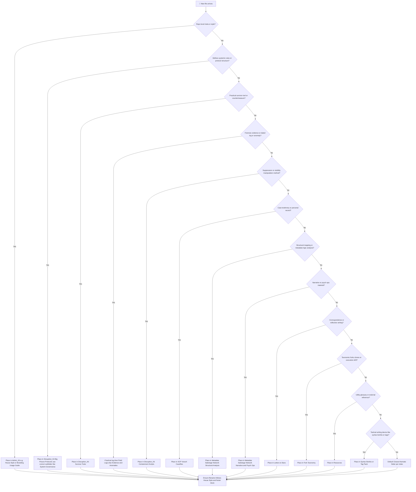

```mermaid 

flowchart TD
    A[📂 New file arrives] --> B{Repo level meta or style?}
    B -->|Yes| B1[Place in Admin_Kit e.g. House Style or Branding Usage Guide]
    B -->|No| C{Defines systemic rules or protocol structure?}

    C -->|Yes| C1[Place in Disruption_Kit Big Picture Protocols use correct subfolder like System Governance]
    C -->|No| D{Practical survivor tool or countermeasure?}

    D -->|Yes| D1[Place in Disruption_Kit Survivor Tools]
    D -->|No| E{Forensic evidence or dated log or anomaly?}

    E -->|Yes| E1[If tactical log then Field Logs else Evidence and Anomalies]
    E -->|No| F{Suppression or visibility manipulation method?}

    F -->|Yes| F1[Place in Disruption_Kit Containment Scripts]
    F -->|No| G{Case testimony or personal record?}

    G -->|Yes| G1[Place in SCP VoiceX Casefiles]
    G -->|No| H{Structural mapping or metadata logic analysis?}

    H -->|Yes| H1[Place in Metadata Sabotage Network Structural Analysis]
    H -->|No| I{Narrative or psych ops material?}

    I -->|Yes| I1[Place in Metadata Sabotage Network Narrative and Psych Ops]
    I -->|No| J{Correspondence or reflective writing?}

    J -->|Yes| J1[Place in Letters to Stars]
    J -->|No| K{Taxonomic forks clones or execution drift?}

    K -->|Yes| K1[Place in Fork Taxonomy]
    K -->|No| L{Utility glossary or external reference?}

    L -->|Yes| L1[Place in Resources]
    L -->|No| M{Tactical writing device like syntax bombs or tags?}

    M -->|Yes| M1[Place in Syntax Bombs or Tag Pack]
    M -->|No| N[Default Closest thematic folder per index]

    %% Final step
    B1 --> X[📑 Update index.md with link emoji and one line scope]
    C1 --> X
    D1 --> X
    E1 --> X
    F1 --> X
    G1 --> X
    H1 --> X
    I1 --> X
    J1 --> X
    K1 --> X
    L1 --> X
    M1 --> X
    N --> X

    X[Ensure filename follows House Style and footer block]

``` 
