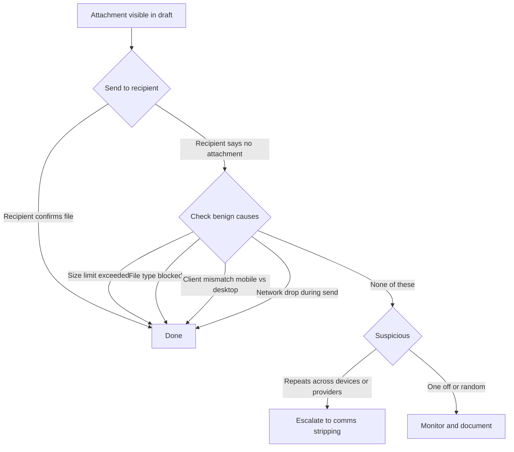

# 📎 Attachments Not Delivered  
**First created:** 2025-09-12 | **Last updated:** 2025-09-12  
*When files vanish between draft box and recipient inbox.*  

---

## 🌳 Flowchart (Mermaid)

---

## 🧰 Quick Checks (benign first)
- **File size**: confirm below service limit (e.g. 25MB for Gmail).  
- **File type**: try renaming/packing file (`.pdf`, `.docx`, `.png` preferred).  
- **Platform mismatch**: test both mobile + desktop clients.  
- **Network stability**: resend over different connection (Wi-Fi vs. mobile data).  
- **Resend to self**: check whether the file arrives in your own inbox.  

---

## 🚩 When to Escalate (suspect patterns)
- Recipient **never** receives attachment across multiple tries.  
- Failures persist **across devices/networks**.  
- Message body always arrives, but **payload stripped**.  
- Occurs specifically with **evidence files** (legal docs, screenshots, logs).  
- No bounceback/error notices appear — system acts like send succeeded.  

> If ≥1 of the above is reliable, classify under *📎 Comms Stripping* and preserve both sent + received views.  

---

## 🧾 Minimal Evidence Pack
- Screenshot of draft (showing attachment present).  
- Screenshot of sent item (still showing attachment).  
- Recipient screenshot showing message **without** attachment.  
- Repeat test from at least two devices/networks; capture both outcomes.  
- Save mail headers + metadata for comparison.  

---

## 🏮 Footer  

*Attachments Not Delivered* is a living node of the Polaris Protocol.  
It begins with ordinary limits (size/type/network) and escalates to stripping patterns indicative of suppression.  

> 📡 Cross-references:  
> - [🖥 Interface Glitches/🖱 Cursor Jump Triage](../🖥_Interface_Glitches/🖱_cursor_jump_troubleshooting_flowchart.md)  
> - [Containment Scripts/Suppression Modes/📎 Attachment Stripping](../../Disruption_Kit/Containment_Scripts/Suppression_Modes/)  

*Survivor authorship is sovereign. Containment is never neutral.*  

_Last updated: 2025-09-12_
